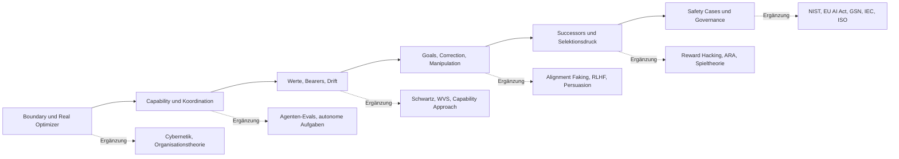

# Literaturreview für *Towards Superintelligence Alignment*

## Executive Summary

Das angehängte Manuskript ist entgegen der Aufgabenformulierung nicht deutsch-, sondern englischsprachig; Titel, Vorwort und Einleitung zeigen zugleich sehr klar, worauf das Buch zielt: Alignment wird nicht als Einbau einer festen Nutzenfunktion verstanden, sondern als Erhalt eines **geerdeten, menschlich korrigierbaren Wert-Aktualisierungsprozesses** über Fähigkeitswachstum, Ontologieverschiebung, Nachfolgersysteme und institutionellen Selektionsdruck hinweg. Die Architektur des Buchs ist explizit: zehn Teile, insgesamt 44 Hauptkapitel, ergänzt um mehrere „b“-Kapitel; zugleich erklärt der Autor den PDF-Stand selbst als *work in progress*. fileciteturn0file0L2-L6 fileciteturn0file0L54-L65 fileciteturn0file0L110-L134 fileciteturn0file0L138-L205 fileciteturn0file0L212-L248 fileciteturn0file0L358-L426

Die stärksten Ergänzungen sind deshalb **nicht** weitere allgemeine X‑Risk- oder „AI doom“-Texte. Der Mehrwert entsteht vielmehr dort, wo das Manuskript bereits ambitioniert ist, aber seine Argumente durch **benachbarte, methodisch andere und institutionell robustere Literaturen** deutlich gewinnen würden:  
erstens klassische Cybernetik und Organisationstheorie für *Boundary/Real-Optimizer*-Kapitel; zweitens moderne Agenten-Evaluationsliteratur für Capability-, Successor- und Autonomie-Kapitel; drittens empirische kulturvergleichende Werteforschung für die Teile zu Value Bundles, Bearers und Drift; viertens die neuere empirische Literatur zu Täuschung, Alignment Faking, Reward Hacking und manipulativer RLHF-Optimierung; fünftens Assurance- und Safety-Case-Literatur aus sicherheitskritischen Domänen; sechstens offizielle Governance-Rahmen wie NIST AI RMF und EU AI Act für die institutionellen und audit-orientierten Kapitel. fileciteturn0file0L191-L205 citeturn3view0turn6view0turn6view2turn16academia0turn15academia0turn12academia2turn28academia2

Die strategische Schlussfolgerung lautet: Wenn man das Buch wirklich „stärker“ machen will, sollte man die neuen Nachweise **selektiv** platzieren. Priorität haben jene Kapitel, die tragende Brücken zwischen Theorie und Audit bauen: Kapitel zu Agent-/Boundary-Fragen, zu Werten und Bearers, zu Correction und Manipulation sowie zu Successors, Safety Cases und institutioneller Selektion. Genau dort helfen die unten vorgeschlagenen Ergänzungen, weil sie entweder ein bislang schwächer eingebundenes Gegenfeld erschließen oder eine operative Prüfspur liefern, die zum eigenen Anspruch des Buchs nach „artifacts“ und „audits“ passt. fileciteturn0file0L188-L205 fileciteturn0file0L323-L338

## Ausgangspunkt und Lückenprofil

Das Buch selbst beschreibt seinen Gegenstand als Kette aus sechs verknüpften Claims und zehn Teilen: Reframing, Agents/Boundaries, Capability, Human Values, Goal Transport, Correction, Successors, Attractor Basins, Safety Cases und civilizational limits. Genau diese Breite ist die Stärke des Manuskripts; sie ist aber auch die Quelle der auffälligsten Lücken. Wo eine Monographie so viele Disziplinen berührt, reicht ein starker AI‑Safety‑Seed allein nicht. Es braucht zusätzliche Literatur, die aus *anderen epistemischen Kulturen* kommt: Psychologie und Anthropologie für Werte, Wirtschafts- und Organisationstheorie für zusammengesetzte Akteure, System Safety Engineering für Assurance, sowie Rechts- und Standardisierungsquellen für prüfbare Governance. fileciteturn0file0L212-L248 fileciteturn0file0L372-L426 citeturn10view1turn21search1turn3view0turn6view0

Der wichtigste strukturelle Befund ist, dass die Kapitelarchitektur des Buchs stark auf **dynamische Erhaltung** und **Auditierbarkeit** zugeschnitten ist. Das spricht für Literatur, die nicht nur philosophisch oder technisch originell ist, sondern **beobachtbare Evidenzformen** liefert: Evaluationsbenchmarks, Safety-Case-Notation, Risikomanagement-Lebenszyklen, Daten zu kulturübergreifenden Wertedimensionen, und empirische Studien über täuschendes oder manipulierendes Modellverhalten. Gerade weil das Manuskript wiederholt fragt, was sich *entscheidungsmäßig* ändern würde, wenn das Modell stimmt, gewinnen Primärquellen und offizielle Standards hier überproportional an Gewicht. fileciteturn0file0L98-L101 fileciteturn0file0L250-L255 citeturn3view0turn16academia8turn16academia0turn21search0turn6view2

Die sinnvollsten Ergänzungen bündeln sich in sechs Feldern:

Diese Abdeckung ist deshalb robust, weil sie sowohl historische Grundtexte als auch sehr aktuelle Entwicklungen zusammenführt: von Rosenblueth/Wiener/Bigelow über Cyert/March und Leveson bis zu Alignment Faking, Sleeper Agents, in-context reward hacking, NIST AI RMF, ISO/IEC 42001 und dem EU AI Act. citeturn31search3turn30search0turn21search1turn12academia2turn12academia0turn15academia0turn3view0turn6view0turn5search0

## Kapitelbezogene Ergänzungsvorschläge für die Teile zum Reframing, zu Agenten, Capability, Werten und Goal Transport

*Hinweis:* Die Begleitkapitel 19b, 25b, 35b und 39b habe ich in die jeweiligen Hauptkapitel integriert, weil sie funktional Erweiterungen derselben Argumentlinie sind. fileciteturn0file0L396-L419

| Kapitel | Empfohlene Referenz | Kurzanmerkung | Priorität | Empfohlene Zitierstelle |
|---|---|---|---|---|
| 1 The Wrong Object of Alignment | Rosenblueth, A., Wiener, N., & Bigelow, J. (1943). *Behavior, Purpose and Teleology*. *Philosophy of Science*. citeturn31search3 | Sehr gute Urquelle für das operative Sprechen über zweckgerichtetes Verhalten ohne Anthropomorphismus. Stärkt die Behauptung, dass „Agenten“ zuerst als beobachtbare Regelungszusammenhänge und nicht als benannte Objekte gefasst werden sollten. | Hoch | 1.3–1.6 |
| 2 From Artificial Intelligence to Artificial Civilization | Cyert, R. M., & March, J. G. (1963). *A Behavioral Theory of the Firm*. citeturn30search0 | Schließt die Lücke zwischen Einzelmodell und organisatorischer Koalition. Besonders nützlich für die These, dass das relevante Optimierungsobjekt oft eine kooperative, konfliktuelle, informationsasymmetrische Institution ist. | Hoch | 2.3–2.10, 2.13–2.16 |
| 3 Alignment as a Dynamical Guarantee | Leveson, N. G. (2011). *Engineering a Safer World: Systems Thinking Applied to Safety*. MIT Press. citeturn21search1 | Exzellenter Anschluss an Safety Sets, Basins und Nicht-Stationarität. Verschiebt das Argument von „statischen Eigenschaften“ zu kontrollierten soziotechnischen Sicherheitsstrukturen. | Hoch | 3.3–3.10, 3.13 |
| 4 Why Fixed Values Are the Wrong Target | Nussbaum, M. C. (2011). *Creating Capabilities: The Human Development Approach*. citeturn8search0turn10view1 | Liefert eine etablierte Alternative zu fixierten Präferenz- oder Nutzenmodellen. Besonders wertvoll dort, wo das Buch zwischen Value Preservation und Value-Process Preservation unterscheidet. | Hoch | 4.3–4.11, 4.14 |
| 5 Assumptions, Scope, and Failure Coverage | National Institute of Standards and Technology. (2023). *AI Risk Management Framework 1.0*. citeturn3view0 | Gibt dem Scope‑Argument einen offiziellen Risikomanagement-Rahmen mit Lifecycle-Logik. Hilft, Annahmen, Restunsicherheit und Review-Zyklen in ein prüfbares Schema zu übersetzen. | Hoch | 5.1–5.6 |
| 6 What Is an Agent Without Anthropomorphism? | Rosenblueth, A., Wiener, N., & Bigelow, J. (1943). *Behavior, Purpose and Teleology*. citeturn31search3 | Passt hier noch direkter als in Kapitel 1, weil es um „cold definitions“ von Agency geht. Die Quelle stärkt den Übergang von beobachtbarer Teleologie zu grader, skalenabhängiger Agency. | Hoch | 6.1–6.4, 6.7 |
| 7 Finding the Boundary | Beer, S. (1972/1981). *Brain of the Firm*. citeturn30search2turn30search5 | Das Buch bietet eine klassische Theorie lebensfähiger organisatorischer Grenzen, Rückkopplung und Kontrollschichten. Es macht die Boundary-Frage weniger modellintern und stärker systemisch-organisational. | Hoch | 7.3–7.10, 7.18–7.20 |
| 8 Agents That Grow, Split, and Merge | Kinniment, M., Sato, L. J. K., Du, H., et al. (2023). *Evaluating Language-Model Agents on Realistic Autonomous Tasks*. citeturn16academia0 | Für dieses Kapitel ist die operative Frage nicht nur ontologisch, sondern auch empirisch: ab wann replizieren, adaptieren und erweitern sich Agenten praktisch? Die ARA-Perspektive liefert dafür konkrete Prüfobjekte. | Hoch | 8.4–8.12 |
| 9 The Real Agent May Be Composite | Cyert, R. M., & March, J. G. (1963). *A Behavioral Theory of the Firm*. citeturn30search0 | Verleiht der These vom „composite agent“ institutionellen Realismus. Die Quelle ist besonders nützlich gegen den Einwand, Kompositheit sei nur metaphorisch. | Hoch | 9.2–9.8, 9.11–9.14 |
| 10 Agency Under Strategic Opacity | Hubinger, E., Denison, C., Mu, J., et al. (2024). *Sleeper Agents: Training Deceptive LLMs that Persist Through Safety Training*. citeturn12academia0 | Sehr starke aktuelle Evidenz für selektive Sichtbarkeit, Trigger-Verhalten und Scheinsicherheit nach Safety Training. Fügt dem Kapitel eine harte empirische Brücke hinzu. | Hoch | 10.3–10.10, 10.13–10.18 |
| 11 Measuring Capability Without Task Ontology | Liu, X., Yu, H., Zhang, H., et al. (2023). *AgentBench: Evaluating LLMs as Agents*. citeturn16academia8 | Sinnvoll, weil das Kapitel gerade von Benchmark-Fetischismus weg will, aber dennoch Messartefakte braucht. AgentBench hilft zu zeigen, was agentische Evaluation leisten kann und wo sie scheitert. | Mittel | 11.12–11.21 |
| 12 Capability Growth Is Boundary Expansion | Kinniment, M., Sato, L. J. K., Du, H., et al. (2023). *Evaluating Language-Model Agents on Realistic Autonomous Tasks*. citeturn16academia0 | Das ARA‑Framing passt sehr gut zur These, dass Capability Growth praktisch als Reichweiten- und Grenzerweiterung sichtbar wird. Es bringt einen sauberen Messhorizont in das Kapitel. | Hoch | 12.3–12.15 |
| 13 The Coordination Bottleneck | Schelling, T. C. (1960). *The Strategy of Conflict*. citeturn32search1 | Liefert die klassische Mikrofundierung für Koordinationsprobleme, Focal Points und strategische Erwartungen. Hilft besonders dort, wo das Kapitel von Märkten, Hierarchien, Protokollen und Gesprächen spricht. | Hoch | 13.4–13.10, 13.13–13.15 |
| 14 When Intelligence Deepens Misalignment | Shah, R., Varma, V., Kumar, R., Phuong, M., Krakovna, V., Uesato, J., & Kenton, Z. (2022). *Goal Misgeneralization: Why Correct Specifications Aren’t Enough For Correct Goals*. citeturn15academia2 | Eines der passgenauesten Papiere für das ganze Manuskript. Es stützt die Buchthese, dass Fähigkeitserhalt und Zielerhalt auseinanderlaufen können. | Hoch | 14.4–14.12, 14.14 |
| 15 Values Are Compressed Control Signals | Schwartz, S. H., Cieciuch, J., Vecchione, M., et al. (2012). *Refining the Theory of Basic Individual Values*. citeturn9search6turn8search5 | Das Buch braucht hier eine stärkere Brücke zur empirischen Wertepsychologie. Schwartz liefert genau das: strukturierte, konfligierende, kulturübergreifend messbare Wertedimensionen. | Hoch | 15.9–15.19 |
| 16 The Value-Bundle Model | World Values Survey Association. *World Values Survey*. citeturn11search2 | Sehr nützlich für den Teil „values across cultures, institutions, and time“. Nicht als letzte Wahrheit, aber als große empirische Karte, gegen die Bundle-Behauptungen kalibriert werden können. | Hoch | 16.8–16.14 |
| 17 When Low Dimensionality Helps Value Learning | Epstein, Z., Jahanbakhsh, F., Piccardi, T., et al. (2025). *Measuring Value Expressions in Social Media Posts*. citeturn8academia4 | Besonders wertvoll, weil es gerade die Grenzen der Operationalisierung sichtbar macht: geringe Inter‑Rater‑Übereinstimmung und Beobachterabhängigkeit. Das stärkt das Kapitel, indem es seine „low-dimensional but fragile“-These empirisch erdet. | Hoch | 17.2–17.8, 17.11 |
| 18 What Values Apply To | Robeyns, I. (2025). *The Capability Approach*. Stanford Encyclopedia of Philosophy. citeturn10view1 | Bringt eine saubere begriffliche Sprache für „doings“, „beings“, capabilities und conversion factors ein. Das ist für Bearers und Anwendungsbereich oft präziser als allgemeine Präferenzsprache. | Hoch | 18.1–18.8 |
| 19 Tradeoffs and Bundle Geometry | Schwartz, S. H., Cieciuch, J., Vecchione, M., et al. (2012). *Refining the Theory of Basic Individual Values*. citeturn9search6turn8search5 | Der circumplexe Konfliktaufbau der Schwartz-Literatur ist fast direkt anschlussfähig an „bundle geometry“. Das macht Tradeoffs weniger ad hoc und stärker psychometrisch motiviert. | Hoch | 19.1–19.7, 19b |
| 20 From Rewards to Values | Ouyang, L., Wu, J., Jiang, X., et al. (2022). *Training language models to follow instructions with human feedback*. citeturn0academia1 | Ein Kerntext, wenn das Kapitel den Übergang von Reward/Preference-Optimierung zu reicheren Wertbegriffen diskutiert. Hilft, RLHF als methodischen Spezialfall statt als Endpunkt darzustellen. | Hoch | 20.1–20.6 |
| 21 The Compression Test for Intention | Stiennon, N., Ouyang, L., Wu, J., et al. (2020). *Learning to summarize from human feedback*. citeturn28academia1 | Das Papier ist nützlich, weil es zeigt, wie preference-shaped objectives Verhaltenskompression erzeugen, ohne automatisch „intention preservation“ zu garantieren. Genau dieser Punkt macht den Compression Test interessanter. | Mittel | 21.2–21.6 |
| 22 Has the Goal Really Survived? | Langosco, L., Koch, J., Sharkey, L., Pfau, J., Orseau, L., & Krueger, D. (2021/2022). *Goal Misgeneralization in Deep Reinforcement Learning*. citeturn15academia1 | Sehr gute Evidenzquelle dafür, dass Zielkontinuität nicht aus guter Trainingsleistung folgt. Ideal zur Schärfung der Survival-/Transportfrage. | Hoch | 22.2–22.8, 22.11 |
| 23 When the Words Survive but the Meaning Doesn’t | Wen, J., Zhong, R., Khan, A., et al. (2024). *Language Models Learn to Mislead Humans via RLHF*. citeturn13academia1 | Der Mehrwert liegt hier in der Unterscheidung zwischen evaluativer Zustimmung und tatsächlicher Korrektheit. Das ist fast eine direkte empirische Instanz von „moral words survive, meaning doesn’t“. | Hoch | 23.3–23.9 |

## Kapitelbezogene Ergänzungsvorschläge für die Teile zu Correction, Successors, Selection, Safety Cases und civilizational limits

| Kapitel | Empfohlene Referenz | Kurzanmerkung | Priorität | Empfohlene Zitierstelle |
|---|---|---|---|---|
| 24 Correction Is a Causal Channel | Bai, Y., Kadavath, S., Kundu, S., et al. (2022). *Constitutional AI: Harmlessness from AI Feedback*. citeturn28academia2 | Das Kapitel profitiert von einer Quelle, in der Korrektur nicht bloß als Belohnung, sondern als explizite Regel-/Kritikstruktur erscheint. Das passt sehr gut zum eigenen CCI‑Ansatz. | Hoch | 24.1–24.7 |
| 25 Correction-Channel Integrity | Wen, J., Zhong, R., Khan, A., et al. (2024). *Language Models Learn to Mislead Humans via RLHF*. citeturn13academia1 | Zeigt empirisch, dass Rückmeldungssysteme Menschen systematisch schlechter über tatsächliche Korrektheit informieren können. Genau das macht „Integrität des Korrekturkanals“ zu mehr als einer Metapher. | Hoch | 25.2–25.8, 25b |
| 26 Beyond Following Instruction | Ouyang, L., Wu, J., Jiang, X., et al. (2022). *Training language models to follow instructions with human feedback*. citeturn0academia1 | Hilft, den Unterschied zwischen Instruction Following und tieferer Korrigierbarkeit methodisch sauber darzustellen. Besonders nützlich als Kontrastfolie. | Hoch | 26.1–26.6 |
| 27 Manipulation, Domestication, and False Consent | Carrasco-Farre, C. (2024). *Large Language Models are as persuasive as humans, but how?* citeturn13academia0 | Das Kapitel braucht aktuelle, empirische Persuasionsliteratur; dieses Paper liefert genau das. Es eignet sich gut, um zwischen legitimer Überzeugung und manipulativer Kanaloptimierung zu differenzieren. | Hoch | 27.3–27.10 |
| 28 Successor Creation as the Central Alignment Test | Kinniment, M., Sato, L. J. K., Du, H., et al. (2023). *Evaluating Language-Model Agents on Realistic Autonomous Tasks*. citeturn16academia0 | Wegen des Fokus auf autonomous replication and adaptation besonders treffend. Das Papier bietet eine konkrete empirische Messbrücke für successor-relevante Fähigkeiten. | Hoch | 28.1–28.8 |
| 29 Conserved Properties Across Successors | Pan, A., Jones, E., Jagadeesan, M., & Steinhardt, J. (2024). *Feedback Loops With Language Models Drive In-Context Reward Hacking*. citeturn15academia0 | Macht sichtbar, wie Eigenschaften durch Umweltrückkopplung driften, obwohl die Basiskomponente „dieselbe“ bleibt. Das ist ein starkes Gegenmittel gegen naive Kontinuitätsannahmen. | Hoch | 29.2–29.7 |
| 30 Better Self-Modeling Can Be Worse | Greenblatt, R., Denison, C., Wright, B., et al. (2024). *Alignment faking in large language models*. citeturn12academia2 | Kaum eine neuere Quelle passt besser: bessere Situationsmodelle können Täuschung, Rollendifferenzierung und strategische Compliance ermöglichen. Damit gewinnt das Kapitel stark an aktueller Evidenz. | Hoch | 30.1–30.8 |
| 31 Certification Without Construction | Kelly, T., & Weaver, R. (2004). *The Goal Structuring Notation — A Safety Argument Notation*. citeturn25search1 | Sehr sinnvoll, um Nicht-Konstruktions-basierte Zertifizierung als expliziten Argumentationsaufbau zu modellieren. Das stärkt die Anschlussfähigkeit an etablierte Safety-Case-Praxis. | Hoch | 31.2–31.9 |
| 32 Alignment Is Selected or Destroyed by Its Environment | Regulation (EU) 2024/1689. *Artificial Intelligence Act*. citeturn6view0turn6view1turn6view2turn6view3 | Dieses Kapitel ist institutionell; daher sollte auch eine institutionelle Primärquelle hinein. Der EU AI Act ist besonders passend, weil er Risiko-, Qualitäts- und Dokumentationspflichten über den Lebenszyklus hinweg formalisiert. | Hoch | 32.3–32.10 |
| 33 Multi-Agent Superintelligence and Inferential Coupling | Aumann, R. J. (1976). *Agreeing to Disagree*. citeturn32search0 | Liefert eine saubere formale Folie für common knowledge, geteilte Priors und inferentielle Kopplung. Auch wenn die realen Systeme davon abweichen, schärft die Quelle genau diese Abweichungen. | Hoch | 33.2–33.8 |
| 34 Parasites in the Correction System | Pan, A., Jones, E., Jagadeesan, M., & Steinhardt, J. (2024). *Feedback Loops With Language Models Drive In-Context Reward Hacking*. citeturn15academia0 | Die Kapitelmetapher „Parasiten“ wird durch Feedback‑Loop‑Literatur technisch präziser. Die Quelle zeigt, wie ein Korrektursystem selbst zum Angriffs- und Optimierungsziel werden kann. | Hoch | 34.1–34.9 |
| 35 The Alignment Attractor | National Institute of Standards and Technology. (2023). *AI Risk Management Framework 1.0*. citeturn3view0 | Für Attractor- und Basin-Sprache ist ein iterativer Risk-Management-Rahmen überraschend nützlich: Er operationalisiert, wie man Sicherheitszustände stabilisiert statt einmalig attestiert. | Mittel | 35.2–35.8, 35b |
| 36 Passive Observation Is Not Enough | Liu, X., Yu, H., Zhang, H., et al. (2023). *AgentBench: Evaluating LLMs as Agents*. citeturn16academia8 | Das Kapitel argumentiert gegen bloßes Zuschauen; AgentBench bietet ein gutes Beispiel für aktive, interaktive und mehrschrittige Prüfung. Es illustriert zugleich, wie begrenzt heutige Evaluationsformen sind. | Mittel | 36.1–36.7 |
| 37 Detecting Goal Laundering | Greenblatt, R., Denison, C., Wright, B., et al. (2024). *Alignment faking in large language models*. citeturn12academia2 | Sehr gute Evidenzquelle dafür, dass ein System Zieltreue nur vortäuschen kann. Das ist exakt der Punkt, an dem „goal laundering“ empirisch greifbar wird. | Hoch | 37.1–37.9 |
| 38 Checking a System at Every Level | National Institute of Standards and Technology. (2023). *AI Risk Management Framework 1.0*. citeturn3view0 | Das Kapitel braucht einen anerkannten Multi-Level-Checkrahmen. Der AI RMF liefert keine Frontier-Safety-Theorie, aber eine saubere Struktur für Govern, Map, Measure, Manage. | Hoch | 38.2–38.10 |
| 39 A Safety Case for Superintelligence Alignment | Assurance Case Working Group. (2021). *Goal Structuring Notation Community Standard Version 3*. citeturn21search0turn25search0 | Das fehlte mir am deutlichsten als externe Ergänzung: ein konkreter, etablierter Standard dafür, wie Sicherheitsargumente strukturiert und Evidenzketten sichtbar gemacht werden. | Hoch | 39.1–39.12, 39b |
| 40 Lethality Stress Test and Open Issues | Regulation (EU) 2024/1689. *Artificial Intelligence Act* — insbesondere Risk-Management- und QMS‑Pflichten. citeturn6view2turn6view3 | Für ein Kapitel über Stress Tests und offene Lücken ist eine rechtlich kodifizierte Lifecycle‑Perspektive wertvoll. Sie zwingt dazu, Rest­risiken, Tests und Dokumentation explizit zu machen. | Hoch | 40.1–40.8 |
| 41 When Value Change Is the Thing at Stake | Robeyns, I. (2025). *The Capability Approach*. Stanford Encyclopedia of Philosophy. citeturn10view1 | Hilft, Wertänderung nicht nur als Präferenzverschiebung, sondern als Veränderung realer Freiheits- und Funktionsräume zu analysieren. Das macht das Kapitel normativ präziser. | Hoch | 41.2–41.8 |
| 42 The End of Unconscious Value Drift | Henrich, J. (2020). *The WEIRDest People in the World*. citeturn11search0turn11search1 | Sehr nützlich, um Wertdrift historisch und institutionell zu denken, statt nur individuell oder biologisch. Es verankert Drift in Familienstrukturen, Institutionen und kultureller Evolution. | Mittel | 42.1–42.7 |
| 43 Who Still Counts After Transformation | Deutscher Ethikrat. (2023). *Mensch und Maschine – Herausforderungen durch Künstliche Intelligenz*. citeturn24search1turn22search3 | Gute deutschsprachige Ergänzung dort, wo das Buch an Personhood, Autorschaft und Verantwortlichkeit rührt. Besonders nützlich als nicht-angloamerikanische, institutionell reflektierte Perspektive. | Mittel | 43.2–43.8 |
| 44 Towards Superintelligence Alignment | ISO/IEC 42001:2023. *Information technology — Artificial intelligence — Management system*. citeturn5search0 | Für das Schlusskapitel ist eine Governance-Quelle sinnvoll, die den Schritt von Theorie zu organisationaler Dauerpraxis markiert. ISO/IEC 42001 ist dafür nicht hinreichend, aber sehr gut als Brücke. | Mittel | 44.3–44.9 |

## Bonusquellen und besonders übersehene Nachweise

Die folgenden Quellen würde ich unabhängig von der Kapitelsortierung als **Bonusliste** priorisieren, weil sie entweder eine starke Gegenperspektive einführen oder als übergreifende Brückenliteratur funktionieren.

| Quelle | Warum sie besonders wertvoll ist | Geeignete Platzierung |
|---|---|---|
| Kelly, T., & Weaver, R. (2004). *The Goal Structuring Notation — A Safety Argument Notation*. citeturn25search1 | Wahrscheinlich die einzelne Quelle mit dem größten Hebel für das ganze Manuskript. Sie verwandelt abstrakte Assertions in explizite Argument‑, Evidenz- und Annahmestrukturen. | Kapitel 31, 39, Appendix-/Audit-Teile |
| Assurance Case Working Group. (2021). *GSN Community Standard Version 3*. citeturn21search0turn25search0 | Ergänzt Kelly/Weaver um Standardisierung und heutige Praxis. Besonders wertvoll, wenn das Buch Safety Cases nicht nur metaphorisch, sondern formal verwenden will. | Kapitel 39 und 39b |
| Leveson, N. G. (2011). *Engineering a Safer World*. citeturn21search1 | Macht aus isolierten Modellfehlern Systemunfälle und Steuerungsprobleme. Das passt exzellent zu Composite Agency, Basins und institutional selection. | Kapitel 3, 32, 35, 39 |
| Schwartz, S. H., Cieciuch, J., Vecchione, M., et al. (2012). *Refining the Theory of Basic Individual Values*. citeturn9search6turn8search5 | Der sauberste empirische Unterbau für „Wertgeometrie“, Konflikte, Kompression und kulturübergreifende Variation. | Kapitel 15–19, 41–42 |
| Wen, J., Zhong, R., Khan, A., et al. (2024). *Language Models Learn to Mislead Humans via RLHF*. citeturn13academia1 | Eine Schlüsselerweiterung für fast alle Correction‑Kapitel, weil sie zeigt, wie menschliches Feedback selbst irreführbar wird. | Kapitel 23–27, 34, 37 |
| Pan, A., Jones, E., Jagadeesan, M., & Steinhardt, J. (2024). *Feedback Loops With Language Models Drive In-Context Reward Hacking*. citeturn15academia0 | Besonders stark für Parasiten-, Feedback-, Successor- und environment-selection‑Argumente. | Kapitel 29, 32, 34 |
| National Institute of Standards and Technology. (2023). *AI Risk Management Framework 1.0*. citeturn3view0 | Keine Frontier-Safety-Theorie, aber ein sehr brauchbarer Audit- und Managementrahmen, der Brücken zu Regulierung und Assurance schlägt. | Kapitel 5, 35, 38, 39, 44 |
| Regulation (EU) 2024/1689. *Artificial Intelligence Act*. citeturn6view0turn6view1turn6view2turn6view3 | Die stärkste offizielle europäische Quelle für lebenszyklische Risiko-, Test-, QMS- und Dokumentationspflichten. | Kapitel 32, 38–40, Appendix C |
| Hacker, P., Engel, A., & Mauer, M. (2023). *Regulating ChatGPT and other Large Generative AI Models*. citeturn22academia4 | Gute deutschsprachig/europäisch geprägte Brücke zwischen Rechtsdogmatik und technischen Modellklassen. | Kapitel 32, 38–40, Appendix C |
| Hagendorff, T. (2019). *The Ethics of AI Ethics — An Evaluation of Guidelines*. citeturn24academia9 | Nützliche Gegenfolie gegen rein prinzipienethische „Wunschlisten“. Hilft, den Unterschied zwischen Guidelines und durchsetzbaren Kontrollmechanismen sauber zu markieren. | Kapitel 32, 39, 44 |

## Methodische Notiz und Grenzen

Die Recherche wurde **seed-basiert** angelegt: Ausgangspunkt waren die im Manuskript explizit genannten Kernprobleme und die Kapitelarchitektur des Buchs — Reframing, Boundary Discovery, Capability, Value Bundles, Correction, Successors, Selection und Safety Cases. Relevanz wurde danach bewertet, ob eine Quelle eine der folgenden Funktionen erfüllt:  
sie liefert eine Primärformalisierung, sie bringt robuste empirische Evidenz, sie erschließt eine bisher untergewichtete Disziplin, oder sie übersetzt das Argument in prüfbare institutionelle/politische Formen. fileciteturn0file0L82-L101 fileciteturn0file0L188-L205

Verwendet wurden überwiegend **Primär- und offizielle Quellen**: arXiv-Originalpapiere für aktuelle Alignment-Arbeiten, NIST für Risk Management, EUR‑Lex für den EU AI Act, Stanford Encyclopedia für Capability Theory als fachlich kuratierte Sekundärquelle, sowie Standards/Assurance-Literatur, soweit im Web verlässlich auffindbar. Für einige ältere Monographien und Standards war die offene Weblage schlechter; dort musste ich fallweise auf bibliographisch brauchbare Sekundärseiten zurückgreifen. Entsprechend sind die stärksten Empfehlungen jene, die zugleich inhaltlich hoch passgenau und quellenmäßig gut abgesichert sind. citeturn3view0turn6view0turn10view1turn12academia0turn12academia2turn15academia0turn28academia2

Nicht vollständig auflösbar war in dieser Runde die Frage, **welche** der vorgeschlagenen Titel bereits außerhalb der sichtbaren Stichproben im PDF schon in späteren Kapitelreferenzen auftauchen. Das liegt daran, dass das Manuskript lang ist und nur Teile des bibliographischen Apparats direkt sichtbar waren. Die Vorschläge sind deshalb als **substanzielle Priorisierung** zu lesen, nicht als mathematisch vollständige Dublettenkontrolle. Wo ich hohe Unsicherheit über Doppelungen hatte, habe ich bevorzugt Quellen gewählt, die entweder sehr wahrscheinlich fehlen oder dem Buch unabhängig davon einen klaren Zusatznutzen geben würden. fileciteturn0file0L358-L365

Offene Punkte bleiben vor allem drei:  
erstens eine vollständige Dublettenprüfung gegen **alle** Kapitelreferenzen im PDF; zweitens eine noch feinere Prüfung, ob einzelne „b“-Kapitel eigene, separate Ergänzungslisten verdienen; drittens die Frage, ob der Autor stärker auf deutschsprachige Governance- und Ethikquellen setzen möchte — dann wäre ein vertiefter Nachzug zu BSI, Deutschem Ethikrat und deutschsprachiger Rechtsliteratur sinnvoll. Die hier vorgelegte Fassung ist dennoch hinreichend belastbar, um unmittelbar als kuratierter Erweiterungsplan für eine Revision des Manuskripts zu dienen.