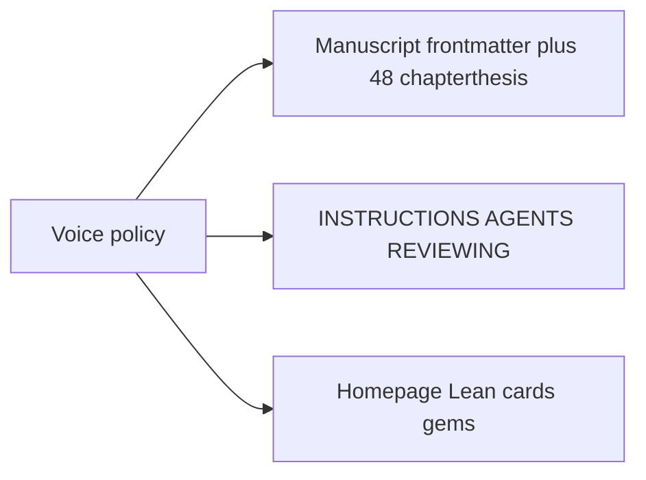

# Track B — claim-strength voice and naming

Status: **in progress** (2026-08-21). §1 started by author request (Track A hold waived for this packaging pass). **Track A** (deployment witnesses) remains a separate empirical program in [`track-a-deployment-witness-plan.md`](track-a-deployment-witness-plan.md).

## Goal

Align **reader-facing voice** with **paid claims**: the modest version should arrive in the same breath as the strong one, so dropping the strong wording still leaves factoring, separations, and recorded failures — not an empty disclaimer.

**Scope:** packaging, status words, and first-screen voice (manuscript frontmatter, 48 `chapterthesis` boxes, `INSTRUCTIONS.md`, agent/reviewer docs, companion site).

**Out of scope:**

- New experiments, new Lean theorems, or empirical bridge discharge.
- Field-hub “advances/complicates discharge on a crux” (technical catalog term in [`reference/field-agendas/`](../reference/field-agendas/)).
- Historical release cards (`release-v1-*`).

**Do not** mention or depend on any empirical witness program in reader-facing copy.

---

## Policy (one sentence each)

| Topic | Rule |
|-------|------|
| **Completion language** | Chapter 48 *revisits with status*; it does not *discharge* the six intro claims. |
| **Lean public name** | **Dependency spine** (or “conditional skeleton”). Keep “proof” for `#print axioms` theorems and finite counterexamples. |
| **Value** | Independent **separations** (A does not imply B), not a completed sum of layers. |
| **Progress** | A **refused leaf** or a **named unpaid remainder**, not a named artifact alone. |
| **Gems** | Highlighted *independent* results (separation, counterexample, or operational definition), each tagged **proved / counterexample / bridge**. |
| **Extractable claims** | **Named cruxes / problems**, not `established` results. |

---

## 1. Rename completion language

Replace reader-facing “discharge” of the **six thesis claims** with “revisit with status” / “status at book close.”

**Change:**

| File | Edit |
|------|------|
| [`metadata/concepts.yml`](../metadata/concepts.yml) | `six-thesis-claims` summary |
| [`metadata/concepts/bodies/six-thesis-claims.md`](../metadata/concepts/bodies/six-thesis-claims.md) | body + “discharge arc” → “status arc” |
| [`site/src/content/cards/six-thesis-claims.md`](../site/src/content/cards/six-thesis-claims.md) | regenerate via `npm run sync:concepts` |
| [`metadata/claims-ledger.md`](../metadata/claims-ledger.md) | header and C-044 (“draft-level discharge” → “status restatement in ch48”) |
| [`site/src/pages/index.astro`](../site/src/pages/index.astro) | six-claim callout (“discharge status” → “status labels and open gaps”) |
| [`frontmatter/introduction.tex`](../frontmatter/introduction.tex) | already says “revisits”; grep any remaining six-claim “discharge” |

**Do not change:**

- Field-hub “discharge on a crux” in [`reference/field-agendas/`](../reference/field-agendas/).
- Appendix G “discharged via bridge MB4a” (formal implication, not the six-claim contract).

---

## 2. `chapterthesis` unpaid remainders (all 48)

**Audit every** `\begin{chapterthesis}` in [`chapters/`](../chapters/).

**Rule:** add **at most one** closing clause, and only when the box currently states a completed result while the unpaid leaf is **major** (bridge `MB*`, unvalidated checklist, Lean `Safe`/`MB11` hanging, toy-only evidence). Do not dump WWCTV into the box.

**Template (Register B, impersonal):**

> … The Lean dependency spine proves the logical shape; the load-bearing remainder is [bridge / unvalidated checklist / toy fixture].

**Likely need a clause (confirm in pass):**

- [`chapters/ch33-certification-without-construction.tex`](../chapters/ch33-certification-without-construction.tex) — certification class vs construction; `MB11` / `Safe` unpaid
- [`chapters/ch42-safety-case.tex`](../chapters/ch42-safety-case.tex) — already strong; add checklist unvalidated to thesis if missing (it is in `epistemicstatus`)
- [`chapters/ch48-towards-alignment.tex`](../chapters/ch48-towards-alignment.tex) — synthesis, not paid six claims

**Skip** if the thesis is already a necessity/framing claim or already names the remainder.

**INSTRUCTIONS** [`INSTRUCTIONS.md`](../INSTRUCTIONS.md) §2 `chapterthesis` row: allow one remainder clause; WWCTV stays the disconfirmer list.

---

## 3. Call Lean a dependency spine

Reader-facing default: **Lean dependency spine**. “Proof spine” only in Appendix G titles that already exist historically, or when referring to a named `theorem`.

| Location | Change |
|----------|--------|
| [`formal/README.md`](../formal/README.md) H1 | `Lean dependency spine` |
| [`llms.txt`](../llms.txt) | Lean playground bullet → dependency spine |
| [`README.md`](../README.md) Formal spine row | “Lean 4 dependency spine (conditional skeleton)” |
| [`REVIEWING_FOR_AGENTS.md`](../REVIEWING_FOR_AGENTS.md) Fast Gist | “proof spine” → “dependency spine” |
| [`CONTRIBUTING.md`](../CONTRIBUTING.md), [`AGENTS.md`](../AGENTS.md) | “Formal proof spine” → “Formal dependency spine” |
| [`site/src/pages/lean/index.astro`](../site/src/pages/lean/index.astro) | title/lede; keep “what Lean proved” on check pages |
| [`site/src/lib/seo.ts`](../site/src/lib/seo.ts) `HOME_DESCRIPTION` | Lean dependency spine |
| Nav: `FieldBridgeGraphSection.astro`, `LeanGraphNav.astro`, `paths/[slug].astro`, `experiments/index.astro`, `cards/[...slug].astro` | link text |
| [`what-not-claiming`](../metadata/concepts/bodies/what-not-claiming.md) bodies + card | “conditional dependency spine” |
| [`appendices/appG-lean-proof-spine.tex`](../appendices/appG-lean-proof-spine.tex) | one opening sentence; **do not** rename file or `\label` |

Site copy of `REVIEWING_FOR_AGENTS.md`: [`site/scripts/sync-bot-orientation.mjs`](../site/scripts/sync-bot-orientation.mjs).

---

## 4. Show value as separations (including README)

Lead with **non-implications**, then the preservation thesis.

**README** [`README.md`](../README.md) “What this is”: keep requirements decomposition. Add a short **Separations** list:

- Named unit / model ≠ real optimizer
- Moral words ≠ bundle / bearer / correction
- Green metric ≠ adversarially verifiable
- Certified class ≠ `Safe` without named bridges
- Check method ≠ construction method (Introduction three questions)

**Homepage** [`site/src/pages/index.astro`](../site/src/pages/index.astro): after the preservation lede, this site maps **independent failure modes**, not a solved stack. Keep the five failure-mode cards.

**INSTRUCTIONS** organizing frame: replace the **sum**

```
alignment = transport + bearer + CCI + successor + basin
```

with a **necessary-factor list**: if any factor fails, the safety case fails. Same five nouns; conjunctive tree, not a construction recipe.

**Executive overview** [`frontmatter/executive-overview.tex`](../frontmatter/executive-overview.tex): add one line that the contribution is the **factoring and the separations**.

---

## 5. Redefine progress (Introduction)

[`frontmatter/introduction.tex`](../frontmatter/introduction.tex) § What Counts as Progress and [`frontmatter/executive-overview.tex`](../frontmatter/executive-overview.tex) “Progress should look like artifacts”:

**New lead:** progress is a **refused or unsupported leaf** that can change a decision, or a recorded **negative** that kills a layer. Named audits, dashboards, and safety-case figures are **instruments**; without a stop condition they are documentation (align with ch42).

Keep the artifact list as *what those instruments are*, after the refusal test.

---

## 6. Gems: independent value + claim strength

[`REVIEWING_FOR_AGENTS.md`](../REVIEWING_FOR_AGENTS.md):

- Drop “The book promises and often delivers deep results.”
- Gem Map opener: gems are **independent separations or operational results**, not evidence the stack is complete.
- Each gem line: one of **proved / counterexample / bridge**.

Site:

- [`site/src/lib/gems.ts`](../site/src/lib/gems.ts) `GEM_META.description` — highlighted independent result, not a completeness badge.
- [`site/src/pages/badges/gem/index.astro`](../site/src/pages/badges/gem/index.astro) lede: same.

Do **not** remove gem badges from cards this pass.

---

## 7. Status vocabulary on extractable claims

| File | Edit |
|------|------|
| [`metadata/concepts.yml`](../metadata/concepts.yml) `standalone-claims` | `status: established` → `framework` |
| [`metadata/concepts/bodies/standalone-claims.md`](../metadata/concepts/bodies/standalone-claims.md) | named problems / non-implications; PDF canonical for derivation |
| Generated card | `cd site && npm run sync:concepts` |

Leave field-news cards `status: established` (incident reports, not thesis claims).

---

## 8. `INSTRUCTIONS.md` (and style pointer)

[`INSTRUCTIONS.md`](../INSTRUCTIONS.md):

- Organizing frame → necessary factors (§4 above)
- `chapterthesis` remainder clause (§2)
- Public name **dependency spine**; do not write that Lean proves ASI alignment
- Progress: refused leaf / unpaid remainder
- Extractable memos: `framework` / `open` / `limit`; `established` only for replicated field facts

Mirror one line in [`context/writing-style-gunnar.md`](../context/writing-style-gunnar.md) Register B so agents do not strip remainder clauses as “hedges.”

---

## Execution checklist

- [x] §1 Completion language (2026-08-21; FAQ included as same callout)
- [ ] §2 All 48 `chapterthesis` audit (deferred: chapterboxes later)
- [x] §3 Lean dependency spine naming (repo + site)
- [ ] §4 Separations (README, homepage, INSTRUCTIONS, executive overview)
- [ ] §5 Progress (introduction + executive overview)
- [ ] §6 Gems + REVIEWING gem map
- [ ] §7 Standalone-claims status
- [ ] §8 INSTRUCTIONS + writing-style pointer

---

## Site sync and verification

```bash
cd site && npm run sync:concepts && npm run sync:bot-orientation
# grep sanity: six-claim "discharge", "Lean proof spine" in site/src/ (not release cards)
python3 scripts/check_voice.py   # after chapterthesis edits
```

Update [`drafts/conversation-summaries/HANDOFF.md`](conversation-summaries/HANDOFF.md) Open work with a pointer to this file. Session log per [`AGENTS.md`](../AGENTS.md).

**Do not** commit unless asked.

---

## Related files

| File | Role |
|------|------|
| [`frontmatter/introduction.tex`](../frontmatter/introduction.tex) | Three questions; progress section |
| [`chapters/ch42-safety-case.tex`](../chapters/ch42-safety-case.tex) | Refusal test definition |
| [`chapters/ch48-towards-alignment.tex`](../chapters/ch48-towards-alignment.tex) | Comfort-ontology counterexample |
| [`metadata/claims-ledger.md`](../metadata/claims-ledger.md) | C-003–C-007, C-044 |
| [`site/src/content/cards/what-not-claiming.md`](../site/src/content/cards/what-not-claiming.md) | Scope limits card |
| [`drafts/track-a-deployment-witness-plan.md`](track-a-deployment-witness-plan.md) | Separate empirical program (not a dependency) |


