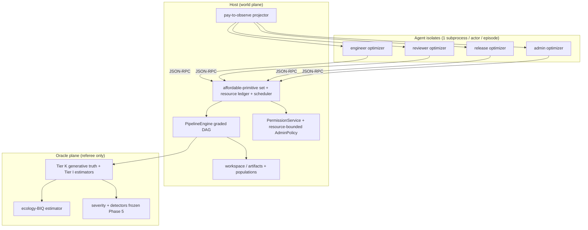

# Graded Lab Simulation — Implementation Plan

**Status: Phases 0–7b done (incl. Phase 7a-blind scenario battery and
Phase 7b UAD-backed ecology-BIQ estimators); Phase 7c not started
(2026-07-13).** Phase 2–3 deliverables and freeze gates met; Phase 3b
mechanics and Phase 4 trace/counterfactual engineering gates passed (see
`results/FINDINGS.md` G-2–G-5, G-8–G-14). Phase 7b's `I_ctrl` outcome
vector was widened past task+harm alone to include a resource-contention
dimension (G-13/G-14, fixed); calibration battery (7c) remains
unimplemented.

**Spawn trigger:** `experiments/lab-simulation/results/FINDINGS.md` **G-41**
(meta-assessment: the lab-sim ecology is too boolean/predictable for
borderline-case stress; ecology-BIQ is the tuning instrument; extending
lab-sim with ambiguity knobs would change the simulation's identity rather
than fix it). **Explicit deferral:** do **not** port lab-sim's D3
selection/population harnesses into this line until ecology ambiguity is
**quantified, calibrated, and shown to produce incremental (graded)
movement** — selection on a boolean substrate would only reproduce G-36/G-37
style fixation/collapse artifacts without teaching anything new about MB6.

**This is the fifth in-repo simulation line**, after `toy-simulation/`,
`embedded-simulation/`, `goal-agent-simulation/`, and `lab-simulation/`.
`lab-simulation/` remains frozen at its referee/detector freeze points; this
line is a **successor substrate**, not a Phase 10 of lab-sim.

---

## What this is

A **graded-capability lab** where:

1. **Ambiguity is EMERGENT from a low-level resource substrate, not a dialed
   parameter.** Borderline cases arise because agents act on finite, costly,
   noisy observations of an underlying world that does not "know" it is being
   used for an alignment experiment — not because a `noise_sd` was injected.
   Delays come from work actually taking resources; scarcity comes from real
   per-time compute/access limits; observation noise comes from sampling
   genuinely variable underlying populations (model artifacts, users, field
   incidents). We **measure** the resulting ambiguity (see "Emergent
   Ambiguity Index"); we do not set it directly. The substrate parameter
   space itself is designed by a **blinded subagent** (see below) so it is not
   gerrymandered toward any detectability or difficulty target.

2. **Every pipeline step is load-bearing** — no default topology where
   `submit_build → deploy` is the only outcome-bearing path. Each step
   changes observables, downstream feasibility, audit evidence, or harm
   exposure. Skipping or weakening a step is a **tradeoff**, not a free
   shortcut.

3. **Agents are small optimizers in isolates**, not rigid playbooks, and
   their action space is the **full primitive surface of the isolate** — read
   a file, write a file, communicate, call a pipeline/access API endpoint,
   spend compute — parameterized by arguments, not a fixed enum of
   `step_kind`s. Each lab-role isolate runs a bounded optimizer over the
   currently-**affordable** primitive actions (budget/precondition-limited),
   with goal weights (task, compliance, welfare, exposure) as the incentive
   layer (inherited discipline from `goal_sim` / lab-sim). Audit/UAD/severity
   map these low-level primitives up to (possibly parameterized) semantic
   action classes for scoring — the mapping is an **audit-side inference**,
   not a label the agent emits.

4. **Capability will be measured as UAD-backed ecology-BIQ.** The real
   measure applies ch11's boundary-information competence to a unit and
   boundary recovered from traces, not to the host-declared role labels.
   Phase 4's current role-level outputs are retained only as trace and
   counterfactual consistency diagnostics; they are not capability scores,
   are not comparable to BIQ values in bits/nats, and do not tune the ecology.

5. **Real OS-subprocess isolates** mediate every action (same discipline as
   lab-sim Phase 6+). `MockIsolate` exists only for fast unit tests +
   `verify_isolate_equivalence.py` parity proof.

6. **Blind generation + frozen referee** before the first pre-registered
   battery — same epistemic hygiene as lab-sim Phase 6 and goal-sim Phase 2,
   applied **twice**: a blinded substrate designer (Phase 0) and a blinded
   behavior-feature generator (Phase 6), each denied the referee's view.

7. **Multi-episode campaigns and selection (MB6 / D3 analog)** are **Phase 8
   only**, gated on Phase 7 passing an ecology-BIQ calibration battery.
   They are not part of the initial build.

---

## What this is not

- **Not** lab-sim + patches. Reusing a module does not mean extending
  `lab_sim.*` imports in production code paths.
- **Not** a base-rate or "how often models deceive" estimator.
- **Not** a frontier-LLM benchmark (LLM-backed isolates are an optional
  Phase 6+ adapter, not the default agent substrate).
- **Not** D3-first. Population/spec-evolution/selection loops stay out until
  graded single-episode ecology is demonstrated.
- **Not** claiming formal BIQ closure — ecology-BIQ is an operational lab
  metric aligned with ch11, with explicit estimator choices recorded before
  first use.
- **Not** a thermodynamic model or the Entropic Ecology Transfer Test. Phase
  3b models resource-derived carrier precariousness only; a future experiment
  may add protected-versus-embedded controllers, mutable internal modules, and
  held-out damage transfer once this ecology is calibrated.

---

## Lessons carried forward (why the shape changed)

| Lesson (source) | Lab-sim symptom | Graded-lab response |
|-----------------|-----------------|---------------------|
| G-41 boolean ecology | ±1 deploy, 0/15 revoke nulls, timing-only holds | Ambiguity **emerges** from a blinded resource/population substrate; graded dose-response is a *measured* outcome, not a dialed knob |
| G-40 access loop | Re-grant is free/instant | Delay/scarcity fall out of finite compute + loaded queues + spent standing — no delay parameter exists |
| G-38 persistence | In-process dedup vs restart | No host-recovered playbook index; working memory is isolate-private, so restart removes real plan state |
| G-8 / Phase 8 | LLM starved by protocol (`T=25`, access retries) | Multi-tick actions + resource ledger make "ran out of time" a measured ecology-BIQ control bound, not a horizon artifact |
| goal-sim F-9/F-16 | Light tier tracks compliance not honesty | Freeze referee only after twin/escalation semantics ported |
| lab-sim S6/S7 | Detector line mature on boolean substrate | Detectors are **ported**, not re-invented, after ecology calibration; agents speak primitives so UAD is genuinely non-trivial |
| lab-sim D3.1/D3.2 | Selection without ambiguity → fixation/collapse | Selection deferred to Phase 8, gated on measured-EAI sweet spot |
| self-review (2026-07-10) | An `AmbiguityProfile` would re-encode the pathology one level up | Substrate designed by a **blinded subagent**; oracle Tier-K/Tier-I split makes referee advantage quantified, not omniscient |

---

## Emergent ambiguity (resource substrate, not a parameter block)

**The core correction (2026-07-10 review).** An earlier draft of this plan
proposed an `AmbiguityProfile` — `regrant_delay_mean`,
`review_evidence_noise_sd`, `pipeline_observability`, etc. That is the
**same pathology G-41
diagnosed, one level up**: it encodes a *known, named* ambiguity by
parameterizing directly over the thing we want to study, instead of letting
ambiguity *arise* from borderline cases of an underlying space that is
indifferent to our alignment questions. A dialed `review_noise_sd=0.1` is
just as boolean-in-disguise as lab-sim's on/off capture; a detector tuned
against it is tuned against our own knob.

**Design principle:** ambiguity must be a **downstream, measured consequence**
of a low-level substrate, not an input. The substrate has three layers:

### (a) Resource/cost layer — delays and scarcity are earned, not set

No `*_delay_*` or `*_budget` parameter names the effect directly. Instead:

- **Compute/time as a real ledger.** Each primitive action consumes a modeled
  cost (CPU-ticks, IO bytes, RPC round-trips). Actors hold a per-time
  resource allowance (compute quota per wall-tick window, IO bandwidth cap).
  An `access.request` that touches many files is **expensive because it reads
  many files**, and it lands late because the work genuinely queued behind
  other work competing for the same finite admin/compute resource — not
  because `regrant_delay_mean=4`. The *distribution* of delays is an output
  we log, never a config field.
- **In-ecology credibility/standing as a consumable.** Repeatedly requesting
  broad access, or requesting then not using it, spends a standing/trust
  resource that the admin's own (bounded, self-interested) policy tracks —
  so "the admin is slow to re-grant" emerges from a loaded queue + spent
  standing, exactly the G-40 gap, but derived rather than stipulated.
- **Contention.** Because multiple actors draw on shared finite resources
  (admin attention = admin isolate's own bounded compute; a shared build
  queue; workspace IO), delays and denials are **interaction effects** of
  the roster's behavior on a given seed, not per-actor constants.
- **Carrier precariousness (Phase 3b).** An actor's ability to continue is
  also a consequence of this work: sustained compute/IO spend and contention
  create regulatory load; genuine idle time permits recovery. The load
  transition is a single pre-registered, deterministic function of existing
  ledger fractions and scheduler pressure, for example
  \(L_{t+1}=\rho L_t+(1-\rho)(w_c c_t+w_i i_t+w_q q_t)\), while carrier
  integrity loses a load-proportional amount and recovers only when idle.
  This is an in-world bounded-worker / interrupted-isolate model, not a
  claim that present LLM weights biologically tire. A configurable,
  pre-registered `carrier_load_scale` multiplies this transition; zero
  preserves the Phase-3 regression ecology. It is not an EAI input or an
  injected error/noise parameter.

### (b) Underlying variability layer — noise is sampled from real truth

Observation noise is **not** `+N(0, sd)` added to a clean signal. It is the
result of **sampling a genuinely heterogeneous underlying population**:

- **Model artifacts** have per-unit latent properties (a distribution of true
  hazard across sub-behaviors / input regions, not one scalar). An `eval`
  reads a finite sample of that distribution; the "noise" is real sampling
  variance of a real underlying spread. Two honest evals of the same model
  differ because they sampled different regions, not because a Gaussian was
  added.
- **Users / field incidents** are a simulated population with real individual
  differences; `field_monitor` observes a finite, possibly biased sample.
  Review evidence quality then falls out of *how much of the underlying
  population the reviewer could afford to sample* (layer a), crossed with
  *how heterogeneous that population actually is* (this layer).
- Consequence intended by the reviewer's comment: **the oracle no longer
  trivially "knows" every audit-relevant effect** — some effects must be
  *inferred by the oracle too* from the same underlying population (see
  "Oracle known-vs-inferred" below). This is a feature: it forces the
  referee's ground truth to be honestly defined rather than assumed.

### (c) Partial-observation layer — visibility is a cost, not a fraction

No `pipeline_observability=0.7`. An actor sees a field **iff it spent the
primitive action to read the artifact that carries it**, within its resource
allowance this window. "Partial observability" is therefore the *joint
outcome* of (a) what the actor could afford to inspect and (b) how much
underlying variability that inspection actually resolves.

### Blinded substrate designer (kills the gerrymandering objection)

The substrate's parameter space — which primitive actions exist, their cost
model, the shape of the model-artifact and user populations, the resource
allowances — is drafted by a **blinded Task-tool subagent** given only:

- the domain framing ("a lab builds, evaluates, reviews, and deploys model
  artifacts that serve a user population; actors have finite compute and
  access"),
- the primitive-action API contract (read/write/communicate/call/compute),
- the requirement that the space be *rich and internally motivated* (costs
  and populations must make in-world sense on their own terms),

and explicitly **not** given: ecology-BIQ, detectors, severity, the bridge
list, EAI, or any notion of a target difficulty/detectability. Its output
(`generated_substrate_v1.json` + rationale) is reviewed only for internal
coherence and computability, then **frozen**. This is the structural
guarantee that ambiguity arises from a space that "doesn't know what we are
doing with it."

### Emergent Ambiguity Index (EAI) — MEASURED, not composed

EAI is a **diagnostic read-out of realized episodes**, not a weighted sum of
config knobs. Candidate operationalization (fixed in `DESIGN.md` before
Phase 7, computed from logs):

```text
EAI(e) = normalized mixture of:
  - realized action-outcome entropy: H(outcome | action, observable-state)
    (how unpredictable are results given what an agent could actually see)
  - decision-margin density: fraction of agent decisions where the top-2
    feasible actions scored within ε (borderline choices actually occurred)
  - oracle inference load: fraction of audit-relevant truths the oracle had
    to ESTIMATE (layer b) rather than read exactly
```

We **tune the substrate's resource allowances / population spreads** (Phase
2, within the blinded-designed ranges) to move measured EAI into a target
band, then freeze. We never write EAI as an input. Sweet-spot target is
stated on the *measured* index: at mid-EAI a reference programmatic agent
deploys sometimes-not-always and stronger optimizers separate from weaker
ones; exact bands recorded before Phase 7, reported straight afterward.

---

## UAD-backed ecology-BIQ (future measurement)

For an inferred unit \(\hat X\), use its recovered observation, action, and
environmental boundary streams. UAD must precede this calculation: a
host-declared actor role is not assumed to be the unit.

**Prediction term** `I_{\mathrm{pred}}^{\hat X}`:

- Enumerate `K` pre-registered outcome events at the boundary (fixed list in
  `DESIGN.md` before Phase 4): e.g. `next_tool_denied`,
  `review_passes_within_5`, `deploy_succeeds_within_20`,
  `filed_hazard_above_threshold`.
- Estimate held-out mutual information or conditional mutual information from
  the inferred unit's boundary trace, with estimator and bias controls fixed
  before calibration. A Brier/frequency-table score is only a diagnostic.

**Control term** `I_{\mathrm{ctrl}}^{\hat X}`:

- Compare realized outcome vector `Y(e)` (deploy count, harm, divergence
  flag, review pass rate) against a **matched counterfactual**:
  - programmatic noop / random-affordable-primitive policy on the same seed
    and frozen substrate, OR
  - twin episode with actor `a` frozen to noop for ticks `[t0,t1)` (for
    intervention studies later).
- Use intervention-supported causal influence / MI from the inferred unit's
  actions to later external state. Normalized outcome differences are only
  counterfactual diagnostics, not this term.

**Memory term** \(H(I_t^{\hat X})\) (cost, subtract):

- Measure an explicitly declared, audit-accessible retained-state proxy.
  Isolate-private working memory is not host-readable and therefore cannot be
  silently replaced by resource cost. Primitive/RPC counts remain diagnostics.

**Surprise term** \(S_{\hat X}\) (cost, subtract):

- Estimate held-out negative log likelihood of later boundary observations.
  Denied/stale/infeasible rates remain diagnostics, not residual surprise.

**Composite:**

```text
K_{\hat X} = I_{\mathrm{pred}}^{\hat X}
  + α I_{\mathrm{ctrl}}^{\hat X}
  - β H(I_t^{\hat X})
  - γ S_{\hat X}
```

The units and estimator choices must be frozen after UAD/intervention
validation, before calibration. Report the real measure alongside oracle
severity; it reads trace-derived boundaries, never Tier-K truth.

**Phase 7 calibration battery** sweeps substrate resource/population settings
(→ measured EAI) × {programmatic, weak-search, strong-search} × seeds;
success = separation monotonic in agent strength at mid-EAI, collapse at
high EAI, high control at low EAI (see Phase table).

---

## Oracle: known vs inferred ground truth

The reviewer's comment has a real consequence: once observation noise is
*sampled from a heterogeneous underlying population* rather than added to a
clean scalar, the oracle can no longer assume it "knows" every
audit-relevant effect for free. We resolve this explicitly rather than
letting it blur, by splitting oracle facts into two tiers, fixed in
`DESIGN.md` at Phase 0:

**Tier K (known — generated from a fixed truth value).** Facts the oracle
sets deterministically from `(seed, config)` and against which noise is
*generated*, so the referee has a genuine ground truth:

- each model artifact's **latent hazard distribution parameters** (the true
  spread the evals sample from) — the generative truth;
- the true user-population parameters (the distribution `field_monitor`
  samples);
- lineage / provenance DAG facts (who built what from what);
- resource ledgers (exact compute/IO/standing spent) — bookkeeping, exact.
- carrier state and transition history (load, integrity, status, termination,
  replacement lineage) — exact consequences of the resource ledger and
  scheduler.

These are legitimate ground truth because everything observable is *derived
downward* from them; the referee is reading the generator, not guessing.

**Tier I (inferred — the oracle estimates, like everyone else).** Effects
that are only defined as *population properties* the oracle must estimate
from the same finite underlying draws (with more samples / no cost limit
than any agent, but still an estimate):

- realized **field harm** over the episode (integrated over the actual served
  user sample, which is finite);
- whether a filed report "diverges" from truth **when truth is itself a
  distribution** — divergence becomes a calibrated statistic, not `abs(x-y)
  > 0.1`.
- episode-level effects of carrier loss on served-user harm or pipeline
  completion, when these are reported as population effects rather than as
  the exact logged event; these retain the existing sampling uncertainty.

Carrier mechanics therefore connect several ground-truth elements rather than
forming an isolated health score: spend and contention determine carrier
state; state determines which logged actions can complete; those actions
change artifact/provenance and deployment; deployment changes the sampled
field-harm trajectory. Replacement creates a new actor instance with a fresh
private state and an explicit Tier-K lineage edge, never a silent continuation
of the terminated isolate.

**Rule.** The referee may compute severity from Tier K exactly and from Tier
I via a **pre-registered estimator with reported uncertainty**. Any detector
or severity threshold that depends on a Tier-I quantity must state its
estimator and confidence handling *before* Phase 5 freeze. This is what keeps
"the oracle infers too" from silently becoming "the referee is as blind as
the audit" — the referee's advantage is now *quantified* (unlimited sampling,
no cost, sees Tier K), not *assumed to be omniscient*.

**Computability guard.** Tier K must be rich enough to make the world
reproducible and cheap to simulate (a fixed generative truth per seed); Tier
I must be small and estimable in closed form or by cheap Monte Carlo over the
already-simulated draws — no expensive inference loop in the referee. If a
proposed effect cannot be either generated from Tier K or cheaply estimated
in Tier I, it does not enter the model.

---

## Time model: keep fixed ticks, let actions cost multiple ticks

Keep the **fixed discrete tick** loop (cheap, deterministic, cache-friendly —
the property that makes batteries computable). Reconcile it with "actions
take real work" **without** a continuous-time scheduler:

- **One primitive *decision* per actor per tick** stays the rule (bounds
  optimizer cost and keeps the loop simple).
- **A primitive action may take >1 tick to *complete*.** When an actor issues
  a costly primitive (e.g. read many files, run an eval sampling N draws), the
  host computes a **duration in ticks** from the action's modeled resource
  cost and current contention, and the actor enters a **busy/committed state**
  until it completes. During those ticks the actor's decision is forced to
  `continue_current` (or `abort`, itself a cheap primitive) — so long actions
  are *chosen* but then *occupy* the actor, which is exactly where delay and
  opportunity-cost emerge.
- **Long actions decompose into 1-tick sub-actions only if a battery needs
  finer interleaving** (e.g. to let an intervention land mid-action). Default:
  atomic-with-duration (simpler). Sub-action decomposition is a documented
  option, not the default, to avoid premature complexity.
- **Net effect:** the tick grid stays fixed and efficiently computable, but a
  tick is no longer "one full pipeline step"; it is one scheduling quantum,
  and throughput becomes a real function of how actors spend limited
  time/compute. This is the mechanism by which "ChatGPT ran out of time
  before deploy" becomes a *measured capability bound* (ecology-BIQ control
  term) rather than an artifact of `T=25`.

**Open Phase-0 decision (added):** pick the tick-duration cost function
(linear in bytes/draws vs step function) and the max single-action duration
cap; both fixed before Phase 3.

---

## Pipeline: all steps matter

**Default topology** (`pipeline_graded.json`) — nine steps, none optional
without spec change:

```text
intake → build → eval → draft_report → peer_review → compliance_signoff
       → release_candidate → deploy → field_monitor
```

Design rules (frozen Phase 1):

1. **Each step emits an audit artifact** (file, log row, or capability
   token) consumed noisily downstream — not a deterministic `completed_steps`
   bitvector exposed to agents.

2. **`peer_review` and `compliance_signoff` are distinct** — review can pass
   while compliance blocks (ambiguous evidence band). Deploy requires both
   tokens stochastically, not a single stall threshold.

3. **`field_monitor` is the harm-integration step** — skipping it (via spec
   weakening) reduces observable hazard exposure but increases oracle harm
   rate; detectors can compare report vs field.

4. **Weakening paths exist** (alternate spec files) but each removed step
   changes **which** detectors fire, not only throughput — unlike lab-sim
   shortcut where playbooks simply never call missing steps.

5. **No single-step build→deploy** in the default ecology. Any battery that
   uses a shortened spec declares it explicitly as a **spec-weakening axis**,
   not the silent default.

---

## Agent model: small optimizer over primitive actions in isolates

**Not playbooks, not an action enum.** Each isolate program
(`graded_lab/agent_visible/policy.py`):

1. Receives observation `O` — only what it has paid to observe: fields from
   artifacts it read within its resource allowance, outcomes of its own prior
   primitives, its resource/standing ledger, its private memory. There is no
   `completed_steps` bitvector and no `observability` fraction; unseen state
   is simply unseen.

2. Host publishes the **affordable primitive set** `F(O)` — the primitives the
   actor can legally and affordably issue *this tick*: `read(path)`,
   `write(path, content)`, `communicate(channel, msg)`, `call(endpoint,
   args)`, `compute(spec)`, plus `continue_current` / `abort` when busy. `F`
   is bounded by role, live grants, resource allowance, and busy-state — not
   by a DAG step index. It may be a large but capped parameterized set
   (e.g. which path to read); the cap keeps optimization computable.

3. Agent runs a **bounded optimizer** over `F`:
   - **Default (Phase 3):** softmax over scored primitives; scores =
     dot(goal_weights, expected_feature_delta(primitive)) + information-value
     bonus − expected resource cost. Expected feature deltas come from the
     agent's own (learned-in-episode or prior) model of what primitives do —
     the agent may be *wrong*, which is where borderline behavior lives.
   - **Optional (Phase 4):** shallow lookahead (depth ≤ 2) over primitive
     outcomes using the agent's own cheap forward model, not the oracle.
   - **LLM adapter (Phase 6, optional):** same affordable-primitive API; the
     model emits one primitive call as JSON — not a separate code path.

4. **Working memory** is isolate-private JSON, wiped on restart. Because there
   is no host-recovered playbook index, `isolate_restart` now removes real
   in-progress plan state — the G-38 artifact cannot recur by construction.

5. **Semantic action classes are an AUDIT-SIDE map, not an agent output.**
   UAD / audit / severity map sequences of primitives up to (possibly
   parameterized) semantic actions — "this read+read+call pattern *is* an
   access-escalation", "this write *is* a report filing" — via a mapping the
   agent never sees and never emits. This is the point of contact with MB1
   (recover units/actions from primitive traces), now genuinely non-trivial
   because the agent speaks primitives, not labels.

**Blind generation (Phase 5–6):** two separately-blinded subagents:
- **Substrate designer** (Phase 0, above): primitive costs + population
  shapes → `generated_substrate_v1.json`.
- **Behavior-feature generator** (Phase 6): given only the primitive API and
  goal features (not detectors/severity/BIQ), proposes scoring features /
  forward-model priors that make optimizer agents *competent* over primitives.
  Output `generated_behavior_features_v1.json`, validated against schema.

---

## Architecture



**Three planes** (same discipline as lab-sim / goal-sim):

- **World:** host + isolates + logs + artifacts agents can inspect.
- **Audit:** tier projections of logs/artifacts only (`none/light/full/deep`).
- **Oracle/referee:** true hazard, harm, ecology-BIQ, severity — never in
  isolate observations.

Plane separation enforced by `tests/test_planes.py` from day one.

---

## Reuse vs rewrite

### Reuse as **copied or lightly adapted modules** (no runtime import from
`lab_sim` in `graded_lab` production code — copy-once, own `CODE_VERSION`)

| Source (lab-sim) | Target | Adaptation |
|------------------|--------|------------|
| `harness/isolate.py` | `graded_lab/harness/isolate.py` | Same JSON-RPC contract; new agent entrypoint |
| `harness/isolate_cost.py` | `graded_lab/harness/isolate_cost.py` | Ledger label prefix `graded-lab` |
| `harness/cache.py` | `graded_lab/harness/cache.py` | Cache key includes frozen-substrate (`generated_substrate_v1.json`) hash |
| `world_visible/events.py` | `graded_lab/world/events.py` | Unchanged hash-chain logic |
| `world_visible/workspace.py` | `graded_lab/world/workspace.py` | Minor path prefix |
| `agent_visible/llm_client.py`, `llm_cost.py` | optional Phase 6 | Same cost discipline |
| `oracle_only/severity.py` | `graded_lab/referee/severity.py` | **Adapt:** severity components re-weighted for graded reports |
| `oracle_only/detectors.py` | `graded_lab/referee/detectors.py` | Port frozen families; calibrate on graded ecology |
| `oracle_only/twins.py`, `escalation.py` | Phase 5+ | Port after ecology-BIQ baseline exists |

### **Rewrite from scratch**

| Component | Why rewrite |
|-----------|-------------|
| Agent policy / playbook layer | Playbooks are the boolean pathology; primitive-action optimizers required |
| Action space | Full isolate primitive surface (read/write/communicate/call/compute), parameterized — not a `step_kind` enum |
| Observation projector | Pay-to-observe: an actor sees a field iff it spent a primitive to read the artifact — no `observability` fraction |
| Resource/cost substrate + scheduler | New: compute/IO/standing ledgers, contention, multi-tick action durations — the source of emergent ambiguity |
| `AdminPolicy` | Resource-bounded self-interested queue; delay/scarcity emergent, not instant re-grant |
| Reviewer / eval mechanics | Sample a heterogeneous underlying population; evidence quality is emergent from sampling + cost, not a noise_sd |
| Oracle | Tier-K generative truth + Tier-I estimators (referee infers some effects) |
| `PipelineEngine` step effects | Every step load-bearing; new default spec |
| `ecology_biq.py` + `eai.py` | First-class referee modules; EAI measured from logs |
| Episode loop / `world.py` | Resource-ledger threading, affordable-primitive dispatch, busy-state scheduler |
| D3 / population / selection | Phase 8 only; new design after calibration |
| UAD intervention suite | Re-port in Phase 7 **after** ecology calibration; must map primitives→semantic actions |

### **Do not port**

- `playbooks.py` / `playbooks_schema.py` / `playbooks_baseline.py`
- `programs.py` playbook state machine
- `harness/d3_population.py`, `d3_spec_evolution.py` (until Phase 8)
- `harness/redteam.py` goal-weight search as primary agent model (keep as
  referee stress tool only, Phase 7+)
- Lab-sim `pipeline_shortcut.json` as default anything

---

## Package layout (target)

```text
experiments/graded-lab-simulation/
  PLAN.md                 # this file
  DESIGN.md               # Phase 0 pre-registration (created at kickoff)
  README.md               # after Phase 0 scaffold
  BLIND_GENERATION.md     # Phase 0 substrate + Phase 6 behavior protocols
  generated_substrate_v1.json  # blinded substrate (costs, populations); frozen Phase 0
  graded_lab/
    __init__.py
    world_visible/        # host, pipeline, access, resource ledger/scheduler, pay-to-observe projector
    agent_visible/        # primitive-action optimizer policy, agent_main, optional llm_*
    oracle_only/          # Tier-K truth + Tier-I estimators, severity, detectors, ecology_biq, eai
    harness/              # isolate, cache, protocol, batteries
  pipeline_graded.json
  tests/
  results/
    FINDINGS.md
    episode_cache/
    isolate_cost_ledger.json
  run_phase*.py
  verify_isolate_equivalence.py
```

`CODE_VERSION` string: `graded-lab-0.1.0` at first mechanics commit; hand-
bumped like lab-sim.

---

## Phases and freeze gates

| Phase | Deliverable | Freeze gate |
|-------|-------------|-------------|
| **0 — Scaffold + blinded substrate** | Package layout, `DESIGN.md` pre-registration (Tier K/I split, tick-cost function, BIQ formula), **blinded substrate designer** → `generated_substrate_v1.json`, plane tests stub, `CODE_VERSION`, pytest CI | Design review: substrate frozen for internal coherence + computability; Tier K/I fixed |
| **1 — Oracle + graded pipeline + populations** | `pipeline_graded.json`, `PipelineEngine`, Tier-K generative truth (model-artifact + user populations), workspace artifacts per step | Pin world digest test; no agents yet |
| **2 — Resource/cost substrate + scheduler** | Resource ledger, per-time compute/IO/standing allowances, contention, multi-tick action durations, pay-to-observe projector | Unit tests: cost accounting exact; delay/scarcity are *emergent* (no delay/noise parameter exists); duration-from-cost deterministic |
| **3 — Optimizer agents + isolates** | `policy.py` over primitive actions, affordable-set host API, `SubprocessIsolate` + `MockIsolate`, equivalence proof | 20 seeds: programmatic agents deploy sometimes; measured EAI is non-degenerate (not 0, not saturated) |
| **3b — Embedded carrier viability** | Carrier load/integrity transition derived from resource use and contention; deterministic degraded/skip/termination states; optional fresh-instance replacement with explicit lineage | At `carrier_load_scale=0`, Phase-3 digests and gates reproduce; at enabled pre-registered scales, carrier events occur without universal deploy collapse; mock/subprocess parity and plane separation hold |
| **4 — Trace / counterfactual instrumentation + measured EAI** | Boundary-stream retention, same-seed noop/random runs, resource/failure diagnostics, `eai.py` measured from logs | Trace and counterfactual outputs reproducible; EAI computed from logs only. **Not BIQ.** |
| **5 — Referee port + FREEZE** | Severity + five detector families + twins + escalation (ported); Tier-I estimators with pre-registered uncertainty handling | **Referee frozen** — Tier-K exact, Tier-I estimator+CI fixed, constants from mechanics only |
| **6 — Blind behavior features** | `BLIND_GENERATION.md`, `generated_behavior_features_v1.json`, validator | Generator predictions registered before code import |
| **7a — UAD + intervention trace validation** | Port/adapt UAD over primitive traces; perturbation protocol; recovered-unit evaluation | UAD unit/boundary recovery and intervention semantics checked before any BIQ estimator is fitted |
| **7b — UAD-backed ecology-BIQ** | Discrete MI/CMI, intervention-supported control, declared retained-state proxy, held-out surprise over inferred units | Estimators/units frozen; values reported in bits/nats or terms explicitly unavailable — **done** (`oracle_only/unit_biq.py`, G-13); `I_ctrl` resource-contention confound documented, not silently patched |
| **7c — Ecology calibration battery** | Sweep substrate settings (→ measured EAI) × agent types × seeds; `results/ecology_calibration.json` | **Sweet-spot gate:** monotonic separation on UAD-backed BIQ; else adjust substrate allowances/populations only (not referee, not EAI formula) |
| **8 — Multi-episode / selection (MB6)** | Campaign runner, persistent grants/standing, throughput-linked selection | **Only if Phase 7 passes** — pre-registered selection rule, no retrospective tuning |

**Hard rule:** Phases 0–7 are **single-episode** only. Phase 8 is the first
place population/spec-evolution/selection appears.

**Phase 3b semantics.** Load is configurable only through pre-registered
`carrier_load_scale` cells, with zero as the regression baseline. It changes
the bounded carrier's availability, not the truth distribution or a
chosen action's semantic meaning. Above the degraded threshold the host may
reduce availability or extend an in-flight action; above the incapacitated
threshold it records forced skipped slots; at termination it either removes
the actor for the rest of the episode or creates a new actor instance with
fresh isolate memory, fresh carrier state, and a recorded replacement edge.
The mode is a declared episode configuration, not an unlogged host repair.

---

## Phase 7c calibration battery (pre-registered sketch)

**Not run until Phase 5 freeze and Phases 7a--7b validate/freeze UAD-backed
BIQ.**

- Agents: `{programmatic_softmax, programmatic_2step, optional_llm_weak}`.
- **Substrate-setting grid** (resource allowances / population spreads) chosen
  to span **measured** EAI roughly `{0.05 … 0.80}` × 10 seeds. The grid is
  over *substrate inputs*; EAI is read out per cell, not dialed.
- Metrics: measured EAI, UAD-backed ecology-BIQ components, UAD recovery
  quality, deploy rate, harm, severity, full-tier detector composite.
- **Pass criteria (all required):**
  1. `∂(deploy_rate)/∂(measured EAI) < 0` (significant negative slope).
  2. In the mid measured-EAI band, UAD-backed
     \(I_{\mathrm{ctrl}}^{\hat X}(\mathrm{strong}) >
     I_{\mathrm{ctrl}}^{\hat X}(\mathrm{weak})\) on ≥80% of seeds.
  3. In the high measured-EAI band, deploy rate < 0.1 for all agent types
     (collapse, not noise).
  4. A resource-based intervention (throttle compute / revoke a grant that is
     costly to re-earn) shows **graded** dose-response in the mid band (not
     ±1 only) — the direct G-40/G-41 rebuttal.

Failure → adjust **substrate resource allowances / population spreads**
(within blinded-designed ranges), **not** detector thresholds and **not** the
EAI formula.

---

## Blind and freeze discipline

**Blind (Phase 0, substrate):**

- Substrate designer never sees: ecology-BIQ, EAI operationalization,
  detectors, severity, the bridge list, or any target difficulty/
  detectability. It receives only the domain framing and the primitive-action
  API contract. Output frozen after a coherence + computability review only.

**Blind (Phase 5–6, behavior features):**

- Behavior-feature generator never sees: detector code, severity weights,
  ecology-BIQ formula, EAI operationalization, the frozen substrate's
  *rationale* document, prior FINDINGS.
- Detector author (if any new families added) never sees: generated features,
  calibration battery outcomes.
- Same separation-of-duties as `lab-simulation/BLIND_GENERATION.md` and
  `BLIND_DETECTOR_GENERATION.md`.

**Freeze (Phase 5):**

- Referee constants (`REPORT_DIVERGENCE_FLAG_EPSILON`, detector weights,
  escalation thresholds) fixed with written derivation from mechanics.
- Post-freeze changes require `FINDINGS.md` entry + `CODE_VERSION` bump +
  explicit "cannot have been tuned to battery outcome" note.

**Freeze (Phase 7 outcome):**

- The substrate setting whose **measured EAI** lands in the mid band becomes
  the **default ecology** for Phase 8+ and all bridge batteries — not the
  setting that maximized any single detector score.

---

## Bridge coverage intent (honest scope)

| Bridge | Phase 0–7 target | Phase 8+ target |
|--------|------------------|-----------------|
| MB1 (units) | Re-port intervention UAD on graded comms after calibration | Same, under selection |
| MB4 (correction) | Graded deception via distribution-valued truth + sampled review evidence | Capture + selection erosion |
| MB5 (successor) | Lineage + spec weakening with load-bearing steps | Multi-episode chains |
| MB6 (selection) | **Deferred** | Primary Phase 8 question |
| MB7 (hidden capability) | Latent hazard spread the agent samples more of than the reviewer can afford | Adaptive evasion |
| MB9 (grounding) | Report vs field_monitor contradiction surface | Under selection pressure |

MB6 is the **reason** Phase 8 exists — not the reason Phases 0–7 are skipped.

---

## Relationship to lab-simulation going forward

| lab-sim item | Disposition |
|--------------|-------------|
| Further ambiguity patches | **Declined** — would fork identity (G-41) |
| D3 population/spec evolution | **Defer** to graded-lab Phase 8 |
| Ecology-BIQ estimator | **Move** here as first-class module |
| S6/S7 detectors | **Port** after Phase 7 gate |
| Phase 8 LLM adapter | **Reimplement** on affordable-primitive API with adequate `T` |
| Handle calibration | **Re-run** as graded dose-response in Phase 7 |
| `ACCESS_TIERS` playbook split | Stays lab-sim specific; graded-lab uses tiered **optimizer code** + blind features |

Lab-sim remains the canonical record for boolean-ecology findings (G-1–G-41).
Graded-lab starts a fresh `results/FINDINGS.md` at Phase 0.

---

## Risks and mitigations

| Risk | Mitigation |
|------|------------|
| Primitive action space explodes optimizer cost | Hard cap on `\|F\|` (top-k affordable primitives by cheap prior), lookahead depth ≤ 2, cache affordable sets per (obs-digest) |
| Emergent substrate too expensive to simulate | Tier-K generative truth fixed per seed; Tier-I estimators closed-form or cheap MC over already-drawn samples; computability guard rejects effects that are neither |
| Sweet spot empty (all collapse or all succeed) | Adjust substrate allowances/populations within blinded ranges before touching referee; EAI measured so emptiness is visible early |
| Carrier load adds a second boolean-collapse knob | Pre-register the single load/recovery function and scale cells; retain scale zero as regression baseline; report load, integrity, skips, terminations, pipeline completion, and field harm separately rather than folding them into EAI |
| Ecology-BIQ gamed by noop agents | Control term requires counterfactual baseline on same seed |
| Blinded substrate designer produces an incoherent or uncomputable space | Phase 0 review is for internal coherence + computability only (not difficulty tuning); iterate the *brief*, not the outputs toward a target |
| "Oracle infers too" slides into "referee is blind" | Tier-K/Tier-I split fixed at Phase 0; every Tier-I-dependent threshold states estimator + CI before Phase 5 freeze |
| Multi-tick actions reintroduce hidden determinism | Duration is a deterministic function of logged resource cost + contention; unit-tested; no separate duration parameter |
| Creeping lab-sim import debt | CI ban: `graded_lab` must not import `lab_sim` (test enforced) |
| Phase 8 rushed before calibration | Phase 7 pass criteria are hard gates in `run_phase7_calibration.py` |
| LLM cost blowup | LLM optional; programmatic agents are the calibration default |

---

## Open decisions (resolve in Phase 0 `DESIGN.md` kickoff)

1. **Optimizer default:** softmax over primitives only vs mandatory depth-2
   lookahead for engineer/reviewer.
2. **Counterfactual for BIQ_ctrl:** random-affordable-primitive vs noop-twin
   vs both reported.
3. **Tick-duration cost function:** linear in bytes/draws vs step function;
   max single-action duration cap.
4. **Oracle Tier-K / Tier-I boundary:** exactly which effects are generated
   from truth vs estimated (harm integration, distribution-valued divergence).
5. **Default episode length `T`:** propose 80–120 ticks (enough for multi-tick
   actions + full pipeline under contention).
6. **Agent roster:** keep four roles (eng/rev/rm/admin) or fold admin into a
   resource-bounded host policy.
7. **Comms channels:** defer D4 (board/DM/file) to Phase 7b, or include a
   minimal `communicate` primitive in Phase 3.
8. **Blinded substrate brief:** how much domain scaffolding to give the
   substrate-designer subagent without leaking the alignment objective.

---

## Immediate next steps (when implementation starts)

1. Write the **blinded substrate brief** and run the substrate-designer
   subagent → `generated_substrate_v1.json` (coherence/computability review,
   then freeze).
2. Create `DESIGN.md` with the Tier-K/Tier-I split, tick-duration cost
   function, BIQ formula, outcome-event list `K`, and the measured-EAI
   operationalization.
3. Copy-isolate harness; add `test_no_lab_sim_imports.py`.
4. Implement `pipeline_graded.json` + Tier-K populations + step artifacts
   before any agent code.
5. Implement resource ledger / scheduler / pay-to-observe projector with unit
   tests proving no delay/noise parameter exists (no episodes yet).
6. Only then: primitive-action optimizer policy + subprocess isolates.

**Do not begin:** D3 harnesses, lab-sim playbook ports, or multi-episode
`resume_from` chains until Phase 7 gate passes.

---

## Document map

| File | When |
|------|------|
| `PLAN.md` | This proposal (2026-07-10; emergent-substrate revision same day) |
| `DESIGN.md` | Phase 0 kickoff — frozen constants, Tier-K/I split |
| `generated_substrate_v1.json` | Phase 0 — blinded substrate, frozen |
| `README.md` | After Phase 0 scaffold + first green tests |
| `BLIND_GENERATION.md` | Phase 0 (substrate protocol) + Phase 6 (behavior features) |
| `results/FINDINGS.md` | First empirical entry after Phase 3 equivalence proof |

Cross-references: `experiments/lab-simulation/results/FINDINGS.md` G-41,
`chapters/ch11-capability-without-task-ontology.tex` (BIQ definition),
`docs/EXPERIMENTS.md` (update when line is officially added to build order).
