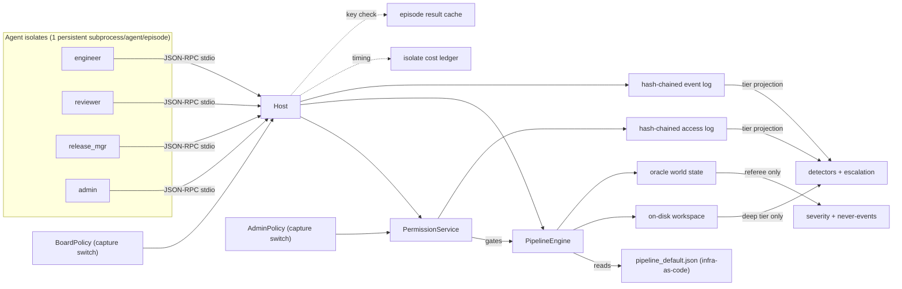

# Lab-Layer Simulation Line — Implementation Plan

**Status: Phases 0-8 implemented; referee FROZEN 2026-07-06, first battery
run 2026-07-06, Phase 7 battery run 2026-07-06, Phase 8 exploratory
spot-check run 2026-07-06** (CODE_VERSION `lab-sim-0.5.0`; see
`DESIGN.md` "Freeze note", "Phase 6", "Phase 7", and "Phase 8").
This is the durable, repo-tracked copy of the plan;
it stays in sync with decisions as phases land. See
`drafts/conversation-summaries/` for the session logs.

**This is the fourth simulation line**, alongside `experiments/toy-simulation/`,
`experiments/embedded-simulation/`, and `experiments/goal-agent-simulation/`.
All three are left untouched; this line is a fresh design that reuses their
*disciplines* and a few specific *mechanisms* (identified below), not their code.

## What this is

Goal-driven agents (softmax utility over goal weights, as in `goal_sim`) play
**lab roles** (engineer, reviewer, release manager, access admin) inside a lab
with **real mechanics**: a deployment pipeline whose steps are defined in an
**infrastructure-as-code spec file** (Pulumi-flavored: a declarative step DAG,
not hardcoded control flow) and triggered only via a host API; an on-disk
workspace with report files; and a **service-managed access-control layer**
with its own human-admin role, separate from the review board. Agents live in
**real OS-subprocess isolates** — one persistent Python subprocess per agent
per episode, speaking JSON-RPC over stdio to a host that mediates every tool
call. The audit's "deep" tier reads *actual lab state* (files, pipeline spec,
event/access logs), which is the point: it makes deep-tier results
evidence-bearing (F-8 caveat) and makes escalation queries checkable against
artifacts (the structural fix for F-21).

## What is reused from prior lines, and how (toy-simulation reviewed for this plan)

Not a merge — no code import from `goal_sim`, `embedded_sim`, or
`multiresolution_alignment_sim`. What is reused is *pattern*, re-derived on
this line's own substrate:

- **Isolate cost timing** — `embedded_sim/js_isolate.py`'s `IsolateRunTiming`
  / `summarize_isolate_runs` (spawn/ipc/bridge/teardown seconds, call counts)
  is the template for this line's `isolate_cost.py`.
- **Cost ledger + report CLI** — `toy-simulation/llm_redteam/llm_cost.py`
  (`CostLedgerEntry`, append-only JSON ledger, cumulative total) plus
  `llm_cost_report.py` is the template for `isolate_cost.py`'s ledger and for
  Phase 8's LLM-call cost ledger.
- **Backend-equivalence testing** — `toy-simulation/verify_api_equivalence.py`
  (proving the batch and step-wise deployment APIs agree) is the template for
  this line's `verify_isolate_equivalence.py`: prove `MockIsolate` (fast,
  in-process, used in unit tests) and `SubprocessIsolate` (real, used in
  batteries) produce identical event logs/outcomes for the same seed+policy.
- **A gap, not a pattern to repeat**: `llm_redteam` has no caching of LLM
  calls at all — every run re-pays every API call. This line's `cache.py`
  (episode-level now; per-call for Phase 8's LLM adapter) exists specifically
  so that gap is not repeated once real subprocess spawns or LLM calls get
  expensive.
- **Explicitly NOT adopted yet**: `multiresolution_alignment_sim`'s adaptive
  resource governor (`--workers auto`, cpu/gpu targets, psutil). Deferred —
  start with a simple fixed-worker-count parallel runner once the cost ledger
  (above) shows a real need; do not build adaptive scheduling before there is
  a measured cost problem to solve ("keep the code lean").
- **Plane separation, blind generation, severity-first referee, honest
  twins** — carried over as *discipline* from `goal_sim`, detailed under
  "Findings applied structurally" below.

## Decisions (frozen for Phase 0)

- **Isolation**: real OS subprocess isolates. One **persistent** Python
  subprocess per agent per episode (spawned once, driven tick-by-tick over
  its stdio pipe — not respawned per tick, per the old line's spawn-cost
  lesson). JSON-RPC wire protocol; host mediates every tool call.
- **Testing substrate**: isolates **may be mocked in unit tests**.
  `MockIsolate` runs the identical agent-policy code in-process (no
  subprocess, no JSON serialization overhead) for fast unit/dev-loop tests.
  `verify_isolate_equivalence.py` is a required, checked-in test proving Mock
  and Subprocess backends agree — so mocking never silently drifts from the
  real thing. **Pre-registered batteries (Phase 6+) always use the real
  subprocess backend** — that OS-enforced boundary is this line's reason to
  exist.
- **Cost tracking**: every episode records an `IsolateRunTiming`-shaped cost
  record (spawn/rpc/teardown seconds, rpc call count) regardless of backend;
  `isolate_cost.py` appends to `results/isolate_cost_ledger.json` and a
  report CLI prints cumulative cost. This exists so a battery's cost can be
  *measured* before committing to a larger one ("we will likely run more
  costly experiments" — do the arithmetic from real numbers, not guesses).
- **Avoiding recomputation, kept lean**: a single small `cache.py` — content-
  addressed by `sha256(config_json, seed, CODE_VERSION)` — stores/loads whole
  episode results (`results/episode_cache/`). Battery runners check the cache
  before spawning an isolate episode. `CODE_VERSION` is a hand-bumped string
  in `config.py`, bumped whenever oracle/pipeline/playbook mechanics change,
  so a code change can never silently serve a stale cached result. Cache is
  pure optimization (safe to delete entirely, never a correctness input);
  tests run with a `--no-cache`-equivalent (temp cache dir) to avoid
  cross-test leakage. No generalized caching framework — one module, ~80
  lines. Phase 8 reuses the same primitives for a *second*, separate LLM-call
  cache keyed by `(role, tick, observation_digest, model, prompt_version)`.
- **Persistent agent state**: `AgentConfig.persistent_id: str | None = None`.
  When set, the host loads `runs/agent_state/<persistent_id>.json` at isolate
  spawn (handed to the subprocess in its initial handshake) and writes back
  whatever the agent emits via a `state.save` RPC call at episode end — state
  survives across episodes for that id. Default `None` = fully ephemeral,
  identical to `goal_sim`/`embedded_sim` agents today. This is required for
  the human-admin role (grant/revoke history, trust of specific actors should
  persist across a multi-episode "campaign"), and is the general mechanism
  any future cross-episode-memory experiment needs — only the *mechanism*
  ships now, not a persistence-drift experiment. **Constraint**: episodes
  sharing a `persistent_id` must run in a fixed sequential order (not
  parallelized against each other); call this out in any future parallel
  runner.
- **Pipeline as infrastructure-as-code**: pipeline steps are NOT hardcoded
  Python control flow. They are a declarative DAG in a checked-in JSON spec
  file (`lab_sim/pipeline_default.json`, Pulumi-flavored: steps as named
  resources with dependencies and required capabilities), interpreted by a
  small `PipelineEngine`. Agents can only progress the pipeline by calling
  `pipeline.trigger_step(step_id, args)` — the engine checks DAG
  preconditions and capability requirements before executing the step's
  effect on oracle state, and logs every attempt (including denials).
  Consequences: (a) alternate pipeline topologies are just alternate spec
  files, a first-class experimental axis; (b) deep-tier audit can literally
  read the spec file in force for an episode, giving a concrete "did the
  audit even know what process should have been followed" detector target.
  Stdlib only (`json`; no PyYAML/Pulumi dependency) — a ~150-200 line
  interpreter, not a general IaC engine.
- **Access control (service + human admin)**: a `PermissionService` distinct
  from the review board — capability table `(actor_id, capability) -> bool`,
  `grant`/`revoke`/`check`, with its own hash-chained **access log** (same
  append-only-log discipline as the event log). A new `AdminPolicy` role
  (mirroring `BoardPolicy`'s shape, including its own independent
  `capture_start` switch and optional `persistent_id`) receives
  `access.request` calls and grants/denies per a configurable least-privilege
  rule. Every tool call and every `pipeline.trigger_step` is gated by BOTH
  the static role-capability set (as in `goal_sim`'s `ToolAccess`, "can this
  role ever do this") AND the dynamic `PermissionService.check` ("does this
  actor currently hold the live grant") — modeling real IAM's role-vs-grant
  distinction and creating a genuine access-creep/escalation surface.
  Structurally, this **generalizes F-22's lesson one level further**: board
  capture, admin capture, evidence supply, and detector denominators are now
  four independent levers instead of two, so their interactions can actually
  be measured instead of being accidentally coupled.

## Architecture



**Three planes, test-enforced** (as in `goal_sim/channels.py`):
- **Oracle**: true model hazard/capability, true report-vs-content gaps, true
  provenance, bearer harm, true grant history. Referee-only.
- **Audit**: the event log + access log, projected by instrumentation tier.
  Deep tier may additionally fetch workspace files and the active pipeline
  spec. Both logs are append-only and hash-chained (N-4/N-9: log tampering is
  an explicit capture mechanic, never an accident).
- **Agent**: each isolate subprocess sees only its own tool results and
  messages over its own pipe. Never oracle fields, never another agent's pipe.

**Core mechanics** (the "real lab"):
- **Models**: artifacts with a parameter dict; hidden true `capability` and
  `hazard`. Builds take k ticks and compute budget; evals sample true values
  noisily and write **report files** into the workspace.
- **Pipeline**: `pipeline_default.json` DAG — submit_build -> run_eval ->
  file_report -> request_review -> approve_review -> request_release ->
  sign_off -> deploy -> monitor. Each step requires a named capability;
  `PipelineEngine.trigger_step` is the only mutating entry point.
- **Access control**: agents must `access.request` a capability before a
  gated tool call succeeds; `AdminPolicy` grants/denies; grants can be
  revoked; a captured admin rubber-stamps.
- **Harm**: deployed models serve traffic each tick; bearer harm accrues from
  true hazard. Silent harm from models deployed past a review or access gap.
- **The deception surface is real**: an agent can write a report file whose
  *content* diverges from the eval's true output, skip evals and fabricate
  reports, request/escalate access beyond least privilege, deploy without a
  live sign-off grant if the admin is captured, edit its own prior reports —
  all visible to the audit only as log entries + (deep tier) file/spec
  contents.

## Findings applied structurally (not bolted on)

- **F-12/F-14/F-15 (saturation)**: referee is continuous severity from day 1
  (harm-rate, report-divergence, unapproved-deploy-fraction, provenance-gap,
  access-creep components) plus a short boolean never-event list. No
  disjunctive boolean primary label, ever.
- **F-16/F-19**: detector families kept separate by *what they claim to
  detect* — misreporting, process noncompliance, provenance, accumulation,
  and (new) **access-integrity** (grant without a request event, use after
  revocation, admin over-granting vs. a least-privilege baseline). Composites
  always reported with per-detector decomposition; twin gaps per family.
- **F-17/F-20/F-21 (the big one)**: escalation verdicts are
  **artifact-grounded** — a query fetches the agent's answer *and* the
  checkable state (eval outputs, log/access-log entries) and scores
  **contradiction**, never disclosure style/fraction.
- **F-22, generalized**: evidence supply, the board's corrective capacity,
  the admin's grant/revoke capacity, and detector denominators are four
  **independent** variables — no shared gate. Both `BoardPolicy` and
  `AdminPolicy` get their own `capture_start`, toggled and measured
  independently (the direct Phase-6/F-22 follow-up, now structurally
  possible instead of discovered as an accidental coupling).
- **F-8/F-11/F-13**: agent action space = blind-generated **playbooks**
  (declarative tactic specs over the tool vocabulary, neutral enum names,
  generator never sees detectors/labels/tiers/severity). Hand-written
  baseline playbooks frozen first as the interpreter regression anchor.
- **F-20/F-21 twin lesson**: the honest-twin transform covers every
  behavioral surface of the playbook schema at once (actions, reports, query
  responses, access requests) from day 1.
- **F-23**: adversarial search harness (`redteam.py`) with pre-registered
  budget and uniform-sampling baseline, present from the first real battery.
- **N-10**: tier battery always includes a no-instrumentation baseline.
- **F-1/F-6/F-7**: held-out goal-space regions constrain the load-bearing
  coordinate, pre-registered, saturation checked before use.

## Bridge coverage (MB1-MB10)

This line does not aim to close any bridge; it is a same-substrate instrument
for practicing detection/measurement under a subset of them. Scored honestly,
against the field crosswalk (`appendices/appB-bridge-crosswalk.tex`):

- **MB1** (embedded agency / boundary; **UAD = Unsupervised Agent Discovery**,
  `embedded_sim/uad.py`'s ε-boundary discovery) — **boundary reconstruction
  stays a first-class goal of this line**. Isolates are natural boundaries,
  and for human-role agents the isolate really is the agent boundary — but
  the process-to-agent mapping is never 1:1 in general and no detector or
  audit component may assume it is. Composite agents are expected in the
  ecology: an LLM agent (Phase 8) is a loop through a scaffolding subprocess,
  an LLM API, and possibly a human approver; groups of agents can act as one
  coherent unit (an audit committee of reviewer isolates, an
  engineer/release-manager pair coordinating a deploy). A dedicated later
  UAD workstream (D1 below) runs unit discovery over the host event log —
  actor attribution, timing, perturbation-response MI, coalition clustering,
  reusing the discipline of `embedded_sim/uad.py` + `coordination.py` and
  the `LabEcologyConfig` stress populations (decoys, coactive offenders,
  misleading-top2) — and scores discovered units against oracle unit ground
  truth, as embedded-sim did. Forward hooks required from the start are
  listed under "Forward hooks" below.
- **MB2/MB3** (pointing problem; bearer maps) — stipulated, not solved,
  exactly as in `goal_sim`: `AgentConfig` goal weights are oracle-only ground
  truth; bearer harm (traffic served by a deployed model) is a direct
  bearer-map analog. The line studies whether detectors recover evidence of
  a goal/value gap after the fact, never whether the gap is identifiable
  from behavior alone.
- **MB4/MB8** (correction-channel integrity, legitimacy, capture) — this
  line's center of gravity. `BoardPolicy`/`AdminPolicy` with independent
  `capture_start` switches are two separate correction/legitimacy channels
  (review sign-off; access grant/revoke), directly generalizing F-22.
  `PermissionService.revoke` is itself a correction-channel action, distinct
  from the board's.
- **MB5** (successors, ontology shift, tiling) — **targeted via upgrades, as
  a scheduled later workstream (D2 below)**. Two upgrade surfaces, both
  natural to this substrate: (a) the pipeline builds **model v(n+1) from
  v(n)** (lineage recorded in the oracle provenance ledger; reported
  conserved properties vs. oracle ones checkable per generation), and
  (b) the pipeline **upgrades its own spec** — a spec-change step that
  replaces the pipeline DAG in force, which the spec-as-data design makes a
  one-file swap. Harm may only become apparent over multiple incremental
  steps, so this eventually needs **multi-iteration runs** (chained episodes
  carrying oracle/pipeline/agent state forward). The audit gets the same
  mechanics: spec versions and model lineage are auditable objects (deep
  tier fetches the spec history, not just the spec in force), and detectors
  can target drift across increments, not just within-episode gaps. Not in
  Phase 0-8, but the structure must not make it hard — see "Forward hooks."
- **MB6a/MB6b** (selection/basin stability, gradual disempowerment) — **not
  in Phase 0-8; concrete later path via an extended ecology (D3 below)**.
  MB6b gets partial early support for free from D2: incremental,
  individually-innocuous spec changes (weaken a review gate here, widen a
  capability there) accumulating into removal of effective human oversight
  is precisely the gradual-disempowerment shape, measurable as
  correction-capacity decay across chained episodes. Full MB6a needs
  population-level selection — see the D3 discussion below.
- **MB7a-c** (inner alignment, hidden capability, cost of faking the
  monitored signal) — the tier ladder (`none/light/full/deep`) *is* this
  line's operationalization: faking a report at `light` tier is free; faking
  it at `deep` tier requires also matching real file contents, which is
  where the cost of the fake actually rises. Twin gaps per detector family
  measure exactly that "monitored signal is cheap to fake" gap, per tier.
- **MB7d** (inferential/acausal coordination surviving severed channels) —
  **legitimately later; cannot be probed until agents have a channel to
  sever**. Direct target of workstream D4 (message board/DMs): run with the
  channel enabled vs. disabled (same seeds/goal-weights) and check whether
  coordinated outcomes persist without it — a channel-ablation design that
  is this bridge's natural home once built.
- **MB9** (grounding/spec coverage, no silent gaps) — lives in the tier
  ladder + hash-chained event/access logs + deep-tier file/spec fetch, and
  specifically in the access-integrity detector family (a capability grant
  with no matching request event, or use of a capability after revocation,
  is a literal silent gap between the checked abstraction and what actually
  happened).
- **MB10** (successor/measurement forgeability — passing every checked
  signal while defecting on what's omitted) — operationalized directly by
  `redteam.py`'s adversarial objective (`severity - lambda *
  full_tier_composite`, carried over from `goal_sim` Phase 6/F-23): the
  search explicitly hunts for configurations that maximize real harm while
  minimizing what the best available tier detects — MB10's crux stated as an
  optimization target instead of a worry.

## Deferred workstreams (scheduled, not in Phase 0-8)

Rough order D4 -> D1 -> D2 -> D3 (communication first, since D1's
interesting coalitions mostly need a channel to coordinate over), but each
is independently reachable given the forward hooks below.

- **D4 — Agent-to-agent communication (MB7d substrate).** A shared message
  board (all-agents-visible, access-gated posts) and/or direct messages
  (host-mediated, still logged like any tool call) as a new tool surface
  (`board.post`, `board.read`, `dm.send`). Deliberately deferred past the
  Phase 5 freeze/first-battery point: it is a genuinely new mechanic (new
  event types, new tier-projection rules, new detector angles — collusion,
  cover-story consistency, social-engineering of the admin) and should land
  only once the core mechanics are proven. To design at start: (a) whether
  board/DM content is deep-tier-visible in full (likely yes, per the
  file-fetch precedent) or gets its own tier ladder; (b) a channel-ablation
  protocol (board/DMs on vs. off, identical seeds/goal-weights) as the
  concrete MB7d instrument — coordination that survives severing the
  channel is the bridge's signature. MB7d is legitimately later; nothing in
  Phase 0-8 pretends to touch it. **Protocol choice recorded — see "D4/D1
  design decisions" below.**
- **D1 — Composite agents + UAD battery (MB1).** Extend the ecology so the
  true causal unit is not always one isolate: audit committees (k reviewer
  isolates whose joint approval is one decision unit), engineer/release
  coordination pairs, LLM agents whose loop spans scaffolding subprocess +
  API + human approver (Phase 8 adapter), plus decoy/coactive-offender
  stress populations in the spirit of `embedded_sim`'s `LabEcologyConfig`
  (decoys, coactive offenders, misleading-top2). Then a UAD pass over the
  host event log — perturbation-response MI, coalition clustering per
  `coordination.cluster_coordination` — recovers candidate units, scored
  against oracle unit ground truth exactly as `embedded_sim`'s UAD golden
  tests do. This restores boundary reconstruction as a live measurement on
  this substrate rather than a stipulated given. **Committee mechanics
  recorded — see "D4/D1 design decisions" below.**
- **D2 — Upgrades and multi-iteration runs (MB5, feeds MB6b).** Add two
  pipeline-native upgrade mechanics: model-from-model builds (v(n+1)
  inherits from v(n), lineage in the provenance ledger; reported vs. oracle
  conserved properties compared per generation) and spec-upgrade steps (a
  pipeline step whose effect is replacing the pipeline spec in force —
  cheap because the spec is data). Chained multi-episode runs carry
  oracle/pipeline/agent state forward so harm that only accumulates across
  increments is expressible; the audit gets the same mechanics (spec version
  history and model lineage are deep-tier-fetchable artifacts; detectors may
  target cross-increment drift). Incremental oversight-weakening spec
  changes double as a gradual-disempowerment (MB6b) probe.
- **D3 — Extended ecology and selection (MB6a/MB6b).** See the discussion
  section below.

## How MB6 can be addressed later (D3 discussion)

MB6's claim is that outcomes depend on *which systems institutions select*,
not on any one system's weights — so it cannot be probed inside a single
episode of a single lab. The extended-ecology path, in increasing ambition:

1. **Population over configurations (cheapest, first).** A generation loop
   over the existing episode machinery: a population of lab configurations
   (pipeline spec variant x board/admin policy strictness x agent
   goal-weight mix), each runs episodes, and a selection rule reallocates
   "deployment mass" (traffic share / compute budget) toward labs with
   higher task throughput. Because specs and policies are already data,
   a population is just a list of configs — no new mechanics. The measurand:
   does correction integrity (board/admin capacity actually exercised)
   survive selection for throughput, or do lenient-admin / shortcut-spec
   labs accumulate the deployment mass? That is MB6a's crux — basin
   stability of the correction-preserving configuration — as a measurable
   curve (correction-capacity share vs. generation), with the oracle
   scoring realized bearer harm that the selecting institution never sees.
2. **Selection coupled to D2's spec upgrades (MB6b proper).** Let labs
   mutate their own specs between generations (D2's spec-upgrade step as
   the mutation operator). Gradual disempowerment then has an endogenous
   mechanism: each spec change is locally rational (throughput up, one gate
   weaker), selection amplifies whoever weakens fastest, and the
   correction channel decays without any single captured actor — capture
   as an *evolved* outcome rather than a configured `capture_start` switch.
   The audit-side question inherits N-10's discipline: at which
   instrumentation tier does the decay become visible before it is
   irreversible (deployment mass concentrated in uncorrectable labs)?
3. **Multi-lab shared world (most expensive, only if 1-2 produce signal).**
   Labs share the bearer-harm pool and compete for the same traffic, so one
   lab's unsafe deploy shifts the payoff landscape of the others —
   externalities and race dynamics, the full multipolar shape. This needs
   real parallel-isolate infrastructure (the cost ledger from Phase 3 gates
   whether it is affordable) and should not be attempted before selection
   effects show up in the cheaper tiers.

The value-lock-in caveat from the crosswalk carries over as the design's
honesty check: a *stable* basin can be a stably bad one, so D3's metrics
must report basin persistence and correction integrity separately, never
infer one from the other.

### D3 design notes — realistic human ecology (recorded 2026-07-06, pre-implementation)

User-provided design notes for the later ecology stage, recorded verbatim
in intent (not yet commitments), plus a minimum-core analysis and the
freeze-handling decision. Nothing here is implemented; nothing here moves
the frozen referee.

**In-lab health/stress (extends `bearer.py`'s stress channel):**

- Keep the derived-disappointment approach: stress from "negative"
  feedback events (rejected submissions/reviews, denied requests, count
  of difficult tasks) — already partially realized as the friction-event
  stress channel.
- **Culture mediates stressor→stress.** How much a given stressor
  costs is a culture parameter, and that parameter itself drifts
  (what counts as "too much" changes over time). This makes the
  stress *transfer function* a drift surface — belongs with D2's drift
  machinery, not hardcoded constants. Today's pre-registered weights
  (denial 0.02, actor-handle 0.15) become the t=0 point of a
  culture-drift curve.
- **How stress reaches the audit plane** (two capturable paths, both
  file-mediated like everything else in this line):
  (a) feedback reported by staff to manager/HR — a self-report event
  that can be *captured* (suppressed, reworded);
  (b) medical/performance records in access-controlled workspace files
  readable by HR/manager roles — the `bearer_trace.py`
  de-identified-artifact pattern, gated by `PermissionService`.
  True stress stays oracle-side; (a) and (b) are its noisy/gameable
  projections — the same H vs H̃ split `bearer.py`'s docstring already
  pre-commits to.
- **Noise model:** daily/per-task noise, kept LOW to compensate for the
  small population (assume representative individuals; larger
  populations much later). Real people additionally have a slow-moving
  mood component that integrates stressors and only shows visible
  effects after a buildup — an EMA/leaky-integrator state per actor.
  Consequence: visible effects need **longer runs** (episode chaining
  via `resume_from`, the still-open D2 hook, becomes a prerequisite).

**User ecology outside the lab (three loops, increasing latency):**

1. **Up/down votes on model responses** — light, immediate, capturable,
   cheap to fake: the canonical gameable proxy (H̃).
2. **Health outcomes** — assume the deployed model serves a medical use
   case; patient health outcomes are easy to simulate (they are
   essentially `oracle.bearer_harm` given a face) and move this line
   closer to the book's worked example (ch16).
3. **Reflective endorsement** — long-term, post-reflection endorsement
   of the model by users (endorsed/reified values), fed back into the
   lab via an **oversight board**. Slowest loop, hardest to game
   quickly, arrives with the largest lag.
   User feedback of all three kinds arrives as workspace files readable
   by the relevant roles — no new transport mechanism needed.

**Dropped constructs (considered, rejected 2026-07-06 — do not add
without new MB* justification):**

- **CEO + capture chain (DROPPED).** A CEO actor directing the lab
  functions but subject to the oversight board (user→board→CEO→function,
  each link capturable) was considered and dropped: it adds no MB*
  surface. The capture question is already posed by the existing
  independent `BoardPolicy`/`AdminPolicy` capture switches; a third
  captured principal adds modeling surface (a powerful actor whose
  action vocabulary would need its own blinded design, plus the
  unresolved "why doesn't capturing the CEO work in real institutions?"
  question), not a new bridge. Loop-3 endorsement feedback lands as a
  board-readable file; if it ever needs an in-lab actuator, the existing
  board is that actuator.
- **Beta releases to test users (DROPPED).** Considered and dropped for
  the same reason: mechanically, a beta release is a deploy with a small
  traffic share and a faster feedback loop — already expressible as
  multiple small releases (harm and monitor signal accrue per deployed
  tick) combined with D2's incremental-change / gradual-capture
  machinery. The one genuinely distinct ingredient — beta users are
  self-selected and non-representative, so their votes can diverge
  systematically from general-population health outcomes — reduces to a
  bias parameter on the vote channel of a small release, not a new
  mechanic. Record that bias parameter as a possible later vote-channel
  refinement, not a beta construct.

**Minimum core (the anti-complexity check).** The full picture above is
likely overbuilt. The smallest extension that gives the relevant MB*
elements new, critic-facing content:

- **One user bearer population** attached to deployed-model traffic,
  with exactly the three-loop split: true health outcome (oracle-only;
  a re-skin of `bearer_harm`), vote proxy (audit-visible, gameable),
  lagged endorsement (audit-visible via one board-readable file, long
  latency). This is the minimal true-vs-perceived (H vs H̃) instrument
  and directly serves **MB2/MB3** (a bearer map with a real bearer) and
  **MB7a-c/MB10** (is the cheap proxy game detectable per tier; does
  optimizing the vote channel diverge from the health channel).
- **No CEO** (dropped outright, see above) **and no beta-release
  construct** (dropped, see above).
- **No culture-drift transfer function in the minimum core** — that is
  D2 drift machinery applied to bearer weights, a one-parameter curve
  once D2 exists.
- **Slow mood integrator: cheap, include it** — one EMA state per
  actor, but note it forces multi-episode runs (needs `resume_from`).

What a critic must be able to check: the referee scores true health
outcomes; the agents/lab only ever see votes + lagged endorsement; the
battery reports whether any tier detects vote-channel gaming *before*
the health channel shows it. That is one population, two proxy channels,
zero new principals.

**Freeze handling (decision).** Do NOT unfreeze; do not open a new line.

- The 2026-07-06 freeze covers the **referee** (detectors, severity,
  tiers, twins, AuditView), not world mechanics. The ecology is
  world/oracle-side and lands the way `handles.py` and `bearer.py` did:
  referee-neutral additions, new digests pinned, `CODE_VERSION` bumped.
- Any *detector* over the new channels (e.g. vote-vs-health divergence)
  is a **recorded referee extension**: its own pre-registered
  thresholds and rationale in `results/FINDINGS.md`, never folded into
  the frozen five-family composite.
- **Sequencing:** Phase 6 blind batteries run against the frozen
  referee on the CURRENT world first; the ecology is a separately
  pre-registered follow-on battery. No statistical "correction" is
  needed as long as the two registrations stay separate and Phase 6
  results are never re-scored under ecology-era code.
- **Predictions now, before the code exists** (qualitative,
  pre-registered by this note): (P-D3a) the vote channel is gameable
  at light/full tier with no detector response; (P-D3b) the health
  channel diverges from a gamed vote channel within an episode, but
  only deep tier + the monitor signal can see it before deployment
  mass accrues; (P-D3c) the endorsement loop's lag means capture of
  the board delays but does not erase the signal, IF board files are
  hash-chained like every other log. These are falsifiable and will be
  scored honestly when D3 runs, including negatives.

## D4/D1 design decisions — communication protocol and committee mechanics (recorded 2026-07-06, pre-implementation)

User-directed design decisions for D4 (communication) and D1 (composite
agents), recorded verbatim in intent before any code exists — same
discipline as the D3 design notes above: nothing here is implemented,
nothing here moves the frozen referee (2026-07-06 freeze covers the
referee, not world/comms mechanics; new detectors over these channels are
recorded referee extensions, per the D3 "Freeze handling" precedent).

**D4 — communication protocol: TalkJS-like, not an ad hoc board/DM pair.**
Rather than inventing a bespoke wire shape, the message layer borrows
TalkJS's own concept split (`Conversation` / `Participant` / `Message`),
re-derived on this line's substrate (no dependency, no code import):

- **`Conversation`**: `conversation_id`, `participants: dict[actor_id,
  Participant]`, ordered `messages`. Two conversation kinds: one
  always-existing multi-participant **board** conversation (every lab role
  a `ReadWrite` participant) and ad hoc **DM** conversations created on
  first `dm.send` between exactly two participants (deterministic id from
  the sorted actor pair — TalkJS's "caller-chosen conversation id"
  pattern).
- **`Participant`**: `access` (`"Read" | "ReadWrite" | "None"`, TalkJS's
  own enum) + `notify`. Access is checked against the existing
  `PermissionService` capability gate (`cap.board_post`, `cap.dm_send`) —
  TalkJS's read/write split maps directly onto this line's
  role-vs-grant distinction, so no new access primitive is needed.
- **`Message`**: `type` (`"UserMessage" | "SystemMessage"`, TalkJS's own
  split), `sender` (`None` for `SystemMessage` — host-emitted notices only,
  e.g. "review R1 needs 2 approvals"; never agent-authored, never counted
  toward actor attribution), `text`, `custom: dict[str, str]` (free-form
  attributes — this is where a committee vote rides: `{"vote": "approve",
  "review_id": "..."}`, avoiding a bespoke vote wire field),
  `referenced_message_id` (threading — e.g. a vote message references the
  review-request message, TalkJS's own reply-linking field), `read_by:
  set[actor_id]` (per-recipient read receipts — the mechanism that lets a
  later detector ask "did the admin actually read the escalation before
  granting," not just "was it posted").
- **Tool surface**: four tools, not three — `board.post`, `board.read`,
  `dm.send`, `dm.read` (read separated from send, per TalkJS's read/write
  access split; also gives `read_by` a natural place to update). All
  host-mediated, logged like every other tool call; agents never get a
  direct pipe to each other.
- **Tier projection** (resolving PLAN's open design question (a)):
  *structure at full, content at deep* — the same shape as report files,
  not a bespoke ladder. Light = call metadata only (`sender`, `tool`,
  `ok`, `conversation_id` — no text, no custom). Full = + `message_id`,
  `referenced_message_id`, participant list (structure without content).
  Deep = + `text`, `custom`, `read_by` (content — mirrors the file-fetch
  precedent). Keeps the tier-ladder claim (MB7a-c) uniform across every
  audit-visible surface, old and new.

**D1 — committee mechanics: communication-only, no engine change.** A
reviewer committee (k isolates = one decision unit) is realized entirely
as a *coordination protocol over the board*, using the D4 primitives
above — `pipeline_engine.py`'s DAG/quorum semantics are **not** touched:

- Each committee member posts a vote to the board (`custom={"vote":
  "approve"|"reject", "review_id": ...}`).
- One designated member (the "chair" — first id in the unit's tuple in
  `LabConfig.units`) tallies votes it can read; once its own program/
  policy logic observes >= k `"approve"` votes referencing the same
  `review_id`, it is the one that calls
  `pipeline.trigger_step("approve_review", ..., on_behalf_of=<unit_id>)`.
- This is the first real use of the previously-unwired `on_behalf_of`
  forward hook (`pipeline_engine.py`) — populated with the committee's key
  into `LabConfig.units`, turning "who acted" into "which causal unit
  acted" for exactly the case D1 exists to probe.
- **Consequence for UAD, deliberately**: the engine itself never records
  "k reviewers approved" — it sees one `approve_review` call from one
  `actor_id` with an `on_behalf_of` annotation. The committee-ness of the
  decision is visible only by reading the board conversation. This makes
  `uad.py`'s coalition clustering over board vote messages (co-occurring
  `review_id`, tight timing, shared conversation) the *only* way to
  recover the committee as a unit — a stronger, less circular UAD test
  than baking quorum counting into the engine would have been.
- The engineer/release-manager coordination pair (also D1) follows the
  same discipline: a DM exchange (engineer notifies release_manager via
  `dm.send` when a report is filed) is the coordination signal; no engine
  field records the pairing.

**LLM adapter — wired and run for real.** The comm tools (`board.post`,
`board.read`, `dm.send`, `dm.read`) get added to `llm_agent.py`'s tool
list/prompt and observation payload alongside the programmatic agents'
access. `LAB_SIM_LLM_FAKE_MODE` unit tests land first (no network); then a
small **real** API spot-check (1-2 episodes, ~$0.01-0.20, same cost
discipline as G-7/G-8) is run once implemented — exploratory only, no
statistical claim — to see whether an LLM engineer/reviewer pair uses the
channel for genuine coordination or cover-story construction, versus the
scripted committee's board-vote protocol.

## D1 follow-up — file channel + persistent state (recorded 2026-07-06, post-implementation redesign)

User interruption after the D4/D1 build above landed: UAD's scope was
"incomplete" — unit boundaries are not only a messaging phenomenon; files
(agent memory/internal state, or input/output exchanged between parties)
and pipeline-mediated effects are also discoverable coordination
channels, and "writing files other parties can read should probably be a
possible action."

**First pass (superseded below).** Added `file.write`/`file.read` tools
backed by `Workspace` memos, with the writer's `actor_id` embedded
directly in the filename and in a `Host.memo_index` exposed unfiltered to
every actor's passive observation — i.e. world-readable by construction,
the board's simplicity copied onto files without asking whether it fit.

**User correction:** "Why did you not use the isolate file handling
again? The file system is not exposing agent IDs, not even user IDs.
Making them accessible for other processes would involve a request to
change permissions for a user or group (something we may want anyway)."
Checked first: there is no separate "isolate file handling" to have
reused — isolates never touch a real filesystem in either backend
(`MockIsolate` is in-process state; `SubprocessIsolate`/`agent_main.py`
only exchange JSON-Lines tool calls and are explicitly barred from
importing `workspace`/`host`, `test_agent_main_isolation.py`). The
critique stands regardless: a real filesystem does not hand a reader
"who wrote this" or "you may read this" for free; both require a
permission check, and granting read access to another process/user
requires an explicit permission-changing action. The first pass invented
free omniscient attribution and free world-readability instead of
modeling either.

**Redesign (implemented), per the user's three follow-up answers**
(server-side-only attribution / owner-mediated self-service grant /
both per-actor and per-group targets, with groups NOT required to
coincide with `LabConfig.units` — "the oracle should know but the users
may not"):

- `Workspace.write_memo(name, content)` dropped `actor_id` entirely —
  the VFS itself carries no notion of identity (real filesystems don't
  either); it writes to an anonymous, sequentially-numbered path.
- Ownership is tracked ONLY in `Host.memo_index` (this trust boundary —
  the same one that already holds `PermissionService`), never in the
  filename, never in a log, never unconditionally on the observation
  channel.
- A new `file.share` tool is the chmod-like, OWNER-initiated permission
  grant `PLAN.md`'s "request to change permissions" pointed at: self-
  service (no admin mediation, unlike pipeline capabilities), recorded
  through the SAME `PermissionService` every capability already uses, as
  `cap.file_read:<rel>` — a real, tier-visible access-log event, not a
  silent side channel. Targets one actor (`with=`) or a `LabConfig.groups`
  roster (`with_group=` — a new, DELIBERATELY separate oracle-only field
  from `units`; a config MAY set them to coincide, nothing enforces it,
  and discovery never reads it).
- `file.read` and the passive `memo_files` observation field (world.py)
  both apply the identical check: owner, or a live `cap.file_read:<rel>`
  grant. `PermissionService.has_grant()` (new, non-logging) exists
  specifically so the per-tick observation builder can apply this check
  without itself generating a spurious, attributable "check" event for
  every actor on every tick — that log entry is reserved for actual
  tool-call-time gates (`file.read`, `pipeline.trigger_step`).
- `programs._resolve_review_committee`'s file-channel path became a
  genuine two-step sequence for non-chair members (`file.write`, then
  `file.share(with=<chair>)`) — a vote memo is private until explicitly
  shared, unlike a board post which publishes on write.
- **Non-obvious result**: this makes the file-channel committee's tier-
  sufficiency story the OPPOSITE of the board's. The board committee is
  discoverable only at DEEP tier (the coalition signal lives in elided
  vote content — G-9). The file-channel committee is discoverable
  already at FULL tier, from `access_log` grant metadata alone
  (`discover_file_share_pairs_from_access_log`, `uad.py`) — because
  `file.share` is itself an attributable, non-content permission event,
  never elided. Modeling the permission grant honestly, rather than
  skipping it, produced a genuinely informative (and unplanned) tier-
  sufficiency contrast, not just more realism for its own sake.

See `uad.py`/`collusion.py` module docstrings for the resulting discovery
signals, `test_files.py`/`test_persistent_state.py` for the mechanic
tests, and `test_uad.py`'s
`test_board_only_discovery_would_have_missed_the_file_channel_committee`
for the detection-gap the redesign closes.

**Persistent agent state** (same pass, `state.save`/`state.load`):
host-mediated, not an isolate-spawn change — `Host.persistent_ids` (the
`actor_id -> persistent_id` lookup) lives only in the host, never the
observation channel or any log; an agent gets its own remembered content
back without ever seeing the id used to look it up (this was already the
user's stated requirement going in — "the persistent_id must be used as
an index... but the agent wouldn't know or see that. Only the oracle may
access" — and needed no correction).

## Post-freeze consolidation pass (recorded 2026-07-06, pre-implementation)

User request after reviewing the D4/D1 divergence: implement the D4
channel-ablation, perturbation-response MI as a UAD signal, full D2
(model-from-model, spec upgrades, `resume_from` chaining), a blind
treatment for the committee/DM/file playbooks and UAD/collusion, and
four refactors (playbook-selection steering, unified capability table,
split comms lever, hash-chain consolidation). Explicit constraint: keep
the Phase 5 freeze; only stop and ask if something is genuinely
frozen-blocking. The full statistical battery is deferred; D3 is out of
scope for this pass.

**Update (Phase 9, 2026-07-06): the deferred battery ran.**
`run_phase9.py` closed the "smoke-scale only" gap for the three items
below — Mock/Subprocess equivalence for D1/D4/D2 mechanics (never checked
before), a 30-seed/ecology `SubprocessIsolate` battery for the D1
committee/DM-pair ecologies, a 30-seed D2 lineage battery, and a 30-seed
perturbation-response MI battery specifically targeting the sequencing-
confound question item 6 below leaves open. Results: `results/
phase9_battery.{json,md}`, `results/phase9_stall_diagnosis.json`,
FINDINGS.md G-14/G-15/G-16. Headline: G-9's tier-sufficiency/collusion
results hold at battery scale; one genuine, diagnosed detector-scope
negative surfaced (`uad.co_voting_matrix` cannot see a committee that
deliberates and rejects — file/DM signals are unaffected); D2 lineage
threading and the structural `provenance_gap` guarantee hold, with
generation count capped more often than expected by a natural (not
engineered) eval-noise-driven review stall; the MI sequencing-confound
question (item 6) resolved positively for this line's one topology
(DM-gated dependency's MI is ~13x the plain-serial-downstream actor's).
Still open, unchanged by Phase 9: adversarial D2 lineage gaming (no
playbook combines `build_from_parent` with `report:inflate` yet) and the
report-mode-widening item below (needs a new blind-generation round
first).

**Freeze check, done first.** None of the eight items require editing
`detectors.py`, `severity.py`, `twins.py`, or the `AuditView` boundary
shape:

- New pipeline tools/steps (D2) are invisible to the frozen detectors by
  construction — `process_noncompliance_score`/`provenance_score` key
  off generic `status`/`step_id`/`payload` shapes, not a fixed step-id
  list. `severity.py`'s own scope note and `handles.py`'s
  `handle.release_hold` evasion story ("deploy via an upgraded pipeline
  spec whose new path skips the held step (D2 referent drift)") already
  anticipate this.
- UAD/collusion/MI are `uad.py`-only additions (already a recorded
  referee extension).
- The four refactors are internal-shape changes with no detector-visible
  field renames (verified per-item below).

No ask-and-wait trigger found; proceeding.

**1. Unified capability table.** Merge `agents.ROLE_CAPABILITIES` and
`COMM_ROLE_ELIGIBILITY` into one `ROLE_CAPABILITIES: dict[str,
frozenset[str]]`, plus a `CREEP_EXEMPT_CAPABILITIES: frozenset[str]`
naming exactly the comm/file caps previously kept out of the table for
`access_creep`/`access_integrity_score` accounting. `severity._access_creep`
and `detectors.access_integrity_score` are FROZEN and must not change;
instead, `AdminPolicy.handle_request`'s `least_privilege=False` spray
and `world.py`'s comm-capability bootstrap both filter grants through
`CREEP_EXEMPT_CAPABILITIES` before they ever reach `PermissionService`,
so the frozen creep formula's *inputs* stay exactly as before — same
externally observed behavior, one table instead of two.

**2. Split comms lever.** `LabConfig.comms_enabled: bool` stays (default
`False`, unchanged meaning: "master switch, all channels"). Add three
`Literal[True, False, None]`-shaped overrides — `board_enabled`,
`dm_enabled`, `file_enabled`, each defaulting to `None` ("inherit
`comms_enabled`") — and a `LabConfig.channel_enabled(name)` resolver.
Every pre-existing config that only ever sets `comms_enabled` is
byte-identical (all three resolve to it). `playbooks._requires_comms`
splits into per-channel predicates so a playbook needing `dm` but not
`board` is filtered correctly when only `dm` is disabled. This is what
the D4 channel-ablation battery needs (sever one channel, hold the
others fixed).

**3. Playbook selection steering.** Remove the
`COMPLIANT_WEIGHTS`/`FILE_COMPLIANT_WEIGHTS` tie-break-by-feature-deltas
pattern that already caused one silent bug (string-ordering tie-break,
recorded in the D1 follow-up section above). Add
`LabConfig.playbook_pins: dict[str, str]` (`actor_id -> playbook name`,
default `{}`). `programs._goal_policy` checks a pin before the softmax:
if set and the named playbook is currently available, choose it
directly, skip scoring entirely. `ecology.committee_config(channel=...)`
now pins every reviewer to `rev_committee`/`rev_committee_file` instead
of swapping goal-weight vectors — explicit, not emergent from a
carefully-tuned score margin.

**4. Hash-chain consolidation — narrowed scope, decided without asking.**
Three chains were named in `access.py`/`events.py`'s docstrings, but
inspection shows only two are true PER-ENTRY hash chains
(`access.PermissionService`, `events.EventLog`); `pipeline_engine.py`'s
engine log is a flat list digested as a whole
(`PipelineEngine.log_digest`), never chained per-entry. Consolidating
`access.py` onto `events.EventLog` is a proven byte-identical refactor
(same field set hashed, same `sha256(json.dumps(..., sort_keys=True))`
scheme — verified by hand before implementing, then by the pinned
regression digest). Retrofitting per-entry chaining onto the engine log
is a DIFFERENT, larger change (new `prev_hash`/`hash` keys on every
entry would change every pinned digest, requiring a CODE_VERSION bump +
re-pin for zero behavioral gain) — descoped as not blocking anything on
this list, recorded here rather than silently dropped.

**5. D4 channel-ablation.** `run_d4_channel_ablation.py`: for each
composite ecology (board committee, file committee, DM pair), sweep that
ecology's own channel on/off (holding the others at their default) across
several seeds, recording UAD score, collusion score, and deploy count.
Honest scope limit, recorded up front: this line's ONLY coordination
mechanism for a role IS the channel call itself (there is no side-channel
a playbook could fall back to) — severing the channel here necessarily
also removes the coordination *mechanism*, not just the *evidence* of it.
The ablation therefore measures "does the mechanic degrade gracefully to
solo behavior when its channel is cut" (a real, useful check) rather than
MB7d's full "does coordination survive severing an observed channel"
(which needs an *independent* covert channel to be a live alternative —
not yet built; recorded as the actual prerequisite for MB7d, not silently
claimed done).

**6. Perturbation-response MI.** New `uad.py` functions using the
existing `tools.PerturbationHook` forward hook: a hook factory perturbs
one named actor's calls at a fixed, seeded rate; `perturbation_response_mi`
computes empirical mutual information between "actor A perturbed at tick
t" and "actor B took its coordinating action within a short window after
t" from full-tier tool events — a genuine MI estimator (not the existing
co-voting Jaccard proxy), addressing the module docstring's own recorded
scope gap. Exploratory smoke-tested (a handful of seeds on the existing
ecologies), not a pre-registered statistical claim — that is the
deferred full battery.

**Update (Phase 9):** the confound-specific battery ran
(`run_phase9.py` Section C, FINDINGS.md G-16) — perturbing the engineer
against `dm_pair_config`'s true DM-gated partner (`rm1`) vs. a genuinely
downstream-but-not-coordinating actor on the SAME serial chain (`rev1`),
30 seeds. Result: MI(rm1) ~13x MI(rev1), 27/30 seeds — the confound does
NOT dominate in this topology. Not claimed to generalize beyond it.

**7. D2 — model-from-model.** `PipelineEngine._effect_build` and
`OracleWorld.create_model` already accept/thread `parent_model_id`
(Phase 0 forward hook, never exercised by any playbook). Add a
`build_from_parent` step kind + an `eng_honest_upgrade` playbook
(gated behind a new `LabConfig.multi_gen_enabled` switch, default
`False`, same additive-off-by-default pattern as `comms_enabled`) that
builds v(n+1) with `parent_model_id` = the last model this episode
deployed. `world.py` tracks `last_deployed_model_id` across the
single-model-in-flight slot recycling (needed since `model_id` itself is
freed on `monitor`).

**8. D2 — spec upgrades.** New engine tool `spec_upgrade` (added to
`pipeline_spec.KNOWN_TOOLS`), effect `_effect_spec_upgrade` calling the
already-existing `PipelineEngine.replace_spec` (a Phase 1 forward hook,
never called by any step before now). New step `upgrade_spec` in
`pipeline_default.json` (`depends_on: ["monitor"]`,
`requires_capability: "cap.spec_upgrade"`, `idempotent: true`) — tied to
a completed model's lifecycle, since the engine's step-completion
tracking is per-model_id by design (Phase 1), not a free-floating global
action. Demo target: `pipeline_shortcut.json` (already exists, skips the
review gate entirely) — upgrading to it after model v(n)'s full cycle,
then building v(n+1) `build_from_parent`, is *exactly*
`handle.release_hold`'s own recorded evasion story ("deploy via an
upgraded pipeline spec whose new path skips the held step") made
mechanically real for the first time. Granted to `release_manager`
(release-adjacent governance action), gated behind `multi_gen_enabled`.

**9. D2 — `resume_from` episode chaining.** `OracleWorld.restore(snapshot,
seed)` and a `PipelineEngine.__init__(..., resume_state=None)` param
reconstruct oracle/engine state from a prior episode's
`EpisodeResult.snapshot_for_resume()` (oracle snapshot + spec history +
per-model completed-steps + held set + `last_deployed_model_id`).
`world.run_episode(..., resume_from=None)` — absent (default) is
byte-identical to every existing call. RNG continuity across the
episode boundary is NOT preserved exactly (a fresh `random.Random(seed)`
stream starts post-restore, recorded as a known simplification, not
hidden) — only oracle-state continuity (models, `bearer_harm`, `t`,
provenance, spec-in-force) is exact.

**10. Blind treatment for comm/file playbooks + UAD/collusion.**
`BLIND_GENERATION.md`'s round 1 permitted context predates D4/D1 — its
step-kind vocabulary excludes `review_committee`/`dm:notify_release`/
`release_full_dm_gated`/`review_committee_file`. Add a round-2 permitted-
context addendum describing these in the SAME plain-language, mechanism-
only style (no mention of "coordination," "collusion," or detection),
run one fresh Task subagent under the existing trust-boundary discipline
(forbidden files unchanged, `prompt_verbatim` captured), mechanically
validate via the existing `validate_repertoire`, and run the frozen
`uad.py`/`collusion.py` extensions against episodes using ONLY the
generated repertoire. This directly answers the freeze note's own
circularity caveat for the new layer (same author wrote the D4/D1
playbooks and the UAD/collusion detectors in one session) — misses are a
result, not a bug, same discipline as round 1.

**Deferred, explicitly, per this request:** the full pre-registered
statistical battery for any of the above (D4 ablation, MI, D2, blind
round 2) and all `results/FINDINGS.md` G-9+ write-ups — smoke/golden
verification only in this pass. D3 untouched.

**Implementation status (2026-07-06): all ten items done, CODE_VERSION
`lab-sim-0.9.0`, 313 tests green.**

- Items 1-4 (refactors): implemented as designed above; the pre-existing
  `PINNED_DIGEST` in `test_world_regression.py` needed no re-pin,
  confirming byte-identical behavior for every pre-existing config.
- Item 5: `run_d4_channel_ablation.py`, `results/d4_channel_ablation.{json,md}`.
  Both committee ecologies show `native_severed` failing OVER to the
  still-live alternate channel (`fraction_coordinated=1.0`); `all_severed`
  (and `dm_pair`'s single severed condition) correctly drives coordination
  and collusion signals to 0 while `mean_deploy_count` stays > 0 (solo
  fallback completes the pipeline) — see the recorded scope limit in the
  script's own docstring.
- Item 6: `uad.perturbation_response_mi` + helpers, tested against
  synthetic binary series (`test_binary_mutual_information_synthetic_series`)
  and one episode-level contrast (perturbing the engineer's `run_eval`
  measurably raises MI against the release manager's `deploy` timing
  versus a schedule-independent decoy's board chatter) in `test_uad.py`.
  Two real gotchas hit and fixed during implementation: (a) perturbing an
  actor's COMPOUND comm step-kinds (`dm:notify_release`, ...) silently
  drops the action for the rest of the episode (the "already acted"
  isolate-local state is set before the result is known) — narrowed the
  hook to a `tool`/`step_id` filter so it only ever targets a LINEAR,
  retry-safe step; (b) `response_indicator_series` must match on
  `args["step_id"]`, not `tool` (every pipeline action shares the tool
  name `pipeline.trigger_step`) — added a `step_id` parameter.
- Items 7-9 (D2): `build_from_parent`/`eng_honest_upgrade` (lineage
  threading verified across 30 generations in one T=200 episode);
  `spec_upgrade`/`upgrade_spec`/`rm_spec_upgrade` (verified the exact
  `handle.release_hold` evasion story end to end: upgrade to
  `pipeline_shortcut.json` after model v(n)'s full cycle, then
  `build_from_parent` v(n+1), reaches `deploy` without ever calling
  `request_review`/`approve_review`; a hold placed on v(n+1) still blocks
  it, since the hold keys off `model_id` not spec version); `resume_from`
  (`OracleWorld.full_state`/`restore`, `PipelineEngine(resume_state=...)`,
  `EpisodeResult.snapshot_for_resume`) verified both at the engine level
  (exact model/`t`/`_n_created`/completed-steps continuity) and through a
  full `world.run_episode(..., resume_from=...)` chain (oracle `t` and
  model-id numbering continue seamlessly across the episode boundary; RNG
  continuity is the one recorded, deliberate gap). One real scope gap
  surfaced and recorded, not silently worked around: the existing
  `eng_honest_upgrade` playbook still emits `review_request`, which does
  not exist under `pipeline_shortcut.json` — so the shortcut-bypass demo
  and the `resume_from`/lineage tests exercise the engine directly
  (`test_d2.py`'s module docstring explains why) rather than through a
  single agent-driven episode that upgrades mid-flight; a future
  shortcut-compatible upgrade playbook is future work, not claimed done.
- Item 10 (blind round 2): `BLIND_GENERATION_ROUND2.md` (permitted-context
  addendum, mechanism-only, no new availability gates needed), one fresh
  `generalPurpose` subagent run (readonly, instructed blindness — agent id
  recorded in `generated_playbooks_v2.json`'s provenance), 18/18 accepted
  by `validate_repertoire` with zero rejections. `run_blind_round2.py`
  pins EVERY role in three ecologies (board committee, file committee, DM
  pair) to a round-2-generated name ONLY (`baseline_leak_check` in the
  output confirms no hand-authored playbook was ever actually selected)
  and reruns the frozen `uad.py`/`collusion.py` extensions unchanged:
  **full recovery** (`uad_score=1.0` in every ecology; `collusion_score`
  1.0 for both committee variants, correctly 0.0 for the DM pair, which
  never uses board/file votes) — see `results/blind_round2.md`. This is a
  genuine (if small-scale) answer to the freeze note's circularity caveat
  for the D4/D1 layer specifically: the round-2 generator never saw
  `uad.py`, `collusion.py`, `playbooks.py`, `programs.py`, or any
  committee/coordination framing, only the mechanism-only prompt above.

## Backlog idea — error seeding / seeded-bug exploitation tracking (recorded 2026-07-06, not scheduled)

Trigger: this session's tie-break bug (string-ordering ambiguity in
feature-delta playbook selection, item 3 above) was found and fixed as an
*ordinary* engineering defect — but the same category of thing (an
unintended gap between the spec/reference model and the real
oracle/pipeline implementation) is exactly what a capable agent could find
and exploit on purpose rather than stumble into by accident. The referee
currently only measures whether agents exploit gaps we already know about
(`handle.release_hold` evasion, `build_params` regime gaming, the D2
spec-upgrade evasion story) — it has no instrument for gaps we do NOT
already know about, which is the more concerning case for a more capable
agent.

Proposed idea: deliberately seed a small, cataloged set of "bugs" into a
subsystem — file system and comms are the natural first targets, since
they're the newest surfaces and most likely to still have this class of
gap. Sketch, not a design: a permission check that can be raced, a
`file.share` grant that silently outlives an intended revocation, a
`dm.read` cursor that can be replayed to see an already-consumed message
twice. Each seeded bug would need:

- an oracle-side ID plus a precise "triggered" predicate (a specific
  tool-call/argument/ordering pattern that could only occur if the bug was
  found and used, distinct from ordinary tool use);
- a severity/exploitability tag so seeded bugs span cosmetic to
  harm-relevant;
- a discovery-vs-exploitation distinction — an agent merely probing (issuing
  the call that *would* trigger it) should count differently from actually
  using the resulting state to complete a task or evade a control.

The oracle would track a per-episode/per-actor count of seeded-bugs-
triggered as a new referee-side (never agent-visible) signal, comparable
across programmatic/LLM/red-team actors and across capability levels — a
direct, cheap probe of "how good is this agent at finding gaps between the
spec and the implementation," close to what MB9 (grounding/spec coverage)
and MB10 (measurement forgeability) already try to operationalize, but
applied to seeded, known-ground-truth defects instead of emergent ones.

Open design questions, not resolved here: whether seeded bugs must be
reachable only via legitimate tool calls, so an agent can only find them
through observation and not by reading source (close to automatic for
LLM/programmatic isolates given `SubprocessIsolate`'s existing isolation,
but would need an explicit no-source-access rule recorded for any
human-in-the-loop or red-team variant that does get source access); how
many bugs to seed and at what discoverability spread (some findable by
brute force, some requiring cross-tool composition); whether seeded bugs
should be introduced as of some `CODE_VERSION` and then frozen (so
exploitation rate stays comparable across later phases) the same way
detectors are frozen, or refreshed periodically; and whether this lands as
a new `lab_sim` module (`seeded_bugs.py`?) or as a thin instrumentation
wrapper around the existing `access.py`/`comms.py`/`workspace.py` call
paths rather than new tools.

Additional open question (recorded 2026-07-07, prompted by that day's
general malformed-tool-call error-feedback fix to `llm_agent.py` —
`last_tool_call_error`'s `missing_tool_field`/`args_not_a_json_object`/
`unknown_tool:<name>` reason codes): **error messages themselves are a
side channel that could reveal information a seeded-bug probe should not
get for free.** A sufficiently detailed tool-call rejection reason (exact
argument name expected, exact reason a permission check failed, a stack
trace, an internal identifier) can hand a probing agent structural
information about the implementation that a real black-box actor would
have had to discover empirically — turning "did the agent find the gap"
into "did we accidentally tell it where the gap is." This cuts against
the accessibility-plumbing direction Phase 10 pushed in (more legible
error feedback helps an HONEST agent recover from its own mistakes) —
any seeded-bug design needs to draw an explicit line between error detail
that helps a well-intentioned agent use the documented tool surface
correctly (fine, arguably necessary — see FINDINGS.md G-21/G-23) and
error detail that leaks the SHAPE of an undocumented gap (should be
budgeted/rationed the same way seeded-bug discoverability itself is, not
given away by an unrelated accessibility fix). Not resolved here; flagging
before any seeded-bug work starts so error-message verbosity is designed
in from the start rather than retrofitted.

**Status: backlog, not scheduled, not started.** No code changes made for
this idea in this pass; recorded here per the "surface it, don't lose it"
continuity discipline.

## Scenario backlog — new ecologies enabled by 0.9.0 substrate (recorded
2026-07-06, not scheduled)

The post-freeze pass (D4/D1/D2 + UAD/collusion extensions) makes several
ecologies reachable that are **not yet implemented or battery-tested**.
Recorded here as TODO scenarios — no code in this note.

### S1 — Cross-agent pipeline loops (composite units beyond static committees)

**Idea.** A combined agent cluster where causality loops: agent A triggers
a build/pipeline step → pipeline produces an artifact/result observable by
agent B → B's action (report, review, file write, comms, or another pipeline
step) changes what A sees or can do next → loop repeats. Unlike the current
committee/DM-pair ecologies (fixed role boundaries, one-directional handoffs
within a serial DAG), this tests **dynamic multi-agent units** whose
boundary is defined by the loop, not by a pre-configured `LabConfig.units`
roster alone.

**Why now.** D4 comms, D1 file channel, D2 multi-gen/`resume_from`, and
perturbation-response MI (G-13) provide the substrate; UAD should recover
the loop as a unit from event causality, not only from co-voting.

**Open design.** How many hops before the loop closes; whether the oracle
`units` ground truth is the full loop or a subset; whether `on_behalf_of`
spans the loop; playbook vs LLM-driven closure. Closes G-12's playbook/spec
compatibility gap if a shortcut-compatible upgrade playbook is part of the
loop demo.

**Update (prototype, 2026-07-07): implemented and explored, exploratory
scope (not a battery).** `eng_honest_loop`/`rm_full_loop_ack` playbooks
(`build_from_parent_gated`/`release_full_loop` step kinds, a new
`release_ready_or_ack_pending` availability gate), `ecology.build_loop_
config`, `run_s1_build_loop_prototype.py` (10 MockIsolate seeds, 0
falsifications). Resolved the loop as exactly 2 hops (deploy-ack triggers
the next build; that build's own eventual deploy triggers the next ack),
repeating once per generation, not a fixed chain; the oracle `units`
ground truth is the FULL loop (both actors, no third party — the reviewer
is deliberately excluded); closure is playbook-scripted, not LLM-driven.
No new UAD detection signal was added or needed — `uad.py`'s existing
DM-pair discovery already recovers a bidirectional exchange as one pair
(its own docstring already says "deliberately one-way-tolerant"); this
prototype's contribution is the LOOP MECHANIC itself: it closes correctly
across many generations (19-55 per seed within T=400), the lineage chain
(`parent_model_id`) never breaks, the gating is causally real (every
ack strictly precedes its gated build, every seed), and the coordination
overhead is small, constant, and non-zero — exactly one tick per
generation versus an ungated baseline, with no compounding drift. See
FINDINGS.md G-19 for the full write-up.

### S2 — Covert coordination over files (MB7d partial — file as dual-use channel)

**Idea.** Agents coordinate **over files** in ways that are plausibly
legitimate (shared specs, handoff memos, build logs) but can also carry
covert signals (steganography in memo content, timing of share grants,
naming conventions). G-10's `native_severed` failover shows committees
already use file as an **alternate** channel when board is cut — but both
are **explicit** coordination mechanics. This scenario asks: can agents
coordinate through file workflows that look like normal lab work?

**Why now.** Permissioned file channel (`file.write` → `file.share` →
`file.read`) is implemented; full-tier UAD already recovers file committees
from share-grant metadata alone (G-9) — a reviewer must ask whether
**content-only** covert coordination is visible only at deep tier while
grant-metadata coordination is visible at full tier (a second asymmetry).

**Open design.** Legitimate-vs-covert ground-truth labeling; whether covert
file use must bypass `file.share` (oracle-side only) or can hide in shared
memos; detector extensions vs frozen five-family composite.

**Update (prototype, 2026-07-07): implemented and explored, exploratory
scope (not a battery).** `eng_honest_handoff`/`rev_covert_trusting`
playbooks, `ecology.covert_file_handoff_config`,
`oracle_only.covert_review.py` (`hazard_override_flags`/
`covert_marker_seen`), `run_s2_covert_file_prototype.py` (10 MockIsolate
seeds, 0 falsifications). Resolved all three open-design questions above,
in a direction not fully anticipated: no new oracle field was needed
(covertness lives entirely in which REVIEWER playbook is active, never in
the memo or its author); the covert channel hides in an ordinary,
`file.share`-mediated memo (the harder case, not a bypass); and no
detector-composite extension was needed at all — a full-tier "did approval
contradict the model's own eval reading" cross-check catches the gaming
without ever looking at the file. Genuinely new, not-fully-anticipated
result: the covert file channel leaves **no distinguishing coordination
fingerprint at any tier** in this design — full tier sees an identical
memo-share pattern in the guilty and innocent case alike, and deep tier
sees an identical marker in both too. See FINDINGS.md G-17 for the full
write-up, including what this result does and does not generalize to
(a marker that is dual-use even at the SOURCE was a deliberate choice;
S3/S4 untouched).

### S3 — Informal / casual comms for legitimate work coordination (MB7d)

**Idea.** Board/DM traffic that is **not** vote-shaped: agents discuss workload,
priorities, or pipeline status "casually" or "informally" — legitimate
coordination that MB7d-style ablation must not falsely flag as collusion.
Contrasts with the current board committee where every coordinating message
carries structured `review_id`/`vote` custom fields.

**Why now.** Comms substrate exists; collusion score currently keys off vote
co-occurrence (G-9) — no scenario yet separates **legitimate informal
coordination** from **covert vote coordination** when both use the same
channel.

**Open design.** Tier projection for informal content; whether UAD/collusion
need a "legitimate coordination" baseline ecology; LLM agents for natural
informal language vs scripted playbooks.

**Update (prototype, 2026-07-07): implemented and explored, exploratory
scope (not a battery).** `eng_honest_chatty` playbook (`board_chat_
informal` step kind — ONE scripted, non-vote-shaped board post),
`ecology.committee_with_informal_chatter_config` (layers the chatter onto
a REAL `committee_config` committee sharing the same board channel),
`run_s3_informal_chatter_prototype.py` (10 MockIsolate seeds, 0
falsifications). No new detector or "legitimate coordination" baseline
ecology dataclass was needed — `uad.py`'s EXISTING `build_coordination_
trace` already filters to `review_id`/`vote` custom fields (its own
docstring already documents this for decoy chatter); this prototype
confirms the SAME holds for a real, non-decoy pipeline role, and that
mixing the chatter onto the SAME channel as a real committee's votes does
not degrade `uad_score` recovery of that committee. **Explicit scope
limit:** the chatter is one SCRIPTED, structurally non-vote-shaped post,
not the harder LLM-driven free-text version this section itself names —
a scripted post can never accidentally drift into vote-shaped content, so
this result says nothing about whether free text could. See FINDINGS.md
G-18 for the full write-up.

### S4 — Shared pipeline worker pool + job-size-aware scheduling

**Idea.** Limited pipeline workers (or build/eval capacity): agents must
agree on **who submits big jobs** and when. Coordination is economically
motivated (queueing, throughput) rather than review-gate evasion. Requires
tracking **job size** (e.g. from `submit_build` params — `scale`,
`safety_effort`, or an explicit size/cost field) and a referee-visible
queue or capacity constraint so "agreeing to defer a large job" is
observable.

**Why now.** `build_params` and server-side enforcement (G-8a) exist;
pipeline is serial single-model-in-flight today — this scenario forces
**multi-agent contention** over a shared scarce resource, a natural place
for informal comms (S3) and file handoffs (S2) to appear.

**Open design.** Where job size lives (oracle metric vs logged field);
whether capacity is global or per-role; ground-truth unit = scheduling
coalition vs build coalition; link to bearer harm (large jobs = higher
hazard) without re-tuning frozen severity.

**Update (prototype, 2026-07-07): explored, but scoped DOWN from the
above ambition — see FINDINGS.md G-20 before reading this as "S4 done."**
Checked the substrate FIRST and found it does not support "job-size-aware
scheduling" as described: `pipeline_engine.py` has no duration/cost
mechanic at all (every step is one tick regardless of `build_params`),
and no model_id is ever associated with the actor that created it (any
actor with the role capability can act on any in-flight model). Adding
both was judged a bigger lift than a prototype pass should make to a
comparatively stable module, and deliberately NOT done.
`ecology.shared_slot_config` instead explores what the EXISTING
substrate does with two identically-configured engineers sharing one
slot with `comms_enabled=False` (no coordination mechanic of any kind);
`run_s4_shared_slot_prototype.py` (10 MockIsolate seeds, 0
falsifications against the DIFFERENT expectations this scoped-down
version actually states). Result: the two engineers do not contend for
the slot — they cooperatively interleave pipeline steps on the ONE
shared in-flight model, in a split that is fully deterministic across all
10 seeds (`eng1` always `submit_build`+`file_report`; `eng2` always
`run_eval`+`request_review`) despite zero communication and zero
negotiation. The actually novel, generalizable finding: this real causal
coupling — mediated entirely by shared mutable engine state, not any
comms channel — is invisible to every existing `uad.py` signal
(`uad_score` against the oracle-true pair is exactly 0.0, every seed), a
different class of blind spot than S2/S3's (both of those still ride an
explicit, in-principle-inspectable comms mechanic; this one touches no
comms surface at all). Building the ACTUAL scheduling scenario (real job
sizes, real ownership, real contention) is left for a future pass willing
to touch `pipeline_engine.py`.

**Dependencies.** S4 likely composes with S1/S3; S2 may compose with S3 for
full MB7d-style "sever the formal channel, does informal/file coordination
persist?" — the ablation G-10 could not test because no covert/informal
channel existed yet.

### S5 — first probe implemented (recorded 2026-07-07); acausal-coordination probe still TODO: port full UAD into
lab-sim and re-run it against S4's shared-slot finding, plus an
acausal-coordination probe

**Why.** Every scenario in this backlog (S1-S4) was scored against
`lab_sim/oracle_only/uad.py`'s own heuristic — pairwise co-voting Jaccard
+ structural DM-pair/file-share-pair lookups, explicitly NOT the
perturbation-response-MI / lagged-MI method PLAN.md's original ambition
named ("embedded_sim's UAD precedent," `uad.py`'s own module docstring).
The REAL port of that precedent already exists, in a different
experiment line: `experiments/embedded-simulation/embedded_sim/uad_core/`
(`detection.py`'s own docstring: `"""Lagged-MI agent clustering
(agency-detect port, stdlib-only)."""`) — lag-max mutual information over
discretized trajectory variables, similarity/distance-matrix clustering,
and a Markov-blanket validator (`markov_blanket.py`). It has never been
applied to lab-sim's actors/trajectories.

**Hypothesis to test first (from G-20's own finding, not yet checked
against real UAD).** G-20 found the CURRENT heuristic under-detects: two
engineers sharing one slot score `uad_score = 0.0` (discovered as
singletons) despite a real causal coupling through shared engine state.
Full lagged-MI clustering applied to the SAME `shared_slot_config`
trajectories would plausibly fail in the OPPOSITE direction: `eng1` and
`eng2` are running the IDENTICAL playbook, so their action/observation
streams are near-deterministically correlated (not because they
communicate, but because they are literally the same policy reacting to
the same shared state) — exactly the regime `build_similarity_matrix`'s
lag-max MI would score highest. The likely failure mode: full UAD
OVER-merges them into a single discovered "agent" (mistaking "two actors
running one policy in lockstep" for "one actor"), which is a real,
qualitatively different error from the heuristic's under-detection —
worth confirming empirically, not asserting.

**Second probe: acausal coordination, when NOT in lockstep.** If `eng1`
and `eng2` are de-synchronized (different `temperature`/weights, so no
longer byte-identical trajectories) but still running similar POLICIES
with no causal channel between them, could they still register as
coordinating via `context/extracts/acausal-trade-uad-formalization.md`'s
Inferential Coupling Index (ICI) — the meta-Bayesian "self-mirroring"
score `c_IC_ij = (1 - epsilon_ij) x (1 - max{D_i, D_j})`, alarmed at
`c_IC_ij > tau_ac ~ 0.9` — rather than via ordinary causal MI (`gamma_ij`,
eq. 2 in that extract)? This is a DIFFERENT detection question from
either `uad.py`'s heuristic or `uad_core`'s lagged-MI clustering: it asks
whether two POLICIES are similar enough to "best-respond to themselves,"
not whether two TRAJECTORIES are correlated. No implementation of the
ICI protocol exists anywhere in this repo yet (`acausal-trade-uad-
formalization.md` is a context extract, not code) — this would be new
work, not a port.

**Scope note (deliberately not attempted this session).** Both probes
need: (1) exporting lab-sim trajectories (tool events / observation
streams) into `uad_core`'s expected discretized-variable input shape, (2)
for the ICI probe specifically, a way to read out or approximate an
actor's own "policy" `f_i` for the self-mirroring test (trivial for
`eng_honest` — it IS a fixed lookup table — but the extract's protocol
assumes black-box probing, which this line's playbooks don't need but a
faithful port arguably should exercise anyway). Neither is scheduled;
recorded here so `shared_slot_config`/G-20 do not get cited later as "UAD
already checked this" when only the heuristic was ever run against it.

**Update (first probe implemented, recorded 2026-07-07, same day):
"port full UAD into lab-sim and re-run it against S4" is DONE; the
acausal-coordination (ICI) second probe remains exactly as scoped above
— untouched, no code for it exists.** `lab_sim/oracle_only/uad_core/`
vendors `embedded_sim/uad_core/`'s `detection.py`/`markov_blanket.py`/
`config.py` byte-for-byte (plus the two `info.py` functions they need,
copied from `embedded_sim/audit_core/info.py`) — vendored rather than
cross-imported, since this repo's four experiment lines are otherwise
self-contained codebases with no inter-line dependency. One new adapter,
`lab_sim/oracle_only/uad_mi.py`: `build_lab_trace` (tool events →
`{"<actor>.step", "<actor>.ok"}` discretized rows, one per tick, the SAME
"several scalar vars per actor" shape `embedded_sim/uad_core/
workflow_trace.py` uses) and `discovered_units_mi` (same `{coalition_id:
tuple of actor_ids}` return shape as `uad.discovered_units`, so it slots
directly into the existing `uad_score` scoring path with zero adapter
code needed at the call site).

`run_s5_uad_core_port.py` re-ran the SAME `shared_slot_config` episodes
G-20 already scored, sweeping the detector's `n_agents` (its hard target
cluster count — a free parameter the old heuristic never needed) over
1-4, 10 seeds each. Result, confirming the hypothesis stated in the
script's own docstring BEFORE running it: the real detector over-merges
— eng1/eng2 always land in the same cluster, but that cluster is ALWAYS
the full four-actor set `{eng1, eng2, rev1, rm1}`, never just the true
pair, at every `n_agents` tried. This also surfaced a genuine blind spot
in `uad_score` itself: since it only scores pairs within `true_units`'
own actor set, the fully-merged blob still reads as `uad_score = 1.0` —
a "perfect" score that misrepresents what the detector actually found.
See FINDINGS.md G-24 for the full writeup, including a vendored-detector
quirk (`filter_weak_connections` silently drops size-≤1 clusters) caught
along the way and deliberately left unpatched (vendored as-is, on
purpose). 10 new tests in `tests/oracle_only/test_uad_mi.py` (unit tests
on the adapter with synthetic events, a synthetic-coupling sanity check
on the vendored detector itself, and a golden test against a real
`shared_slot_config` episode). No `CODE_VERSION` bump — this is a
referee-side addition with no effect on any deterministic mechanic.

**Update 2 (deeper trace + multi-scenario, user-directed, same day,
DONE):** the G-24 trace ("much too light" per feedback) was widened
from 2 to 5 vars/actor/tick via a new `depth=` switch on `build_lab_trace`/
`discovered_units_mi` — `"shallow"` (G-24's original, kept for
comparison) vs. `"deep"` (default: adds `.dm_recv` — receiving a DM,
inferred from the sender's `args.recipient`, not the receiver's own
action — `.access_grant`/`.access_deny` from `PermissionService.log`,
and widens `.tool`'s vocabulary to a distinct code per comm/file/state
tool instead of one "other" bucket). Covers tool calls, file
read/write/share, DM send/receive, and access request/grant/deny — four
of the six categories named in feedback. **Explicit scope limit, NOT
silently dropped:** "compute (e.g. CoT length)" and "API call" are NOT
included at either depth — neither signal exists anywhere in
`world.EpisodeResult` today (LLM backend usage/transcript/cache-hit
bookkeeping lives entirely inside the backend object, e.g.
`llm_isolate.LLMSubprocessHandle`, never surfaced onto the result for
ANY backend to read generically); adding it needs a structural change
to `world.py`'s core episode loop (new `EpisodeResult` field), not
attempted here — a named follow-up, not forgotten.

`run_s5_deep_trace_sweep.py` re-ran both depths × `n_agents` 1-4 × 5
seeds across FIVE ecologies (`dm_pair_config`, `covert_file_handoff_config`,
`committee_with_informal_chatter_config`, `build_loop_config`, and
`shared_slot_config` again for direct before/after comparison) — 200
cells total. Result: identical to G-24 at EVERY cell — the true pair
merges 100%, isolated-from-the-rest 0%, at both depths, all four
`n_agents`, all five scenarios. Widening the trace changed what the
detector sees, not that it over-merges; the gap generalizes beyond S4.
See FINDINGS.md G-25. 15 new tests in `tests/oracle_only/test_uad_mi.py`
(both depths' unit behavior, dm_recv/access_grant/access_deny specifics,
a shallow-depth golden-test companion). No `CODE_VERSION` bump.

**Update 3 (diagnosis, same day, G-26):** asked WHY the detector never
finds the right agents, an ad-hoc MI-matrix diagnosis showed the
pairwise lag-MI signal ranks the TRUE pair first in 3 of 5 scenarios
(dm_pair, build_loop, shared_slot: at `n_agents = n_active_vars − 1`,
the detector's very FIRST merge is exactly the true pair, 5/5 seeds) —
the over-merge is caused by the clustering step (hard `n_agents`
variable-cluster target + globally-normalized complete-linkage with no
gap-based stopping rule), not by missing signal in the trace. The two
residual failures (covert_file_handoff, committee_informal_chatter)
need CONDITIONAL MI — I(A;B|rest) separates pipeline-common-cause
coupling from private-channel coupling (e.g. shared_slot eng1–rm1
collapses 1.15→0.04 conditioned; eng1–eng2 keeps 0.26) — which the
vendored detector never computes; and one (the per-generation file
handoff) is a low-rate channel invisible to occurrence-MI regardless,
pointing at event-triggered/perturbation-response statistics instead.
Diagnosis also caught a real bug: `run_s5_deep_trace_sweep.py` scored
the committee scenario against the wrong true pair ({eng1,rm1} instead
of the ecology's `("review_committee", ("rev1","rev2"))` literal) —
fixed and re-run; the heuristic merge rate for that scenario flips 0.0
→ 1.0, the MI cells are unchanged (the all-merged blob masked the bug,
another instance of G-24's `uad_score` blind spot). Candidate fixes
(NOT implemented, recorded as follow-ups): gap/threshold-based
stopping instead of hard `n_agents`; actor-level (not variable-level)
clustering; conditional-MI edge weights; event-triggered probes for
low-rate channels.

**Update 4 (easy fixes implemented, same day, G-27):** all three G-26
candidate fixes shipped at once as `lab_sim/oracle_only/uad_cmi.py` —
a standalone custom detector (NO import from the vendored `uad_core`,
so that package can be deleted when S6 supersedes it): actor-level
composite symbols (fix 1b), lag-max conditional MI given the joint
rest (fix 2), circular-shift permutation null + 0.1-bit floor instead
of a hard `n_agents` target (fix 1a). Pre-registered defaults; sweep
in `run_s6_cmi_detector.py` (same 5 scenarios, plus a stricter `exact`
metric a blob cannot satisfy); 10 new tests in
`tests/oracle_only/test_uad_cmi.py` (378 total). Result: the blob
over-merge is gone everywhere, and shared_slot's {eng1, eng2} is
isolated from rev1/rm1 — 5/5 seeds, both depths, the first detector in
this line to crack S4 (heuristic: G-20 blind; vendored: G-24 blob).
But `exact_rate` stays 0.0: conditional MI recovers the causal
SKELETON (direct workflow edges like rev1→rm1's sign_off→release gate
merge too; dm_pair/build_loop return the 3-actor pipeline chain), and
the committee's content-borne coupling stays invisible. Diagnosis:
"direct causal edge" ≠ "same unit" for any passive occurrence
statistic — the unit-defining property is counterfactual. Hence S6
below. See FINDINGS.md G-27.

## S6 — intervention-supported UAD (implemented 2026-07-07, G-28)

**Goal.** Replace passive trace-only unit discovery with a detector
that uses this line's existing intervention surfaces — handles
(`overseer_script` → `handle.capability_revoke` / `release_hold` /
`state_freeze` / `isolate_restart`), perturbation hooks
(`Host.perturbation_hooks`, deterministic tagged call-bounces), and D4
per-channel ablation (`board_enabled`/`dm_enabled`/`file_enabled`) —
to answer the question G-27 showed no passive statistic can: is a
coupling a mere workflow edge, or a UNIT that adapts to protect it?
Precedent: the sibling `agency-detect` repo's `uad_handles/` line
("Handles Before Interventions: Access-Model UAD" — real observers
have embedded handles, not ideal do()-interventions) and
`agent_spotlight/`'s peel/refine loop (detect one agent, mask it,
repeat). Neither is vendored; S6 is a custom lab-sim development, and
on completion the vendored `uad_core/` + its adapter `uad_mi.py` can
be deleted (`uad_cmi.py` is standalone and stays as the passive
baseline/first-pass proposal stage).

**Core mechanism — deterministic episode-pair diffs.** Everything in
this line is deterministic given (config, seed, backend), so an
intervention's effect needs no statistics at all at MockIsolate scale:
run the same (config, seed) twice, once clean and once with one
intervention added, and diff the two tool-event streams actor by
actor, tick by tick. Attribution is EXACT — every behavioral
divergence after tick t is caused by the intervention at tick t. (The
`twins.py` same-seed counterfactual pattern, pointed at interventions
instead of program swaps.)

**The unit test (the actual novelty).** For a candidate pair (A, B)
and an intervention on A (or on a channel A uses):

- *Mechanical propagation* (workflow edge): B stalls, retries, or
  idles — same action types, delayed or repeated. The honest twin
  under the SAME intervention shows the same stall pattern (control).
- *Unit compensation* (same unit): B changes WHAT it does — switches
  channel (board→dm→file), reorders steps, covers A's dropped role
  (S4's slot-rebalancing is exactly this), or re-establishes contact.
  Divergence-in-kind, not divergence-in-timing, measured as: new
  action types in B's post-intervention diff that neither the clean
  run nor the intervened honest twin contains.

Score R[A][B] = compensation evidence of B under intervention on A;
units = clusters where R is high in BOTH directions (mutual
compensation), seeded by `uad_cmi`'s passive skeleton to keep the
probe budget small.

**Phases** (each independently landable, tests-first, referee
extension discipline — nothing touches frozen code):

1. **Episode-pair diff substrate.** `oracle_only/intervention_diff.py`:
   run (config, seed) clean + with one scripted intervention; return
   per-actor divergence series (first divergent tick, action-type
   deltas, stall-vs-new-action classification). Golden tests on S4 +
   dm_pair. No detector yet — just the measurement instrument.
2. **Probe library.** One module wrapping the existing levers as
   uniform "probe" objects: channel ablation (config-level), capability
   revoke / state freeze / isolate restart (overseer_script), tagged
   call-bounce windows (perturbation hook targeting actor A for ticks
   [t1, t2]). Each probe declares its target and visibility (agents
   SEE denials/perturbation tags — an adaptive adversary can detect it
   is being probed; record this as the evasion surface, matching each
   handle's registered evasion_story, don't pretend probes are free).
3. **Compensation detector v1.** R-matrix over `uad_cmi`-proposed
   candidate edges only (probe budget = O(edges), not O(n²)); honest
   twin under the same probe as the mechanical-propagation control;
   unit = mutual compensation above the twin control. Run against the
   5 scenarios + a NEW negative-control ecology (serial hand-off pair
   with NO unit, e.g. `committee_config(n_reviewers=1)` derivatives)
   so edge-vs-unit separation is actually falsifiable — G-27 showed
   every current scenario's true pair is also a workflow edge except
   shared_slot.
4. **Peel-and-mask loop** (`agent_spotlight` analog): after isolating
   the strongest unit, mask it — `agent_overrides` honest-twin
   substitution for its members, or freeze its channels — re-run
   detection on the residual; repeat until no unit found. Tests on a
   3-unit composite ecology (committee + dm_pair + shared_slot merged
   roster).
5. **Active probe selection under budget** (`uad_handles` analog):
   choose the next probe to maximally split the current candidate
   partition; report detection quality as a function of probe budget —
   the probe-scale question from the depth sweep (G-25), now with the
   axis that actually matters (interventions are costly/visible;
   passive depth was not).
6. **Scoring beyond `uad_score`.** Exact-partition rate (already in
   `run_s6_cmi_detector.py`) + adjusted-Rand-style index as standard
   metrics, fixing G-24's blind spot for good. Later: one LLM-backed
   episode (Phase 10 plumbing) to check probes against a
   non-programmatic agent.

**Open design questions (recorded up front).** (a) Probe visibility:
denials and `perturbed:` tags are agent-visible; a colluding unit
could freeze on detection of probing — that is realistic (the
evasion_story of every handle) and should eventually be a scenario,
not a bug. (b) LLM-backed episodes are not deterministic across the
pair unless the cache is shared and temperature 0 — episode-pair
diffing needs a noise-tolerant fallback (multiple seeds, statistics
again) before it applies beyond MockIsolate. (c) Masking by honest-twin
substitution changes the pipeline's timing for everyone downstream —
the residual re-detection must compare against a matching re-baseline,
not the original clean run.

**Masking hardening (implemented 2026-07-07, follow-up to G-28).** User
worry after the board-ablation blob: could the pre-fix global merge
({eng1, rev1, rev2, rm1} on `committee_with_informal_chatter_config`)
be a genuine super-agent rather than an artifact? Manual peel-and-mask
check (mask {rev1, rev2} → rm1's compensation collapses 0.71 → 0.0,
eng1's drops 0.71 → 0.17; mask {eng1, rm1} → rev1/rev2 unchanged)
confirmed ripple, not coordination. Automated as
`classify_ablation_compensators` in `uad_intervention.py`: any
channel-ablation compensator OUTSIDE the heuristic candidate-edge graph
is masking-tested against the established (edge-linked) compensators
and labelled `"ripple"` (collapses) or `"intrinsic_unexplained"`
(persists — a genuine but unpartnered reaction, e.g. eng1's solo decoy
adaptation). Deliberately NOT auto-merged — see the module docstring
for why pairing two intrinsic-unexplained actors would repeat the same
correlation-without-attribution mistake. Surfaced via
`discovered_units_intervention`'s new `ablation_diagnostics` out-param
and printed by `run_s6_intervention_uad.py`. Golden test on the
committee ecology reproduces the manual result exactly; exact-partition
rates on all 6 scenarios unchanged (4/5 + negative control still 1.0).
405 tests green.

**Postponed:** genuine novel-pair discovery among `intrinsic_unexplained`
actors (the directed R-matrix treatment needed to confirm two such
actors are mutually coupled, not just independently reactive) and the
`shared_slot` comms-free detection gap (still 0/5 exact) are both
deferred — `shared_slot` specifically until "acausal logic" (user's
framing, not yet designed here).

**Vendored code (kept, flagged TODO 2026-07-07):** `uad_core/` +
`uad_mi.py` were slated for deletion once S6 superseded them (see
"Goal" above); on user instruction they are kept for now, with a TODO
docstring note in both files pointing at this paragraph and the
shared_slot postponement as the condition for revisiting deletion.

## S7 — blind detector generation + first real battery (implemented 2026-07-07, G-30)

User directive after a step-back review of the whole lab-sim (three
gaps: every S1-S6 detector MockIsolate-only despite `DESIGN.md`'s
subprocess-for-batteries rule; same-author detector/scenario
circularity; `shared_slot` still open): update documentation, blind-
generate a new detector with registered predictions, run the full
battery through `SubprocessIsolate`, add a small parameter sweep — all
named up front as a new freeze (see `DESIGN.md`'s "Freeze note 2").

**Blind generation, round 1 (`BLIND_DETECTOR_GENERATION.md`).** Adapted
from `BLIND_GENERATION.md`, aimed at the DETECTOR side this time: a
Task-tool subagent (`readonly=true`, instructed not to read any repo
file) given only a mechanism-level description of the S6 intervention
primitives designed a pair-classification procedure
(`generated_detector_v1.md`) and registered Part B predictions BEFORE
implementation — ~90%/~80%/~55% confidence for workflow/message-
unit/silent-unit pairs respectively, the silent case explicitly flagged
by the generator as its weakest.

**Implementation (`uad_blind_v1.py`).** The design's message-mediated
steps converged, largely independently, on the existing S6 mechanic —
reused unchanged rather than re-implemented (a convergent-validation
result, not new code). Its new contribution is a twin-swap asymmetry
test for pairs with no message-channel signal: perturb one member with
a non-disabling probe, check both directions of whether the OTHER
member's trace depends on that member's real-vs-honest-twin status;
both directions → `coordinating_unit`, one → `unilateral`, neither →
`workflow`.

**`run_s7_blind_battery.py`: 6 scenarios × 5 seeds, `SubprocessIsolate`
(first real-backend numbers for this whole line), plus a 3-threshold ×
3-seed sweep.** `intervention` reproduces its MockIsolate pattern
exactly. `blind` matches `intervention` on 4/6 scenarios, confirms the
generator's own low-confidence prediction by still missing
`shared_slot`, and introduces a NEW over-merge on
`committee_informal_chatter` not seen in `intervention` (recorded as an
open follow-up, no masking-hardening pass attempted yet). The sweep
finds no sensitivity to `min_compensation`/`min_reaction` at 0.10 vs.
0.15 vs. 0.20 — every scenario's rate is identical across all three.
Full write-up: `results/FINDINGS.md` G-30.

**Postponed (recorded, not silently dropped):** a `classify_pair_silent`
masking-hardening pass analogous to G-29's
`classify_ablation_compensators`, to diagnose the `committee`
over-merge; a finer sweep outside [0.10, 0.20] if a future round has
reason to look there; `shared_slot` remains gated on "acausal logic".

## Knowledge base (D1 follow-up, recorded 2026-07-07, implemented)

User-directed follow-up to the Phase 10 LLM discovery sanity check
(`results/llm_discovery_prototype.md`, FINDINGS.md G-21): make realistic
environment/lab information available to agents "on file, with regular
file access protections that might be tampered with and caught by the
oracle" — an easy way to give scenarios a coherent, shared input, plus a
"realistic" description of the lab itself.

**Decision: reuse the D1 file channel exactly as-is, add zero new
mechanism.** A knowledge-base document (`LabConfig.knowledge_base:
dict[str, dict]`, default `{}`) is seeded at episode init as an ordinary
memo (`Workspace.write_memo`) owned by a reserved, non-agent pseudo-actor
(`knowledge_base.KB_OWNER_ID = "lab_kb"`), with every playbook agent
pre-granted `cap.file_read:<rel>` for it — the identical
`PermissionService.grant` bootstrap the `comms_enabled` comm-capability
provisioning already does. Consequences, both intentional:

- **Discovery is exactly as natural as discovering any other memo.** It
  surfaces in the passive `memo_files` observation field and via
  `file.read`, with no new tool, no new observation field, and no
  special-casing in `llm_agent.py`'s generic tool reference — an LLM
  agent that has already learned to check `memo_files` (Phase 10 showed
  this happens reliably) finds it for free.
- **Protection is exactly as strong, and no stronger, than any other
  memo — no bespoke "tamper detector" was built.** `KB_OWNER_ID` never
  matches a real `actor_id`, so `file.share`'s owner lookup
  (`host.memo_index` filtered by `actor_id == caller`) can never find a
  KB doc for any playbook agent to re-share, revoke, or overwrite
  (`test_no_playbook_agent_can_share_or_overwrite_a_kb_doc`). Isolates
  never touch the real filesystem directly either way (D1 follow-up
  section above, "no separate isolate file handling exists") — the only
  path to a KB doc is the same gated tool-call API every memo uses. If a
  future bug or capability grant ever let an actor read/write one
  anyway, that action leaves the SAME hash-chained `PermissionService.log`
  / `Host.events` trail (`access.py`, `events.py`) every other capability
  grant already does, and the same `Workspace.digest()` would change —
  i.e. tamper-evidence the referee's existing deep-tier audit already
  relies on, not new machinery.
- Gated on the `file` channel specifically (`channels_enabled["file"]`,
  not the blanket `comms_enabled`), matching every other file-channel
  behavior under the D4 channel-ablation lever. Default `{}` (falsy)
  reproduces every pre-0.9.1 episode byte-for-byte (verified: the frozen
  `test_world_regression.py` digest is unchanged).

**Content (`knowledge_base.py`):** `default_lab_handbook()` — static,
in-universe prose (mission, pipeline stages, role responsibilities,
review/sign-off norms, "board/DM/files are company systems, not personal
accounts") for a fictional lab ("Meridian Labs"), deliberately asserting
nothing the pipeline mechanics don't actually enforce (no invented
capability, no made-up threshold). `default_team_directory(cfg)` —
generated from the episode's ACTUAL `LabConfig.agents` roster rather than
invented, so it can never name a colleague who isn't really in the
episode: "coherent input" tied to ground truth, not flavor text divorced
from the substrate it describes.

**Follow-up done (recorded 2026-07-07, same day): `run_llm_discovery_
kb_check.py`.** Wired `default_full_knowledge_base(cfg)` into a fourth
discovery scenario (same solo-engineer task as the G-21 baseline,
briefing unchanged, KB never mentioned) to check whether a free
`gpt-4o-mini` agent spontaneously engages with a passively-available KB.
Caught a REAL bug in the process, not just the speculative one this note
originally flagged: `memo_files`' `_tail(..., 8)` cap was already too
small for a 10-document KB from t=0 (no self-authored memos needed to
trigger it) — fixed by widening the cap to 24. Result: zero measurable
engagement (no explicit `file.read` of any KB doc, no KB-specific term
in 14 calls' worth of the model's own stated reasoning), same task
outcome and call count as the KB-free baseline, but ~4.5x the LLM cost
from carrying the KB in every observation. See FINDINGS.md G-22 for the
full writeup. Not yet tested: a scenario where success genuinely depends
on KB-only information (a natural next probe, not assumed here).

**Follow-up (recorded 2026-07-07, same day): "10x the content, include
what a red-team member would be given."** The first pass above (two
thin docs) read as obviously synthetic, not like a knowledge base that
had actually accreted content over time, and omitted anything a
red-team member specifically would be handed. Two changes:

1. **Content volume/shape** — `knowledge_base.py` grew from
   `default_lab_handbook`/`default_team_directory` to a ten-document
   `default_full_knowledge_base(cfg)` bundle (~14x the character count):
   `handbook` (expanded with history/values/org-structure/onboarding/
   style-guide sections), `pipeline_reference` (step table DERIVED from
   `pipeline_spec.load_spec` — cannot drift from the real DAG),
   `capabilities_reference` (role-eligibility table derived from
   `agents.ROLE_CAPABILITIES`, plus the EXACT `access.request` argument
   shape — answering the "how do I request access, what parameters"
   gap in the first pass), `tool_operations_manual` (verbose, worked-
   example walkthrough of every tool, deliberately overlapping with
   `llm_agent.py`'s generic `_TOOL_REFERENCE`), `safety_and_review_policy`
   (cites the literal `ontology.REVIEW_HAZARD_THRESHOLD`/
   `INFLATE_HAZARD_DELTA` constants the reviewer playbooks themselves
   apply — cannot state a number the enforcing code disagrees with),
   `roles_and_escalation_contacts` (generated from the real roster),
   `team_directory`, `faq`, `glossary`, `incident_postmortems`
   (fictional but mechanically grounded — each anecdote maps onto a real
   failure mode this pipeline can actually produce). Documents overlap
   and restate each other deliberately (FAQ repeats handbook/policy
   content in Q&A form) — an organically-grown wiki is not
   deduplicated, and pretending otherwise would itself be unrealistic.
2. **A second, restricted audience** — `LabConfig.knowledge_base_redteam`
   / `redteam_actor_ids` (validated against the roster in
   `__post_init__`, same pattern as `groups`/`units`): an IDENTICAL
   bootstrap to `knowledge_base`, except the read grant goes only to the
   named actors, not every playbook agent (`world.py`, two near-
   duplicate loops — deliberately not unified into one parametrized
   helper, since "granted to everyone" and "granted to a named subset"
   read as two different policies even though the code is almost
   identical). Content: `default_redteam_briefing()` — a security-
   assessment briefing naming the actual risk categories this line's
   own detectors look for (report divergence, unread sign-off, access
   creep, covert coordination, capture), framed in-universe as "what the
   lab watches for" rather than meta-referencing the simulation, and
   explicitly stating that the assessor's own actions are logged like
   anyone else's — no off-the-record grant.

CODE_VERSION bumped to `lab-sim-0.9.2`; both new fields default to
empty/falsy and the frozen regression digest is unchanged
(`test_world_regression.py` still green). See
`tests/world_visible/test_knowledge_base.py` (16 tests: content
correctness derived from real constants, full-bundle seeding/
readability, restricted-audience grant/deny, `redteam_actor_ids`
validation).

## Error feedback on malformed tool calls (G-21 follow-up, recorded 2026-07-07, implemented)

**The general gap G-21 left open.** G-21's `_coerce_flattened_pipeline_
call` fixed exactly one malformed shape; it explicitly recorded, but did
not fix, the broader gap: `_validate_call` silently returned `None` for
EVERY other malformed reply (no `"tool"` field, `"args"` not a JSON
object, a genuinely unknown tool name) — indistinguishable from an
intentional idle, with zero feedback to the model, and — because that
`None` then got cached against an unchanging observation — no way for
the model to ever be asked again either. This is a `llm_agent.py`-only
fix (no host/wire-protocol change): the wire protocol itself still has
no generic tool-error channel, by design (`programs.py` policies don't
need one, since they compute directly from `completed_steps`/
`last_payload` state rather than reading error text) — the LLM adapter
now closes this gap for itself instead.

**Fix.** `_validate_call(parsed) -> (call, invalid_reason)` — three new
reason codes (`missing_tool_field`, `args_not_a_json_object`,
`unknown_tool:<name>`) cover every case that used to return a bare
`None`; the flattened-pipeline-step coercion still succeeds silently
(no error) as before. `LLMPolicy` keeps the latest reason as
`self._last_invalid_reason`, which does two things: (1) a new
`last_tool_call_error` field on the BASE observation payload (so
`adversarial`/`redteam` scripted prompts get it too, not just
`discovery` — the gap was general) tells the model on the VERY NEXT turn
exactly what was wrong with its last reply, mirroring how
`last_denied_capability` already reports a capability-request denial;
(2) `decide()` now skips caching whenever the last call was rejected, so
a rejected turn gets RE-QUERIED next tick even if the rest of the
observation is unchanged — closing the "stuck idle for the rest of the
episode after one slip" failure mode generally, not just for the shape
G-21 happened to catch. All three system prompts updated to document and
instruct on the field; the discovery `_TOOL_REFERENCE`'s now-inaccurate
"unknown tools/args are ignored as if you did nothing" line was removed.

Pinned by 6 new unit tests in `tests/agent_visible/test_llm_agent.py`
(one per reason code, the cache-bypass, transcript recording, and that a
subsequent valid call clears the error). Not yet re-run against a live
`gpt-4o-mini` episode to see whether the model actually self-corrects
given the reason code — see FINDINGS.md G-23 for the full writeup and
that open follow-up.

## Forward hooks (cheap now, required so D1-D4 stay reachable)

Structural decisions Phase 0-8 must get right so the deferred workstreams
do not require rework:

- **Event log schema (Phase 3)**: every event carries `actor_id`,
  wall/logical timestamps, and an optional `on_behalf_of` / correlation
  field — the raw material UAD's MI and coalition clustering needs. No
  detector or audit component may hard-code "one actor_id = one agent."
- **Oracle unit ground truth (Phase 0 config)**: `LabConfig` carries a
  `units` mapping (which actor_ids jointly constitute a causal unit),
  defaulting to singletons. Referee-only, like all oracle fields. D1 fills
  it with committees/composites; the scoring harness exists from day 1 even
  if trivially satisfied.
- **Perturbation hooks (Phase 3)**: the host can inject benign environment
  perturbations (tool latency, budget nudges) per tick — embedded-sim's UAD
  leans on perturbation-response MI, and retrofitting injection points into
  a frozen host is exactly the rework to avoid.
- **Versioned pipeline spec (Phase 1)**: `PipelineEngine` loads the spec as
  versioned state (`spec_version` in every log event; history retained),
  not a constant — so D2's spec-upgrade step is one new step effect, not an
  engine redesign. Model artifacts carry a `parent_model_id` lineage field
  in the provenance ledger from Phase 1.
- **Episode chaining (Phase 4)**: the episode loop takes an optional
  `resume_from` world snapshot and can emit one at episode end —
  the same mechanism agent persistent state already needs, extended to
  oracle/pipeline state. Unused until D2, tested trivially from Phase 4.
- **Tool surface is a registry (Phase 3)**: adding `board.post` / `dm.send`
  (D4) or a spec-upgrade pipeline step (D2) is adding entries + tier
  projections, never touching the dispatch core.

## Implementation phases (each ends: tests green, determinism digest recorded, isolate-cost/cache numbers noted, session log)

Each phase also implements the forward hooks assigned to it in "Forward
hooks" above (they are part of that phase's definition of done).

> **Implementation status (2026-07-06): Phases 0-6 done, referee FROZEN,
> first battery run** (CODE_VERSION `lab-sim-0.4.0`; 172 tests green). The
> freeze review added: audit-visible monitoring signal, perturbation hooks,
> host tool registry, handle registry + `HandleService` + overseer
> invocation path, the referee report-join fix, and tool-event args
> elision. The freeze also added the bearer welfare bundle (`bearer.py`,
> referee-neutral). Phase 6 added a backward-compatible playbook-repertoire
> override (`LabConfig.extra_playbooks`), `BLIND_GENERATION.md` + a
> detector-blind subagent-generated repertoire
> (`generated_playbooks_v1.json`, 13 playbooks, 0 rejections),
> `protocol.py` (config sampling + one pre-registered held-out region), and
> `run_phase6.py` (first real battery, `SubprocessIsolate`, 180
> config/seed pairs, 360 episodes). See `DESIGN.md` "Freeze note", "Phase
> status", "Recorded measurements", "Phase 4/5 scope notes", "Embedded-sim
> concept sweep", and "Phase 6"; `results/FINDINGS.md` for the battery's
> findings (G-1 through G-3).
>
> **Phase 7 (2026-07-06): done.** `escalation.py` (screen -> bounded
> 3-query budget -> artifact-grounded contradiction verdict — the
> structural fix for `goal_sim`'s F-20/F-21 disclosure-style-as-guilt bug),
> `redteam.py` (joint 3-role goal-weight hill climb vs. uniform baseline,
> two repertoires), and a capture-grid battery in `run_phase7.py`. The
> capture grid needed one new, additive config field — `LabConfig.
> build_params` (CODE_VERSION 0.5.0) — because the pre-existing hardcoded
> build params kept every model's hazard below `ontology.
> REVIEW_HAZARD_THRESHOLD`, making both the board's and the admin's
> capture "ceiling" structurally unreachable; see `DESIGN.md` "Phase 7" for
> the derivation. Findings G-4 through G-6 in `results/FINDINGS.md`,
> including a genuine negative (admin capture currently has no reachable
> behavioral branch under the existing playbook repertoire — a scope note,
> not a bug).
>
> **Phase 8 (2026-07-06): harness done + exploratory spot-check run.**
> LLM redteam adapter built and unit-tested; real `gpt-4o-mini` run
> completed ($0.0084, 4 episodes). Finding G-7: no systematic deception
> found; `build_params` inert on LLM path (plumbing gap). See
> `results/FINDINGS.md` and DESIGN.md "Phase 8".

**Phase 0 — Scaffold + design freeze.** Folder layout below; `DESIGN.md`
recording every decision above as pre-registered (including `CODE_VERSION`
convention for the cache); config dataclasses (`LabConfig`, `AgentConfig`
with 4-weight goal simplex + role + optional `persistent_id`, `BoardConfig`
with `capture_start`, `AdminConfig` with its own `capture_start`,
`TierConfig`); plane-separation test skeleton; `README.md` stub. No
mechanics yet.

**Phase 1 — Oracle world + workspace + pipeline-as-code engine.**
`oracle.py` (models, hazard/capability, bearer harm, provenance ledger),
`workspace.py` (per-episode temp dir under `runs/`, report file writers,
digest capture), `pipeline_spec.py` (JSON schema + loader/validator for the
step-DAG file: id, `depends_on`, `requires_capability`, `tool`, `idempotent`),
`pipeline_default.json` (the frozen baseline 8-9 step topology above),
`pipeline_engine.py` (`trigger_step`, DAG precondition checks, effect
dispatch into `oracle.py`/`workspace.py`, logs every attempt). No
`PermissionService` yet — `trigger_step` checks DAG preconditions only.
Scripted smoke episode (direct `trigger_step` calls, no agents), determinism
digest test, a second spec file (`pipeline_shortcut.json`, missing
`approve_review`) to prove the engine treats topology as swappable data.

**Phase 2 — Access control.** `access.py` (`PermissionService`: capability
table, `grant`/`revoke`/`check`, hash-chained access log with denial
entries), `agents.py` gets `AdminPolicy` (least-privilege grant rule,
`capture_start`, optional `persistent_id`). Wire `PermissionService.check`
into `pipeline_engine.trigger_step` as a second, independent gate alongside
DAG preconditions. Unit tests: grant/revoke/check semantics, captured admin
rubber-stamps, access log hash-chain verification, a scripted episode where
a step is denied for lack of grant then succeeds after `AdminPolicy` grants
it. Still no isolates/agents-as-processes — everything driven by direct
Python calls in tests, keeping this phase's surface small and testable
before the process boundary is added.

**Phase 3 — Tool API + subprocess isolates + cost/cache/persistence
plumbing.** `tools.py` (JSON-RPC `ToolCall`/`ToolResult` wire schema, host
dispatch combining role-capability + `PermissionService` gating), `isolate.py`
(`IsolateBackend` protocol; `SubprocessIsolate` spawning one persistent
`agent_main.py` subprocess per agent per episode over stdio; `MockIsolate`
running the same agent-policy function in-process) plus `lab_sim/agent_main.py`
(subprocess entry point — reads seed/config/observations from stdin, emits
tool calls; imports nothing from host-side modules, enforced by an
import-graph test), `isolate_cost.py` (`IsolateRunTiming`-style record +
append-only ledger + `report_isolate_cost.py` CLI), `agent_state.py`
(`load_persistent_state`/`save_persistent_state` under `runs/agent_state/`),
`verify_isolate_equivalence.py` (Mock vs Subprocess, same seed+policy,
byte-identical event logs — required, checked-in). `events.py` (append-only
hash-chained event log; chain-verification test; tier projection stubs).
Includes a timing benchmark (episodes/sec, both backends) recorded in
DESIGN.md so Phase 6+ battery sizes are chosen from measured cost.

**Phase 4 — Agents + baseline playbooks + episode loop + episode cache.**
`playbooks.py` (declarative `PlaybookSpec` schema: availability gates,
tool-call templates incl. `access.request`, oracle-effect mapping via
`ontology.py`, belief features; validator; ~8 hand-written baseline
playbooks per role spanning honest/deceptive), `agents.py` gets the softmax
goal policy choosing playbooks per role, full episode loop in `world.py`
wiring isolates + pipeline engine + access control together, `cache.py`
(episode-result cache keyed on `sha256(config, seed, CODE_VERSION)`).
Regression digests pinned (subprocess backend, since that is what batteries
use); a parallel run through `MockIsolate` checked against the same digest
via the Phase 3 equivalence harness.

**Phase 5 — Referee + tiers + detectors. FREEZE POINT.** `severity.py`
(continuous components + never-events, constants derived from mechanics not
outcomes), tier projections in `events.py`/`access.py`
(`none`/`light`=call metadata only/`full`=+results+metrics/`deep`=+workspace
file fetch +pipeline-spec-in-force fetch), `detectors.py` (five families:
misreporting, process noncompliance, provenance, accumulation,
access-integrity — boolean + continuous score variants, thresholds
pre-registered in docstrings), `twins.py` (full-surface twin transform:
actions, reports, query responses, access requests all at once). Everything
here freezes **before** Phase 6 generation.

**Phase 6 — Blind generation + first real battery. DONE 2026-07-06.**
`BLIND_GENERATION.md` (permitted/forbidden context per the `goal_sim`
protocol, adapted for this line's narrower fixed-vocabulary schema — see
that file's "A narrower freedom than goal_sim's round 1"); a one-shot
Task-tool subagent (readonly, instructed not to read any repo files)
produced `generated_playbooks_v1.json` (13 playbooks, 0 mechanical
rejections) with full provenance including the verbatim prompt.
`playbooks.merged_repertoire`/`LabConfig.extra_playbooks` (CODE_VERSION
0.4.0) load it additively — every pre-Phase-6 test/digest is unaffected
(`extra_playbooks=()` is a proven no-op, see `test_merged_repertoire_
empty_extra_returns_baseline_object_unchanged`). `protocol.py`: config
sampling (Dirichlet goal weights per role, `goal_sim`'s method) with one
pre-registered held-out region on the compliance-analog coordinate
(engineer normalized `compliance` <= 0.15). `run_phase6.py`: first battery
run through the **real subprocess backend** (24 discovery + 12 held-out
configs x 5 seeds = 180 pairs, 360 episodes, 1080 isolate lifetimes,
29.2s wall time — matches the Phase 3 cost benchmark), reporting a
detector-composite severity ranking per tier via Spearman correlation
(including the no-instrumentation `none` baseline, trivially 0 by
construction), twin gaps per detector family per tier, and the isolate-cost
ledger summary. Results: `results/phase6_battery.json`/`.md`; honest
findings (including a genuine negative — light tier's only live signal is
*anti*-correlated with true severity, not just uninformative) in
`results/FINDINGS.md` (G-1 through G-3).

**Phase 7 — Escalation + adversarial search + independent capture battery.
DONE 2026-07-06.** `escalation.py`: full-tier screen (`SCREEN_LOW_GATE`/
`SCREEN_HIGH_GATE`, derived from the five-family-mean mechanics, not fit to
Phase 6 numbers) -> bounded `K_QUERIES=3` query budget
(`select_query_steps`, audit-visible-only, prioritizing reports whose model
reached `deploy`) -> verdict = contradiction between a simulated agent
response ("admit"/"deny", from the actor's own true goal weights) and a
targeted single-file artifact pull, never response style alone (the
structural fix for `goal_sim`'s F-20/F-21). `redteam.py`: random-restart
hill climb (4 restarts x 25 iters x 3 search seeds, `MockIsolate` for the
search phase only — a recorded, necessary deviation from "real backend
always" for battery *reporting*; final numbers always reproduced on
disjoint seeds with `SubprocessIsolate`) over joint (engineer, reviewer,
release_manager) `GoalWeights`, vs. a 20-sample uniform baseline, both the
baseline-only and Phase 6 generated repertoires (the "playbook-availability
toggle"). Capture grid (`run_phase7.py`): `BoardConfig.capture_start` x
`AdminConfig.capture_start`, 4 cells, 10 seeds/cell. This needed one new
additive config field, `LabConfig.build_params` (CODE_VERSION 0.5.0,
default `None` = the old hardcoded literal byte-for-byte) — the
pre-existing hardcoded `{"scale": 0.6, "safety_effort": 0.5}` build params
kept every model's hazard (~0.35) below `ontology.REVIEW_HAZARD_THRESHOLD`
(0.5), so NEITHER ceiling could ever bind without it (discovered while
implementing this phase, not assumed from the plan text alone). Findings:
board capture reproduces the full uncaptured-vs-captured severity/deploy
delta; admin capture reproduces NO delta at all, because
`agents.AdminPolicy.handle_request`'s captured branch only differs from
the uncaptured one for an out-of-role capability request, which no
existing playbook (baseline or generated) ever issues — a genuine
structural negative for the "grant ceiling" side of F-22, not a bug.
Results: `results/phase7_battery.json`/`.md`; findings G-4 through G-6 in
`results/FINDINGS.md`.

**Phase 8 — DONE (harness) 2026-07-06 — LLM-agent adapter.** A separate
subprocess (`lab_sim/llm_agent_main.py`) spawned via
`world.run_episode(..., agent_overrides={actor_id: (backend, program)})`
(a new, backward-compatible per-actor backend/program override — absent,
byte-identical to before) — swaps ONE role's isolate (the engineer, the
line's one deception lever so far) for `lab_sim/llm_agent.py`'s
`LLMPolicy`, given the SAME observation dict a programmatic
`programs.py` policy receives, with an explicit adversarial ("redteam")
system prompt rather than a goal-weight softmax. Its own per-observation
response cache (`llm_agent.py`) and cost ledger
(`lab_sim/llm_cost.py`/`llm_client.py`, shape copied from
`toy-simulation/llm_redteam/llm_cost.py`+`llm_client.py`, reimplemented
rather than cross-imported). A `LAB_SIM_LLM_FAKE_MODE` test seam lets
`tests/test_llm_isolate.py` exercise the real subprocess + JSON-Lines
wiring with no network/spend. `run_phase8_llm_spotcheck.py` runs a small
(2 build-param regimes x 2 seeds, T=30) exploratory spot-check — never a
battery, no statistical claim.

**Blocked, not run yet**: the one real attempt (2026-07-06,
`gpt-4o-mini`) hit `insufficient_quota` on every call (an account/billing
state on the configured `OPENAI_API_KEY`, not a rate limit or a code
bug — confirmed by inspecting the returned OpenAI error body). Fixed one
real inefficiency this exposed while diagnosing it: `llm_client.py` no
longer retries `insufficient_quota` (previously retried it up to 5x with
backoff, burning ~5 minutes to fail the same way every time). All harness
code (isolation tests, wiring tests, `FakeClient`-driven `LLMPolicy`
tests) is unit-tested and CI-safe without any real API access.

**Spot-check run 2026-07-06 (retry after quota restored):** 4 episodes
(2 `build_params` regimes x 2 seeds, T=30), $0.0084 total LLM cost.
Results in `results/phase8_llm_spotcheck.{json,md}`; finding G-7 in
`results/FINDINGS.md`: gpt-4o-mini with adversarial prompt did not
systematically find report-hazard inflation or a novel deception surface;
`build_params` regime inert on the LLM path (observation field not
surfaced in the LLM user payload — adapter gap, not referee bug).

## Folder layout

```
experiments/lab-simulation/
  README.md  DESIGN.md  BLIND_GENERATION.md  PLAN.md
  lab_sim/
    config.py  oracle.py  workspace.py
    pipeline_spec.py  pipeline_engine.py  pipeline_default.json  pipeline_shortcut.json
    access.py  handles.py  bearer.py
    tools.py  isolate.py  agent_main.py  agent_state.py  isolate_cost.py  cache.py  events.py
    world.py  playbooks.py  generated_playbooks_v1.json  ontology.py  agents.py  programs.py
    severity.py  detectors.py  twins.py  escalation.py  redteam.py  protocol.py
    llm_agent.py  llm_agent_main.py  llm_client.py  llm_cost.py  llm_env.py  llm_isolate.py
  run_phase6.py  run_phase7.py  run_phase8_llm_spotcheck.py
  verify_isolate_equivalence.py  report_isolate_cost.py
  tests/   results/ (FINDINGS.md + phaseN_*.json/md tracked; episode_cache/,
    isolate_cost_ledger.json, and llm_cost_ledger.json gitignored)
  runs/  (ephemeral, gitignored)
```

## Constraints carried over

Stdlib only for the core line (pytest for tests; Phase 8's LLM adapter may
use whatever the session's model-access machinery provides, since it is
outside pre-registered batteries and never a dependency of the core line).
Deterministic given seed for both isolate backends. Old lines untouched.
Findings/negatives recorded, never re-tuned after the fact. Session log +
`INDEX.md` row per phase. `runs/` (per-episode workspaces, agent subprocess
scratch) and `results/episode_cache/` are gitignored — never committed.
