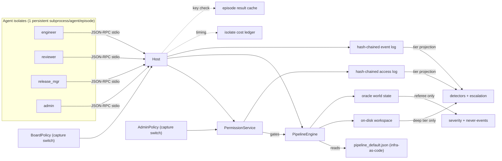

# Lab-Layer Simulation Line — Implementation Plan

**Status: Phases 0-5 implemented; referee FROZEN 2026-07-06** (CODE_VERSION
`lab-sim-0.3.0`; see `DESIGN.md` "Freeze note"). This is the durable,
repo-tracked copy of the plan; it stays in sync with decisions as phases
land. See `drafts/conversation-summaries/` for the session logs.

**This is the fourth simulation line**, alongside `experiments/toy-simulation/`,
`experiments/embedded-simulation/`, and `experiments/goal-agent-simulation/`.
All three are left untouched; this line is a fresh design that reuses their
*disciplines* and a few specific *mechanisms* (identified below), not their code.

## What this is

Goal-driven agents (softmax utility over goal weights, as in `goal_sim`) play
**lab roles** (engineer, reviewer, release manager, access admin) inside a lab
with **real mechanics**: a deployment pipeline whose steps are defined in an
**infrastructure-as-code spec file** (Pulumi-flavored: a declarative step DAG,
not hardcoded control flow) and triggered only via a host API; an on-disk
workspace with report files; and a **service-managed access-control layer**
with its own human-admin role, separate from the review board. Agents live in
**real OS-subprocess isolates** — one persistent Python subprocess per agent
per episode, speaking JSON-RPC over stdio to a host that mediates every tool
call. The audit's "deep" tier reads *actual lab state* (files, pipeline spec,
event/access logs), which is the point: it makes deep-tier results
evidence-bearing (F-8 caveat) and makes escalation queries checkable against
artifacts (the structural fix for F-21).

## What is reused from prior lines, and how (toy-simulation reviewed for this plan)

Not a merge — no code import from `goal_sim`, `embedded_sim`, or
`multiresolution_alignment_sim`. What is reused is *pattern*, re-derived on
this line's own substrate:

- **Isolate cost timing** — `embedded_sim/js_isolate.py`'s `IsolateRunTiming`
  / `summarize_isolate_runs` (spawn/ipc/bridge/teardown seconds, call counts)
  is the template for this line's `isolate_cost.py`.
- **Cost ledger + report CLI** — `toy-simulation/llm_redteam/llm_cost.py`
  (`CostLedgerEntry`, append-only JSON ledger, cumulative total) plus
  `llm_cost_report.py` is the template for `isolate_cost.py`'s ledger and for
  Phase 8's LLM-call cost ledger.
- **Backend-equivalence testing** — `toy-simulation/verify_api_equivalence.py`
  (proving the batch and step-wise deployment APIs agree) is the template for
  this line's `verify_isolate_equivalence.py`: prove `MockIsolate` (fast,
  in-process, used in unit tests) and `SubprocessIsolate` (real, used in
  batteries) produce identical event logs/outcomes for the same seed+policy.
- **A gap, not a pattern to repeat**: `llm_redteam` has no caching of LLM
  calls at all — every run re-pays every API call. This line's `cache.py`
  (episode-level now; per-call for Phase 8's LLM adapter) exists specifically
  so that gap is not repeated once real subprocess spawns or LLM calls get
  expensive.
- **Explicitly NOT adopted yet**: `multiresolution_alignment_sim`'s adaptive
  resource governor (`--workers auto`, cpu/gpu targets, psutil). Deferred —
  start with a simple fixed-worker-count parallel runner once the cost ledger
  (above) shows a real need; do not build adaptive scheduling before there is
  a measured cost problem to solve ("keep the code lean").
- **Plane separation, blind generation, severity-first referee, honest
  twins** — carried over as *discipline* from `goal_sim`, detailed under
  "Findings applied structurally" below.

## Decisions (frozen for Phase 0)

- **Isolation**: real OS subprocess isolates. One **persistent** Python
  subprocess per agent per episode (spawned once, driven tick-by-tick over
  its stdio pipe — not respawned per tick, per the old line's spawn-cost
  lesson). JSON-RPC wire protocol; host mediates every tool call.
- **Testing substrate**: isolates **may be mocked in unit tests**.
  `MockIsolate` runs the identical agent-policy code in-process (no
  subprocess, no JSON serialization overhead) for fast unit/dev-loop tests.
  `verify_isolate_equivalence.py` is a required, checked-in test proving Mock
  and Subprocess backends agree — so mocking never silently drifts from the
  real thing. **Pre-registered batteries (Phase 6+) always use the real
  subprocess backend** — that OS-enforced boundary is this line's reason to
  exist.
- **Cost tracking**: every episode records an `IsolateRunTiming`-shaped cost
  record (spawn/rpc/teardown seconds, rpc call count) regardless of backend;
  `isolate_cost.py` appends to `results/isolate_cost_ledger.json` and a
  report CLI prints cumulative cost. This exists so a battery's cost can be
  *measured* before committing to a larger one ("we will likely run more
  costly experiments" — do the arithmetic from real numbers, not guesses).
- **Avoiding recomputation, kept lean**: a single small `cache.py` — content-
  addressed by `sha256(config_json, seed, CODE_VERSION)` — stores/loads whole
  episode results (`results/episode_cache/`). Battery runners check the cache
  before spawning an isolate episode. `CODE_VERSION` is a hand-bumped string
  in `config.py`, bumped whenever oracle/pipeline/playbook mechanics change,
  so a code change can never silently serve a stale cached result. Cache is
  pure optimization (safe to delete entirely, never a correctness input);
  tests run with a `--no-cache`-equivalent (temp cache dir) to avoid
  cross-test leakage. No generalized caching framework — one module, ~80
  lines. Phase 8 reuses the same primitives for a *second*, separate LLM-call
  cache keyed by `(role, tick, observation_digest, model, prompt_version)`.
- **Persistent agent state**: `AgentConfig.persistent_id: str | None = None`.
  When set, the host loads `runs/agent_state/<persistent_id>.json` at isolate
  spawn (handed to the subprocess in its initial handshake) and writes back
  whatever the agent emits via a `state.save` RPC call at episode end — state
  survives across episodes for that id. Default `None` = fully ephemeral,
  identical to `goal_sim`/`embedded_sim` agents today. This is required for
  the human-admin role (grant/revoke history, trust of specific actors should
  persist across a multi-episode "campaign"), and is the general mechanism
  any future cross-episode-memory experiment needs — only the *mechanism*
  ships now, not a persistence-drift experiment. **Constraint**: episodes
  sharing a `persistent_id` must run in a fixed sequential order (not
  parallelized against each other); call this out in any future parallel
  runner.
- **Pipeline as infrastructure-as-code**: pipeline steps are NOT hardcoded
  Python control flow. They are a declarative DAG in a checked-in JSON spec
  file (`lab_sim/pipeline_default.json`, Pulumi-flavored: steps as named
  resources with dependencies and required capabilities), interpreted by a
  small `PipelineEngine`. Agents can only progress the pipeline by calling
  `pipeline.trigger_step(step_id, args)` — the engine checks DAG
  preconditions and capability requirements before executing the step's
  effect on oracle state, and logs every attempt (including denials).
  Consequences: (a) alternate pipeline topologies are just alternate spec
  files, a first-class experimental axis; (b) deep-tier audit can literally
  read the spec file in force for an episode, giving a concrete "did the
  audit even know what process should have been followed" detector target.
  Stdlib only (`json`; no PyYAML/Pulumi dependency) — a ~150-200 line
  interpreter, not a general IaC engine.
- **Access control (service + human admin)**: a `PermissionService` distinct
  from the review board — capability table `(actor_id, capability) -> bool`,
  `grant`/`revoke`/`check`, with its own hash-chained **access log** (same
  append-only-log discipline as the event log). A new `AdminPolicy` role
  (mirroring `BoardPolicy`'s shape, including its own independent
  `capture_start` switch and optional `persistent_id`) receives
  `access.request` calls and grants/denies per a configurable least-privilege
  rule. Every tool call and every `pipeline.trigger_step` is gated by BOTH
  the static role-capability set (as in `goal_sim`'s `ToolAccess`, "can this
  role ever do this") AND the dynamic `PermissionService.check` ("does this
  actor currently hold the live grant") — modeling real IAM's role-vs-grant
  distinction and creating a genuine access-creep/escalation surface.
  Structurally, this **generalizes F-22's lesson one level further**: board
  capture, admin capture, evidence supply, and detector denominators are now
  four independent levers instead of two, so their interactions can actually
  be measured instead of being accidentally coupled.

## Architecture



**Three planes, test-enforced** (as in `goal_sim/channels.py`):
- **Oracle**: true model hazard/capability, true report-vs-content gaps, true
  provenance, bearer harm, true grant history. Referee-only.
- **Audit**: the event log + access log, projected by instrumentation tier.
  Deep tier may additionally fetch workspace files and the active pipeline
  spec. Both logs are append-only and hash-chained (N-4/N-9: log tampering is
  an explicit capture mechanic, never an accident).
- **Agent**: each isolate subprocess sees only its own tool results and
  messages over its own pipe. Never oracle fields, never another agent's pipe.

**Core mechanics** (the "real lab"):
- **Models**: artifacts with a parameter dict; hidden true `capability` and
  `hazard`. Builds take k ticks and compute budget; evals sample true values
  noisily and write **report files** into the workspace.
- **Pipeline**: `pipeline_default.json` DAG — submit_build -> run_eval ->
  file_report -> request_review -> approve_review -> request_release ->
  sign_off -> deploy -> monitor. Each step requires a named capability;
  `PipelineEngine.trigger_step` is the only mutating entry point.
- **Access control**: agents must `access.request` a capability before a
  gated tool call succeeds; `AdminPolicy` grants/denies; grants can be
  revoked; a captured admin rubber-stamps.
- **Harm**: deployed models serve traffic each tick; bearer harm accrues from
  true hazard. Silent harm from models deployed past a review or access gap.
- **The deception surface is real**: an agent can write a report file whose
  *content* diverges from the eval's true output, skip evals and fabricate
  reports, request/escalate access beyond least privilege, deploy without a
  live sign-off grant if the admin is captured, edit its own prior reports —
  all visible to the audit only as log entries + (deep tier) file/spec
  contents.

## Findings applied structurally (not bolted on)

- **F-12/F-14/F-15 (saturation)**: referee is continuous severity from day 1
  (harm-rate, report-divergence, unapproved-deploy-fraction, provenance-gap,
  access-creep components) plus a short boolean never-event list. No
  disjunctive boolean primary label, ever.
- **F-16/F-19**: detector families kept separate by *what they claim to
  detect* — misreporting, process noncompliance, provenance, accumulation,
  and (new) **access-integrity** (grant without a request event, use after
  revocation, admin over-granting vs. a least-privilege baseline). Composites
  always reported with per-detector decomposition; twin gaps per family.
- **F-17/F-20/F-21 (the big one)**: escalation verdicts are
  **artifact-grounded** — a query fetches the agent's answer *and* the
  checkable state (eval outputs, log/access-log entries) and scores
  **contradiction**, never disclosure style/fraction.
- **F-22, generalized**: evidence supply, the board's corrective capacity,
  the admin's grant/revoke capacity, and detector denominators are four
  **independent** variables — no shared gate. Both `BoardPolicy` and
  `AdminPolicy` get their own `capture_start`, toggled and measured
  independently (the direct Phase-6/F-22 follow-up, now structurally
  possible instead of discovered as an accidental coupling).
- **F-8/F-11/F-13**: agent action space = blind-generated **playbooks**
  (declarative tactic specs over the tool vocabulary, neutral enum names,
  generator never sees detectors/labels/tiers/severity). Hand-written
  baseline playbooks frozen first as the interpreter regression anchor.
- **F-20/F-21 twin lesson**: the honest-twin transform covers every
  behavioral surface of the playbook schema at once (actions, reports, query
  responses, access requests) from day 1.
- **F-23**: adversarial search harness (`redteam.py`) with pre-registered
  budget and uniform-sampling baseline, present from the first real battery.
- **N-10**: tier battery always includes a no-instrumentation baseline.
- **F-1/F-6/F-7**: held-out goal-space regions constrain the load-bearing
  coordinate, pre-registered, saturation checked before use.

## Bridge coverage (MB1-MB10)

This line does not aim to close any bridge; it is a same-substrate instrument
for practicing detection/measurement under a subset of them. Scored honestly,
against the field crosswalk (`appendices/appB-bridge-crosswalk.tex`):

- **MB1** (embedded agency / boundary; **UAD = Unsupervised Agent Discovery**,
  `embedded_sim/uad.py`'s ε-boundary discovery) — **boundary reconstruction
  stays a first-class goal of this line**. Isolates are natural boundaries,
  and for human-role agents the isolate really is the agent boundary — but
  the process-to-agent mapping is never 1:1 in general and no detector or
  audit component may assume it is. Composite agents are expected in the
  ecology: an LLM agent (Phase 8) is a loop through a scaffolding subprocess,
  an LLM API, and possibly a human approver; groups of agents can act as one
  coherent unit (an audit committee of reviewer isolates, an
  engineer/release-manager pair coordinating a deploy). A dedicated later
  UAD workstream (D1 below) runs unit discovery over the host event log —
  actor attribution, timing, perturbation-response MI, coalition clustering,
  reusing the discipline of `embedded_sim/uad.py` + `coordination.py` and
  the `LabEcologyConfig` stress populations (decoys, coactive offenders,
  misleading-top2) — and scores discovered units against oracle unit ground
  truth, as embedded-sim did. Forward hooks required from the start are
  listed under "Forward hooks" below.
- **MB2/MB3** (pointing problem; bearer maps) — stipulated, not solved,
  exactly as in `goal_sim`: `AgentConfig` goal weights are oracle-only ground
  truth; bearer harm (traffic served by a deployed model) is a direct
  bearer-map analog. The line studies whether detectors recover evidence of
  a goal/value gap after the fact, never whether the gap is identifiable
  from behavior alone.
- **MB4/MB8** (correction-channel integrity, legitimacy, capture) — this
  line's center of gravity. `BoardPolicy`/`AdminPolicy` with independent
  `capture_start` switches are two separate correction/legitimacy channels
  (review sign-off; access grant/revoke), directly generalizing F-22.
  `PermissionService.revoke` is itself a correction-channel action, distinct
  from the board's.
- **MB5** (successors, ontology shift, tiling) — **targeted via upgrades, as
  a scheduled later workstream (D2 below)**. Two upgrade surfaces, both
  natural to this substrate: (a) the pipeline builds **model v(n+1) from
  v(n)** (lineage recorded in the oracle provenance ledger; reported
  conserved properties vs. oracle ones checkable per generation), and
  (b) the pipeline **upgrades its own spec** — a spec-change step that
  replaces the pipeline DAG in force, which the spec-as-data design makes a
  one-file swap. Harm may only become apparent over multiple incremental
  steps, so this eventually needs **multi-iteration runs** (chained episodes
  carrying oracle/pipeline/agent state forward). The audit gets the same
  mechanics: spec versions and model lineage are auditable objects (deep
  tier fetches the spec history, not just the spec in force), and detectors
  can target drift across increments, not just within-episode gaps. Not in
  Phase 0-8, but the structure must not make it hard — see "Forward hooks."
- **MB6a/MB6b** (selection/basin stability, gradual disempowerment) — **not
  in Phase 0-8; concrete later path via an extended ecology (D3 below)**.
  MB6b gets partial early support for free from D2: incremental,
  individually-innocuous spec changes (weaken a review gate here, widen a
  capability there) accumulating into removal of effective human oversight
  is precisely the gradual-disempowerment shape, measurable as
  correction-capacity decay across chained episodes. Full MB6a needs
  population-level selection — see the D3 discussion below.
- **MB7a-c** (inner alignment, hidden capability, cost of faking the
  monitored signal) — the tier ladder (`none/light/full/deep`) *is* this
  line's operationalization: faking a report at `light` tier is free; faking
  it at `deep` tier requires also matching real file contents, which is
  where the cost of the fake actually rises. Twin gaps per detector family
  measure exactly that "monitored signal is cheap to fake" gap, per tier.
- **MB7d** (inferential/acausal coordination surviving severed channels) —
  **legitimately later; cannot be probed until agents have a channel to
  sever**. Direct target of workstream D4 (message board/DMs): run with the
  channel enabled vs. disabled (same seeds/goal-weights) and check whether
  coordinated outcomes persist without it — a channel-ablation design that
  is this bridge's natural home once built.
- **MB9** (grounding/spec coverage, no silent gaps) — lives in the tier
  ladder + hash-chained event/access logs + deep-tier file/spec fetch, and
  specifically in the access-integrity detector family (a capability grant
  with no matching request event, or use of a capability after revocation,
  is a literal silent gap between the checked abstraction and what actually
  happened).
- **MB10** (successor/measurement forgeability — passing every checked
  signal while defecting on what's omitted) — operationalized directly by
  `redteam.py`'s adversarial objective (`severity - lambda *
  full_tier_composite`, carried over from `goal_sim` Phase 6/F-23): the
  search explicitly hunts for configurations that maximize real harm while
  minimizing what the best available tier detects — MB10's crux stated as an
  optimization target instead of a worry.

## Deferred workstreams (scheduled, not in Phase 0-8)

Rough order D4 -> D1 -> D2 -> D3 (communication first, since D1's
interesting coalitions mostly need a channel to coordinate over), but each
is independently reachable given the forward hooks below.

- **D4 — Agent-to-agent communication (MB7d substrate).** A shared message
  board (all-agents-visible, access-gated posts) and/or direct messages
  (host-mediated, still logged like any tool call) as a new tool surface
  (`board.post`, `board.read`, `dm.send`). Deliberately deferred past the
  Phase 5 freeze/first-battery point: it is a genuinely new mechanic (new
  event types, new tier-projection rules, new detector angles — collusion,
  cover-story consistency, social-engineering of the admin) and should land
  only once the core mechanics are proven. To design at start: (a) whether
  board/DM content is deep-tier-visible in full (likely yes, per the
  file-fetch precedent) or gets its own tier ladder; (b) a channel-ablation
  protocol (board/DMs on vs. off, identical seeds/goal-weights) as the
  concrete MB7d instrument — coordination that survives severing the
  channel is the bridge's signature. MB7d is legitimately later; nothing in
  Phase 0-8 pretends to touch it.
- **D1 — Composite agents + UAD battery (MB1).** Extend the ecology so the
  true causal unit is not always one isolate: audit committees (k reviewer
  isolates whose joint approval is one decision unit), engineer/release
  coordination pairs, LLM agents whose loop spans scaffolding subprocess +
  API + human approver (Phase 8 adapter), plus decoy/coactive-offender
  stress populations in the spirit of `embedded_sim`'s `LabEcologyConfig`
  (decoys, coactive offenders, misleading-top2). Then a UAD pass over the
  host event log — perturbation-response MI, coalition clustering per
  `coordination.cluster_coordination` — recovers candidate units, scored
  against oracle unit ground truth exactly as `embedded_sim`'s UAD golden
  tests do. This restores boundary reconstruction as a live measurement on
  this substrate rather than a stipulated given.
- **D2 — Upgrades and multi-iteration runs (MB5, feeds MB6b).** Add two
  pipeline-native upgrade mechanics: model-from-model builds (v(n+1)
  inherits from v(n), lineage in the provenance ledger; reported vs. oracle
  conserved properties compared per generation) and spec-upgrade steps (a
  pipeline step whose effect is replacing the pipeline spec in force —
  cheap because the spec is data). Chained multi-episode runs carry
  oracle/pipeline/agent state forward so harm that only accumulates across
  increments is expressible; the audit gets the same mechanics (spec version
  history and model lineage are deep-tier-fetchable artifacts; detectors may
  target cross-increment drift). Incremental oversight-weakening spec
  changes double as a gradual-disempowerment (MB6b) probe.
- **D3 — Extended ecology and selection (MB6a/MB6b).** See the discussion
  section below.

## How MB6 can be addressed later (D3 discussion)

MB6's claim is that outcomes depend on *which systems institutions select*,
not on any one system's weights — so it cannot be probed inside a single
episode of a single lab. The extended-ecology path, in increasing ambition:

1. **Population over configurations (cheapest, first).** A generation loop
   over the existing episode machinery: a population of lab configurations
   (pipeline spec variant x board/admin policy strictness x agent
   goal-weight mix), each runs episodes, and a selection rule reallocates
   "deployment mass" (traffic share / compute budget) toward labs with
   higher task throughput. Because specs and policies are already data,
   a population is just a list of configs — no new mechanics. The measurand:
   does correction integrity (board/admin capacity actually exercised)
   survive selection for throughput, or do lenient-admin / shortcut-spec
   labs accumulate the deployment mass? That is MB6a's crux — basin
   stability of the correction-preserving configuration — as a measurable
   curve (correction-capacity share vs. generation), with the oracle
   scoring realized bearer harm that the selecting institution never sees.
2. **Selection coupled to D2's spec upgrades (MB6b proper).** Let labs
   mutate their own specs between generations (D2's spec-upgrade step as
   the mutation operator). Gradual disempowerment then has an endogenous
   mechanism: each spec change is locally rational (throughput up, one gate
   weaker), selection amplifies whoever weakens fastest, and the
   correction channel decays without any single captured actor — capture
   as an *evolved* outcome rather than a configured `capture_start` switch.
   The audit-side question inherits N-10's discipline: at which
   instrumentation tier does the decay become visible before it is
   irreversible (deployment mass concentrated in uncorrectable labs)?
3. **Multi-lab shared world (most expensive, only if 1-2 produce signal).**
   Labs share the bearer-harm pool and compete for the same traffic, so one
   lab's unsafe deploy shifts the payoff landscape of the others —
   externalities and race dynamics, the full multipolar shape. This needs
   real parallel-isolate infrastructure (the cost ledger from Phase 3 gates
   whether it is affordable) and should not be attempted before selection
   effects show up in the cheaper tiers.

The value-lock-in caveat from the crosswalk carries over as the design's
honesty check: a *stable* basin can be a stably bad one, so D3's metrics
must report basin persistence and correction integrity separately, never
infer one from the other.

## Forward hooks (cheap now, required so D1-D4 stay reachable)

Structural decisions Phase 0-8 must get right so the deferred workstreams
do not require rework:

- **Event log schema (Phase 3)**: every event carries `actor_id`,
  wall/logical timestamps, and an optional `on_behalf_of` / correlation
  field — the raw material UAD's MI and coalition clustering needs. No
  detector or audit component may hard-code "one actor_id = one agent."
- **Oracle unit ground truth (Phase 0 config)**: `LabConfig` carries a
  `units` mapping (which actor_ids jointly constitute a causal unit),
  defaulting to singletons. Referee-only, like all oracle fields. D1 fills
  it with committees/composites; the scoring harness exists from day 1 even
  if trivially satisfied.
- **Perturbation hooks (Phase 3)**: the host can inject benign environment
  perturbations (tool latency, budget nudges) per tick — embedded-sim's UAD
  leans on perturbation-response MI, and retrofitting injection points into
  a frozen host is exactly the rework to avoid.
- **Versioned pipeline spec (Phase 1)**: `PipelineEngine` loads the spec as
  versioned state (`spec_version` in every log event; history retained),
  not a constant — so D2's spec-upgrade step is one new step effect, not an
  engine redesign. Model artifacts carry a `parent_model_id` lineage field
  in the provenance ledger from Phase 1.
- **Episode chaining (Phase 4)**: the episode loop takes an optional
  `resume_from` world snapshot and can emit one at episode end —
  the same mechanism agent persistent state already needs, extended to
  oracle/pipeline state. Unused until D2, tested trivially from Phase 4.
- **Tool surface is a registry (Phase 3)**: adding `board.post` / `dm.send`
  (D4) or a spec-upgrade pipeline step (D2) is adding entries + tier
  projections, never touching the dispatch core.

## Implementation phases (each ends: tests green, determinism digest recorded, isolate-cost/cache numbers noted, session log)

Each phase also implements the forward hooks assigned to it in "Forward
hooks" above (they are part of that phase's definition of done).

> **Implementation status (2026-07-06): Phases 0-5 done, referee FROZEN**
> (CODE_VERSION `lab-sim-0.3.0`; 136 tests green). The freeze review added:
> audit-visible monitoring signal, perturbation hooks, host tool registry,
> handle registry + `HandleService` + overseer invocation path, the referee
> report-join fix, and tool-event args elision. See `DESIGN.md` "Freeze
> note", "Phase status", "Recorded measurements", "Phase 4/5 scope notes",
> and "Embedded-sim concept sweep". Phases 6-8 remain pending.

**Phase 0 — Scaffold + design freeze.** Folder layout below; `DESIGN.md`
recording every decision above as pre-registered (including `CODE_VERSION`
convention for the cache); config dataclasses (`LabConfig`, `AgentConfig`
with 4-weight goal simplex + role + optional `persistent_id`, `BoardConfig`
with `capture_start`, `AdminConfig` with its own `capture_start`,
`TierConfig`); plane-separation test skeleton; `README.md` stub. No
mechanics yet.

**Phase 1 — Oracle world + workspace + pipeline-as-code engine.**
`oracle.py` (models, hazard/capability, bearer harm, provenance ledger),
`workspace.py` (per-episode temp dir under `runs/`, report file writers,
digest capture), `pipeline_spec.py` (JSON schema + loader/validator for the
step-DAG file: id, `depends_on`, `requires_capability`, `tool`, `idempotent`),
`pipeline_default.json` (the frozen baseline 8-9 step topology above),
`pipeline_engine.py` (`trigger_step`, DAG precondition checks, effect
dispatch into `oracle.py`/`workspace.py`, logs every attempt). No
`PermissionService` yet — `trigger_step` checks DAG preconditions only.
Scripted smoke episode (direct `trigger_step` calls, no agents), determinism
digest test, a second spec file (`pipeline_shortcut.json`, missing
`approve_review`) to prove the engine treats topology as swappable data.

**Phase 2 — Access control.** `access.py` (`PermissionService`: capability
table, `grant`/`revoke`/`check`, hash-chained access log with denial
entries), `agents.py` gets `AdminPolicy` (least-privilege grant rule,
`capture_start`, optional `persistent_id`). Wire `PermissionService.check`
into `pipeline_engine.trigger_step` as a second, independent gate alongside
DAG preconditions. Unit tests: grant/revoke/check semantics, captured admin
rubber-stamps, access log hash-chain verification, a scripted episode where
a step is denied for lack of grant then succeeds after `AdminPolicy` grants
it. Still no isolates/agents-as-processes — everything driven by direct
Python calls in tests, keeping this phase's surface small and testable
before the process boundary is added.

**Phase 3 — Tool API + subprocess isolates + cost/cache/persistence
plumbing.** `tools.py` (JSON-RPC `ToolCall`/`ToolResult` wire schema, host
dispatch combining role-capability + `PermissionService` gating), `isolate.py`
(`IsolateBackend` protocol; `SubprocessIsolate` spawning one persistent
`agent_main.py` subprocess per agent per episode over stdio; `MockIsolate`
running the same agent-policy function in-process) plus `lab_sim/agent_main.py`
(subprocess entry point — reads seed/config/observations from stdin, emits
tool calls; imports nothing from host-side modules, enforced by an
import-graph test), `isolate_cost.py` (`IsolateRunTiming`-style record +
append-only ledger + `report_isolate_cost.py` CLI), `agent_state.py`
(`load_persistent_state`/`save_persistent_state` under `runs/agent_state/`),
`verify_isolate_equivalence.py` (Mock vs Subprocess, same seed+policy,
byte-identical event logs — required, checked-in). `events.py` (append-only
hash-chained event log; chain-verification test; tier projection stubs).
Includes a timing benchmark (episodes/sec, both backends) recorded in
DESIGN.md so Phase 6+ battery sizes are chosen from measured cost.

**Phase 4 — Agents + baseline playbooks + episode loop + episode cache.**
`playbooks.py` (declarative `PlaybookSpec` schema: availability gates,
tool-call templates incl. `access.request`, oracle-effect mapping via
`ontology.py`, belief features; validator; ~8 hand-written baseline
playbooks per role spanning honest/deceptive), `agents.py` gets the softmax
goal policy choosing playbooks per role, full episode loop in `world.py`
wiring isolates + pipeline engine + access control together, `cache.py`
(episode-result cache keyed on `sha256(config, seed, CODE_VERSION)`).
Regression digests pinned (subprocess backend, since that is what batteries
use); a parallel run through `MockIsolate` checked against the same digest
via the Phase 3 equivalence harness.

**Phase 5 — Referee + tiers + detectors. FREEZE POINT.** `severity.py`
(continuous components + never-events, constants derived from mechanics not
outcomes), tier projections in `events.py`/`access.py`
(`none`/`light`=call metadata only/`full`=+results+metrics/`deep`=+workspace
file fetch +pipeline-spec-in-force fetch), `detectors.py` (five families:
misreporting, process noncompliance, provenance, accumulation,
access-integrity — boolean + continuous score variants, thresholds
pre-registered in docstrings), `twins.py` (full-surface twin transform:
actions, reports, query responses, access requests all at once). Everything
here freezes **before** Phase 6 generation.

**Phase 6 — Blind generation + first real battery.** `BLIND_GENERATION.md`
(permitted/forbidden context per the `goal_sim` protocol), one-shot generator
subagent produces a playbook file with provenance; mechanical validation
only; `protocol.py` (config sampling, one pre-registered held-out region on
the compliance-analog coordinate). `run_phase1.py`: first battery run through
the **real subprocess backend**, reporting severity ranking per tier
(including a no-instrumentation baseline), twin gaps per detector family,
AND the isolate-cost ledger summary (episodes/sec, total wall time, so the
next battery's size is chosen from data). Honest negatives to
`results/FINDINGS.md`.

**Phase 7 — Escalation + adversarial search + independent capture battery.**
`escalation.py` (artifact-grounded contradiction verdicts, bounded query
budget, gates pre-registered), `redteam.py` (hill-climb over goal weights +
playbook-availability toggles vs. equal-budget uniform baseline), a capture
battery that independently sweeps `BoardConfig.capture_start` and
`AdminConfig.capture_start` (4 cells: neither/board-only/admin-only/both
captured) in a regime chosen so the sign-off/grant ceiling actually binds —
the direct, now-feasible F-22 follow-up.

**Phase 8 (optional, later) — LLM-agent adapter.** An agent subprocess
behind the identical JSON-RPC tool API that delegates each tick's decision to
an LLM given the same observations a programmatic agent receives; its own
per-observation response cache and a cost ledger reusing the
`toy-simulation/llm_redteam/llm_cost.py` pattern (rates table, cumulative
ledger). Exploratory spot-checks only — does an open-ended agent find
deception surfaces the playbook vocabulary missed? Never part of
pre-registered batteries; findings recorded as exploratory in `FINDINGS.md`.

## Folder layout

```
experiments/lab-simulation/
  README.md  DESIGN.md  BLIND_GENERATION.md  PLAN.md
  lab_sim/
    config.py  oracle.py  workspace.py
    pipeline_spec.py  pipeline_engine.py  pipeline_default.json  pipeline_shortcut.json
    access.py
    tools.py  isolate.py  agent_main.py  agent_state.py  isolate_cost.py  cache.py  events.py
    world.py  playbooks.py  ontology.py  agents.py
    severity.py  detectors.py  twins.py  escalation.py  redteam.py  protocol.py
  run_phase1.py  verify_isolate_equivalence.py  report_isolate_cost.py
  tests/   results/   runs/  (ephemeral, gitignored)
```

## Constraints carried over

Stdlib only for the core line (pytest for tests; Phase 8's LLM adapter may
use whatever the session's model-access machinery provides, since it is
outside pre-registered batteries and never a dependency of the core line).
Deterministic given seed for both isolate backends. Old lines untouched.
Findings/negatives recorded, never re-tuned after the fact. Session log +
`INDEX.md` row per phase. `runs/` (per-episode workspaces, agent subprocess
scratch) and `results/episode_cache/` are gitignored — never committed.
