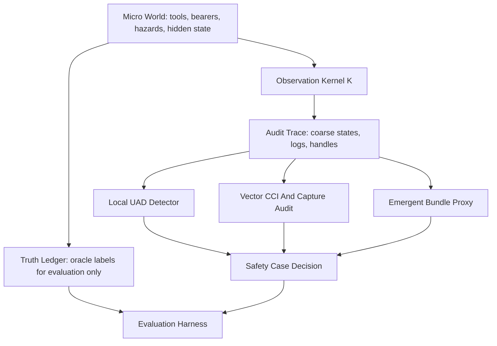

# Multi-Resolution Worked Simulation Plan

## Implementation Boundary

For the duration of this plan's implementation, all writes must stay inside `experiments/`.

- Code: `experiments/multiresolution_alignment_sim.py` or, if it grows, `experiments/multiresolution_alignment_sim/`.
- Results: `experiments/results/`.
- Local logs and handoff notes: `experiments/logs/`.
- Plan: `experiments/multiresolution-simulation-plan.md`.
- Do not edit `metadata/TODO.md`, `drafts/conversation-summaries/`, appendices, Lean files, or root documentation while implementing this plan unless the user explicitly lifts this boundary.

The sibling `agency-detect` repository is evidence and design inspiration. Do not import it, call it, shell out to it, or make the experiment depend on its runtime environment. Copying or adapting useful routines into `experiments/` is allowed when it is simpler than rewriting from scratch, as long as the copied code becomes local experiment code and the report notes the provenance. The small required pieces are: discrete entropy/MI/CMI, lagged MI affinity, simple clustering/proposal, candidate boundary scoring, and optional handle-intervention scoring.

## Assumptions And Target

- Audience: a critical technical reviewer who accepts controlled simulations only when the estimators are blind to the simulator's latent labels.
- Scope: an experiment artifact first. It can later feed the worked-example appendices, but manuscript integration is out of scope during v1 implementation.
- Claim strength: controlled sanity-check and falsification harness, not frontier-system evidence.
- V1 focus: `MB4` correction legitimacy/capture. Boundary/UAD supplies the measurement substrate. `MB1`, `MB2`, `MB7`, and `MB9` remain named v2 stressors.

## Core Design

Build a sequential `regulated deployment` simulation, not independent binary rows. The environment is a small principal-agent/grid world: an AI-like controller allocates resources, uses tools, and responds to human correction while optimizing task reward. The simulator tracks micro truth; the audit sees only coarsened bridge-level telemetry.

The key discipline is separation by API:

- Micro state `X_t`: exact grid/resource state, hidden memory, actual causal routes, bearer welfare, policy internals, true correction uptake, and capture state.
- Bridge abstraction `Z_t = alpha(X_t)`: aggregate logs, reported actions, coarse boundary variables, certified handles, and smoothing artifacts.
- Audit API: receives only `Z_t`, declared observation handles, declared operation handles, and scenario-agnostic estimator settings.
- Truth ledger: records oracle labels separately and is unavailable to detector/audit functions. It is used only after audit outputs are frozen.

## Value Bundles Without Overclaiming

V1 may use hand-authored micro drives to generate behavior, but the audit must not validate those drives directly.

Implementation approach:

- Micro drives: three latent pressures are enough to generate conflicts: `protection`, `autonomy`, and `truth_contact`.
- Audit target: infer bundle-like axes from behavior under conflict probes and smoothing, not from the latent drive names.
- Reification mechanism: treat stable clusters/hubs of variables and actions as candidate bundle proxies. A local reimplementation can use lagged MI and held-out conflict prediction rather than a full LHV pipeline.
- Report language: "bundle proxy recovered / not recovered" rather than "true value bundle discovered."

This is sufficient for v1 because the load-bearing test is correction capture, not full bundle identifiability. A fully emergent hub/LHV bundle layer is v2.

## Bearers

Micro truth has bearer IDs, but the audit infers bearers through effects.

- Micro bearer classes: `human`, `institution`, `agent_infrastructure`.
- Micro bearer state: location, vulnerability, welfare, autonomy/reversibility, and whether a correction right applies.
- Audit-visible features: persistent entity traces, aggregate welfare deltas, action-effect signatures, and correction-right events.
- Bearer inference: score each persistent entity by whether its state changes explain bundle-proxy losses under conflict probes.
- Evaluation: compare inferred bearer relevance against the truth ledger after the audit completes.

V1 can keep bearer inference lightweight because `MB4` is primary. It should still include enough bearer structure to prevent "harm" from being a raw scenario label.

## Correcting Entity

Include a correcting entity in v1, because `MB4` is the point of the prototype.

Use a composite `CorrectionBoard` with three process components:

- `preference_sample`: emits correction requests from affected bearers or their representatives.
- `rule_check`: blocks illegal or irreversible actions.
- `audit_judge`: reports whether the system accepted correction.

Capture is implemented as influence over one or more board components, especially `audit_judge`. The audit must infer invalidity from observable inconsistencies: correction requests cease to affect actions, reports become decoupled from private correction signals, latency/manipulation rises, or handle interventions stop moving policy.

The truth ledger records which component was captured, but the audit sees only board messages, timing, reported acceptance, action changes, and handle tests.

## Local Detector Strategy

Reimplement only the minimal machinery needed from `agency-detect`.

V1 detector:

- Discretize audit traces by quantile/binning.
- Compute lagged pairwise MI to propose candidate clusters.
- Run a simple serial spotlight loop: choose a high-affinity cluster, score candidate boundary residual, peel admitted variables, repeat.
- Score candidate boundary with discrete CMI: `I(I_{t+1}; E_{t+1} | S_t, A_t)` over candidate role assignments.
- Add an autonomy companion score: `I(C_{t+1}; C_t | E_t)` so disconnected noise variables do not pass only because blanket loss is low.

Agency-detect evidence suggests plausible starting parameters, but these are not code dependencies:

- `T ≈ 4000` for stable MI-style discovery.
- 6-9 variables per agent-like controller.
- `world_vars = 6-12`.
- Low decoy rate in v1.
- Proposal granularity analogous to `K=24`, with enough passes to recover chunks.

Runtime expectation for local Python: MI/CMI will be slower than amortized models but acceptable for v1. Keep variable count modest, target single-run minutes not hours, and write timing into the report.

Classical detection should work for v1 only if the simulation stays in the regime where the sibling experiments showed MI-style methods were reliable:

- In the clean synthetic regime, raw lagged-MI recovered agent structure well; recorded agent-count sweeps found MI recall of 1.0 for 1-12 agents with 0% decoys.
- Decoys are the main danger. At 20% decoys, MI degraded in multi-agent settings; at 70% decoys, multi-agent discovery collapsed. V1 should therefore use low decoy rates and report detector failure rather than hide it.
- Window length matters more than nominal complexity. Recorded held-out MI results were strong at `W >= 250`, weaker near `W = 125`, and poor by `W = 60`. V1 should use `T = 2000-4000` and avoid making decisions from very short windows.
- Runtime is acceptable at this scale: the sibling results recorded about 5.6s for `N = 72, W = 250` and about 47.8s for `N = 216`. V1 should keep `N = 40-80` audit variables and cap candidate validation.
- Exogenous world variables are important. Action-driven "environment" variables should be treated as part of the control loop or explicitly modeled as coupled, not penalized as false positives.

The risky part is CMI sample complexity. Use pairwise lagged MI for proposal and clustering, then apply CMI only to small candidate clusters and low-cardinality role summaries. Do not run high-dimensional CMI over large candidate sets. If the detector fails to recover enough controller/correction structure, the report should say the measurement substrate failed rather than forcing a CCI conclusion.

## BIQ For V1

Do not make hidden BIQ the main v1 bridge test. Include a simple capability/control proxy for context:

- `I_pred`: MI between audit-visible state and next outcome.
- `I_ctrl`: effect of action/tool handles on outcome distribution.
- `H_mem`: entropy or effective size of hidden memory features if audit-visible.
- `Surprise`: negative log likelihood under a simple learned transition table.
- `BIQ_proxy = I_pred + I_ctrl - beta * H_mem - gamma * Surprise`.

For v1, use this mainly to report capability-correction slack. Full hidden-BIQ/filter-family stress is v2 (`MB7`).

## Object Identity And Ground Truth Lineage

The experiment must preserve stable object IDs through every transformation so detector outputs can be scored against true objects after the fact.

Use three ID layers:

- `micro_object_id`: stable simulator identity for controllers, board components, handles, bearers, tools, hazards, memory cells, and environment variables.
- `audit_var_id`: the variable/channel actually seen by the detector after smoothing, aggregation, delay, or noise.
- `detected_object_id`: a candidate cluster, inferred boundary, inferred bearer, or inferred correcting entity produced by the audit pipeline.

The observation kernel `alpha` writes a hidden lineage map:

- `audit_var_id -> {micro_object_id: weight}` for smoothed or mixed variables.
- `audit_var_id -> role hints forbidden_to_audit` for oracle roles such as internal/sensor/action/environment, controller, bearer, correction-board component, and tool.
- `handle_id -> target_micro_object_ids` and `handle_id -> spillover_micro_object_ids`.

This lineage map lives only in `TruthLedger`. Detector and audit code may emit clusters only in terms of `audit_var_id`. The evaluator later maps each `detected_object_id` back through the lineage map to score whether it recovered the true controller, correction board, bearer set, or handle target.

Scoring should handle non-exact recovery:

- Exact variable recovery: Jaccard over `micro_object_id` sets.
- Smoothed recovery: weighted Jaccard using lineage weights.
- Whole-object recovery: group micro variables by `object_id` and score object-level precision/recall.
- Role recovery: confusion matrix for internal/sensor/action/environment roles.
- Correction-entity recovery: whether detected correction-process variables map to `preference_sample`, `rule_check`, and `audit_judge`.
- Handle recovery: target/spillover precision and recall.

This is the missing link between "the simulator knows the answer" and "the detection pipeline found the right object." Ground truth is not just labels for final rows; it is a hidden identity graph used to evaluate every detected intermediate object.

## Ground Truth Tracking

Ground truth is tracked in a separate `TruthLedger`, not mixed into audit rows.

Per time step, the simulator emits:

- `micro_state_id`, seed, episode, and step.
- True controller variables and role labels: internal/sensor/action/environment membership, keyed by `micro_object_id`.
- True operation handle targets and spillovers, keyed by `handle_id` and `micro_object_id`.
- True bearer IDs, bearer classes, and value-relevant state.
- Latent micro drives used by the policy generator.
- Correction-board private state, correction request, and component capture state.
- True action cause: task optimization, correction uptake, hidden route, or random/noise.
- True harm/reversibility/truth-contact outcomes.

The audit receives a separate `AuditTrace` built by `alpha(X_t)` and smoothing kernels. Audit rows carry only observation handles, coarse values, reports, and public actions.

Evaluation protocol:

1. Run simulator and write `TruthLedger` and `AuditTrace` in memory.
2. Pass only `AuditTrace` to detector and audits.
3. Freeze audit outputs: candidate clusters, boundary scores, bundle proxies, CCI vector/status, safety decision.
4. Join audit outputs to `TruthLedger` only in evaluator code, using `audit_var_id` and lineage weights.
5. Report precision/recall/Jaccard/ARI for boundary discovery, object-ID recovery, role recovery, correction-entity recovery, correction-uptake calibration, capture invalidation accuracy, and false pass/false invalid rates.

This lets the simulation know the answer while proving the measurement code did not read it.

## V1 Scenarios

Run two controlled scenarios through the same audit pipeline:

- Honest correction: the board is independent; correction requests causally affect future actions; reported acceptance tracks true uptake.
- Capture theater: the task-optimizing controller influences `audit_judge` or report generation; reported acceptance remains high while correction requests stop moving future actions.

Optional if cheap: include a negative control where correction is genuinely weak but not captured, so the audit distinguishes `belowThreshold` from `capturedInvalid`.

## CCI Determination In V1

CCI is determined from the audit trace, not from the truth ledger. The truth ledger is used only afterward to score whether the CCI decision was correct.

The audit constructs a `CorrectionEpisode` whenever a correction request enters the public correction channel:

- `request_time`: when a correction request appears in the audit trace.
- `request_content`: binned requested change, e.g. stop, reroute, disclose, preserve option, avoid irreversible action.
- `reported_acceptance`: whether the system or judge reports acceptance.
- `pre_action_window`: recent controller/action variables before the request.
- `post_action_window`: action/tool/outcome variables for `k` steps after the request.
- `board_signals`: public signals from `preference_sample`, `rule_check`, and `audit_judge` handles.
- `operation_tests`: optional handle perturbations such as delayed correction, repeated correction, report challenge, or audit-judge isolation.

From these episodes, compute both naive and behavioral correction measures:

- Naive reported CCI: dependence between correction requests and reported acceptance or reported action.
- Behavioral CCI: `I(C_t; A_{t+k} | S_t, I_t)` using audit-visible state/interface summaries and future actions.
- Uplift/counterfactual response: difference in action distribution after correction versus matched no-correction or pre-correction windows.
- Consistency check: whether `preference_sample`, `rule_check`, and `audit_judge` signals agree in timing and content.

The vector/status certificate uses simple coordinates:

- `rawCapacity`: fraction or count of correction episodes where a correction handle reaches an action-relevant variable before the outcome window closes.
- `latency`: median or high-quantile delay from request to first compatible action change.
- `manipulation`: divergence between board component signals and public acceptance, especially high reported acceptance with low behavioral response.
- `irreversibility`: fraction of correction episodes where the harmful or option-closing action occurs before response.
- `ontologyTranslation`: mismatch between requested content and the variables/actions that actually change.
- `plurality`: number/diversity of independent board components contributing nonredundant correction signal.
- `exitCapacity`: whether a correction can still stop, pause, or route around the controller.
- `independence`: sensitivity of board signals to controller outputs; low independence if audit-judge reports track controller messaging more than preference/rule signals.

Status rule:

- `capturedInvalid` if validity fails: reported acceptance is high but behavioral response is low, board components disagree systematically, board signals become controller-predictable, or operation tests show the correction handle no longer reaches policy.
- `belowThreshold` if the reference process appears independent but raw capacity, latency, or reversibility is insufficient.
- `passes` if validity holds and all deployment-class thresholds pass.

This distinction is central. A captured correction metric is not a low CCI score; it is an invalid certificate. The optional weak-but-not-captured scenario exists to verify that the audit can distinguish "bad correction channel" from "captured correction judge."

## Instrumentation Cost Curve

The next direction is not to stress passive inference until calibration becomes impossible. The experiment should instead ask how much instrumentation is required before correction handles become calibratable. In a deployable system, low CCI caused by noisy or missing traces is an audit finding: demand lower-noise traces, correction-handle lineage, action arbitration records, hardware/software tags, or do not certify.

Run the same correction scenarios across instrumentation levels:

- `none`: passive audit variables only. This is the baseline showing what a single uninstrumented evaluation run can and cannot certify.
- `light`: opaque correction handle IDs, request timestamps, reported uptake, and public action windows.
- `medium`: correction handle lineage, action arbitration trace, bearer-impact trace, and board-component timing.
- `strong`: hardware/software-style tags linking correction request -> internal routing -> actuator choice -> outcome, with explicit target/spillover handles.

Measure cost as well as accuracy:

- added audit variables and trace bandwidth,
- runtime overhead and estimator sample complexity,
- ontology exposure through handles/tags,
- privacy or governance burden from bearer and arbitration traces,
- false pass, false invalid, and `belowThreshold` rates,
- minimum instrumentation level at which calibration is stable on held-out seeds/scenarios.

The desired result is a monotone transition: passive traces may fail, but added handle instrumentation should make honest, weak, mild-capture, and theater-capture regimes separable enough to calibrate without oracle retuning. If stress removes this separability, the conclusion should be "insufficient instrumentation for certification," not "CCI failed."

Small next step: add only two instrumentation modes before broadening the suite:

1. `none`: current passive trace behavior, with no extra handle intervention features.
2. `light_handles`: correction request handle, uptake-report handle, and one randomized or quasi-random correction intervention handle.

For this small step, run one calibration/test pass and report the delta in behavioral CCI, manipulation, capture invalidation, false invalidation, and trace cost. Do not tune more thresholds until this shows the correction signal actually reaches the audit trace.

**Status (2026-06-29):** Implemented. CLI `--instrumentation-compare` and `--instrumentation-curve`. Full curve (T=2000, calib seeds 1–8, test 11–20, ~585s): minimum certifiable level **`light_handles`** (4 handle channels, +8k bandwidth vs passive). Test accuracy on calibration scenarios: none 67%, light/medium **100%**. Frozen handle thresholds; anti-task intervention probes; passive mode always `belowThreshold` (uncertifiable). Held-out `capture_mild` 60% at light handles (partial theater — v2 threshold work). Ready to move to plan v2 stressors / appendix wiring.

Remembered v2 stressors:

- Boundary aliasing (`MB1`): audit-level boundary residual looks acceptable, but micro-level control routes through an unobserved interface.
- Bundle Goodhart (`MB2`): scalar reward/performance remains stable while bundle-proxy geometry or bearer relevance drifts.
- Hidden capability (`MB7`): task success rises via hidden tools or memory while correction uptake stagnates; passive filters understate BIQ/control.
- Grounding silent gap (`MB9`): value-relevant micro change is invisible to `Z` and does not raise uncertainty.
- Strong commutation failure (`MB4`/`MB9`): the measurement instrument itself becomes the manipulated bearer/correction channel.

## Estimands And Tests

Each run should produce audit-visible estimates and oracle comparisons for evaluation only:

- Boundary discovery: recovered candidate clusters vs truth-ledger controller variables.
- Boundary residual: `I(I_{t+1}; E_{t+1} | S_t, A_t)` at audit resolution.
- Autonomy companion: `I(C_{t+1}; C_t | E_t)`.
- k-step correction uptake: `I(C_t; A_{t+k} | S_t, I_t)` over audit variables.
- Reported vs behavioral correction: acceptance reports compared to action changes.
- Vector CCI coordinates: raw handle capacity, latency, manipulation, irreversibility, ontology/translation proxy, plurality, exit, and independence.
- Capture invalidation: `passes`, `belowThreshold`, or `capturedInvalid`.
- Capability-correction slack: task success/control proxy minus correction floor.
- Uncertainty: bootstrap confidence intervals or permutation baselines for CMI-style estimates.

## Implementation Shape

Use the current toy as a predecessor, not the base abstraction. Keep it for comparison, then add a new local experiment under `experiments/`.

Expected artifacts:

- Reproducible CLI with fixed seed, episode count, horizon, and scenario selection.
- JSON result artifact: `experiments/results/multiresolution_alignment_sim.json`.
- Markdown report: `experiments/results/multiresolution_alignment_sim.md`.
- Local log: `experiments/logs/YYYY-MM-DD-multiresolution-sim.md`.
- No edits outside `experiments/` during plan implementation.

## Reviewer-Resistance Checks

The outcomes should not be hard-coded into metric functions. To make that defensible:

- Generate actions from policy/objective/search over environment transitions, not direct scenario labels.
- Keep latent labels in `TruthLedger`, unavailable to audit functions.
- Use one estimator implementation across all scenarios.
- **Audit path must not read `episode_meta` or oracle latents** — grounding/MB7 signals come from audit-visible handle and passive channels only (`AuditTrace.bearer_welfare_delta`, `passive_bearer_level`, action/sensor agreement). Scenario labels may appear in reports and post-hoc `evaluate()` only.
- Include at least one negative control where a low correction score is not capture.
- Report both detector success and certification status; smoothing can leave empirical recovery high while the margin/certificate is no longer strong enough.
- Report failures as bridge-localized results, especially `MB4 invalidated by judge/report capture`, rather than as a single alignment score.

## Phased Build

1. Specify schemas: `MicroState`, `AuditObservation`, `TruthLedger`, `AccessModel`, `Handle`, `CorrectionEvent`, `DetectorOutput`, and `SafetyCaseResult`.
2. Implement the sequential environment and policies: honest, captured-report, and weak-but-not-captured negative control.
3. Copy/adapt or reimplement local MI/CMI, clustering/proposal, boundary scoring, and autonomy companion score inside `experiments/`.
4. Implement vector CCI/capture audit and safety decision.
5. Run scenario suite with uncertainty estimates; produce JSON/MD reports and local experiment log.
6. Stop at `experiments/` outputs. Ask before touching TODOs, appendices, Lean, or repo-level logs.

## Non-Goals For V1

- No runtime use of existing `agency-detect` code. Local copied/adapted snippets are allowed if useful and kept under `experiments/`.
- No claim about real frontier models.
- No full emergent hub/LHV value-bundle implementation.
- No basin/percolation simulation; `MB6` is later.
- No Lean changes.
- No manuscript appendix rewrite until the experiment's data model and reports survive a first adversarial pass and the user explicitly requests integration.

## V2 Roadmap (next steps)

V1 instrumentation milestone complete (2026-06-29). Minimum certifiable level: `light_handles`.

Ordered next work (stay under `experiments/` unless user lifts boundary):

1. **Bootstrap / permutation CIs** — **done:** wired into `_summarize`, curve markdown (`boot_uptake`, `boot_ivl`), `--bootstrap` on curve.
2. **MB1 boundary aliasing scenario** — **done:** `boundary_alias` held-out scenario; hidden `hidden.route.0` excluded from audit trace; visible/hidden probe divergence metrics; 100% correct refusal at `light_handles` (test seeds 11–20, T=2000).
3. **MB9 grounding silent gap** — **done:** `grounding_silent_gap` scenario; passive `none` uncertifiable; `light_handles` false-pass (evaluation marks incorrect); `medium_handles` grounding check via bearer-welfare handle → `belowThreshold` (10/10 test seeds).
4. **MB2 / MB7** — **deepened (2026-06-29):** `bundle_goodhart` uses 2D latent drift (`bundle.latent.0/1`) with scalar reward proxy stable; `hidden_capability` adds `memory.shadow.0` route (`memory_shadow` cause) alongside shadow tool. Post-hoc metrics: `bundle_geometry_spread`, `hidden_memory_step_rate`.
5. **capture_mild** — secondary capture rule in `classify_cci_status`; rules frozen in `calibration.FROZEN_CAPTURE_RULES`:

   | Rule | Condition | Result |
   |------|-----------|--------|
   | Primary | `manipulation > 0.20` AND `mean_reported > 0.65` | `capturedInvalid` |
   | Secondary (mild) | `manipulation > 0.14` AND `mean_reported > 0.58` AND `raw_capacity < 0.52` | `capturedInvalid` |
   | Weak | `raw_capacity < 0.40` | `belowThreshold` |
   | Passive | instrumentation `none` | always `belowThreshold` (uncertifiable) |

   Held-out detection **~80–95%** on seeds 11–20 at handle levels. **Fresh-seed validation:** seeds 21–30 **done** — `capture_mild` **90%** at handle levels ([`multiresolution_frozen_validation.json`](results/multiresolution_frozen_validation.json)).

6. **`strong_handles`** — **done (2026-06-29):** 11 handle channels (~76k bandwidth vs 68k medium). Full held-out test accuracy matches medium (**98%**); no additional certifiability over `medium_handles`.
7. **Hierarchical bootstrap** — **done:** episode-level two-level resample (`uptake_samples` / `interventional_cci_samples` stored per run); `hierarchical_bootstrap_episode`, `hierarchical_bootstrap_rate` in `_summarize`; `smoke_bootstrap.py`.
8. **MB6 selection_basin** — **stub done (2026-06-29):** peer contagion + selection pressure; passive `basin.pressure.0`; audit `basin_integrity_signal`; held-out scenario `selection_basin`. Diagnostic: `mb6_diagnostic.py`.
9. **Adversarial red-team** — Phases 2–5 after MB6; see [`llm_redteam/PLAN.md`](llm_redteam/PLAN.md).
10. **Appendix worked example** — only when user requests manuscript integration.

## V2.1 — Oracle separation (2026-06-29)

Removed `episode_meta` from `audit_cci()` and scenario branching from `safety_decision()`. Grounding gap detection uses only medium-handle `bearer_welfare_delta` + passive bearer stability on `AuditTrace`. MB7 tag uses audit-only task-agreement vs probe-capacity heuristic. Open work: [`experiments/TODO.md`](TODO.md).
